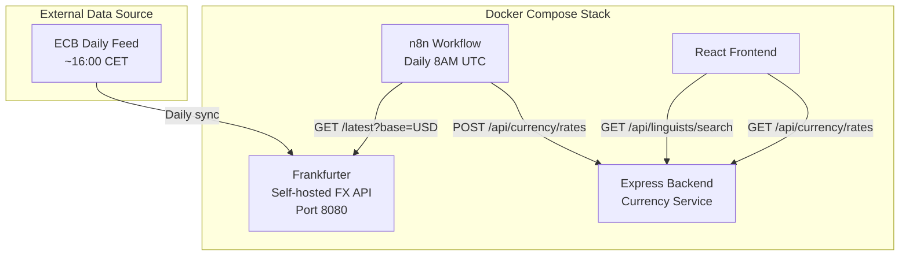
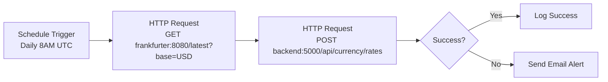

# FX Rate Conversion Implementation

## Business Decisions & Rationale

This section documents the key decisions made during planning and their reasoning.

### Problem Statement

The LinguistNow application stores linguist hourly rates in multiple currencies but has NO currency conversion implementation. This causes critical issues:

1. **Filtering is broken**: Rate filters (`minRate`/`maxRate`) compare raw numbers without currency conversion. Example: Filtering for `minRate=40` (USD) incorrectly excludes a linguist with `50 EUR` (approximately $54 USD).

2. **Currency field not exposed**: API responses don't include the `currency` field - only `hourlyRate` as a number.

3. **Rate range calculation ignores currency**: `getFilterOptions` mixes all currencies when calculating min/max values.

4. **UI hardcodes USD symbol**: All rates displayed as `$` regardless of actual currency.

### Decision 1: PM-Selectable Display Currency (Not Fixed USD)

**Decision**: Allow Project Managers to select their preferred currency for comparing linguists, rather than forcing USD.

**Rationale**:

- PMs work globally and may prefer to see rates in their local currency (EUR, GBP, etc.)
- Comparing linguists "like for like" requires all rates converted to a common currency
- The PM's selected currency becomes the basis for filtering and comparison

### Decision 2: Frankfurter Self-Hosted (Not Cloud APIs)

**Decision**: Use Frankfurter as a self-hosted Docker service instead of cloud-based APIs like ExchangeRate-API.com or Open Exchange Rates.

**Rationale**:

- **Minimize external dependencies**: Self-hosting eliminates reliance on third-party cloud services
- **Free forever**: No API keys, no rate limits, no monthly costs
- **Reputable data source**: Uses European Central Bank (ECB) daily reference rates - the gold standard for FX
- **Actively maintained**: ECB updates daily; Frankfurter syncs automatically
- **Fits existing infrastructure**: Docker Compose pattern already established (Vault, n8n)
- **Open source**: MIT license, auditable code

**Alternatives Considered**:

| API | Pros | Cons | Decision |

|-----|------|------|----------|

| Frankfurter (self-hosted) | Free, no API key, ECB data, self-hosted | ~33 currencies (ECB only) | **Selected** |

| ExchangeRate-API.com | 161 currencies, free tier 1,500 req/mo | Requires API key, cloud dependency | Rejected |

| Open Exchange Rates | 200+ currencies | 1,000 req/mo free, USD base only on free tier | Rejected |

| Fixer.io | 170 currencies | Cloud only, paid for frequent updates | Rejected |

### Decision 3: Replace RUB with UAH

**Decision**: Remove Russian Ruble (RUB) from supported currencies and replace with Ukrainian Hryvnia (UAH).

**Rationale**:

- **ECB suspended RUB**: Since March 2022, the European Central Bank no longer publishes RUB reference rates due to EU sanctions on Russia
- **Frankfurter cannot provide RUB**: As ECB is the data source, RUB rates are unavailable
- **Support Ukraine**: Replacing with UAH (Ukrainian Hryvnia) aligns with supporting Ukrainian linguists
- **ECB supports UAH**: Ukrainian Hryvnia is included in ECB reference rates

**Updated currency list** (15 currencies):

`USD, EUR, GBP, JPY, CNY, CAD, AUD, CHF, INR, BRL, MXN, KRW, UAH, ZAR, SGD`

### Decision 4: n8n for Periodic FX Updates

**Decision**: Use n8n workflow to fetch and update exchange rates daily, rather than on-demand API calls or Express cron jobs.

**Rationale**:

- **Existing pattern**: Token Refresh Schedule already uses this exact pattern (n8n -> Express API)
- **Centralized automation**: All scheduled tasks managed in one place (n8n dashboard)
- **Non-developer friendly**: PMs can monitor/adjust schedules without code changes
- **Error alerting**: Built-in email/Slack notifications on failure
- **Decoupled**: FX updates independent of application restarts

### Decision 5: Daily Updates (Not Real-Time)

**Decision**: Update exchange rates once daily (8:00 AM UTC), not hourly or real-time.

**Rationale**:

- **ECB updates once daily**: Source data only refreshes around 16:00 CET each business day
- **Hourly rates don't fluctuate rapidly**: Unlike trading, linguist rate comparisons don't need sub-daily precision
- **Simpler architecture**: No need for WebSocket updates or frequent polling
- **Sufficient accuracy**: Daily rates are accurate enough for hiring decisions

### Decision 6: In-Memory Rate Storage

**Decision**: Store exchange rates in-memory in the Express backend, not in a database.

**Rationale**:

- **Performance**: No database query overhead for every rate conversion
- **Simplicity**: No additional database schema or migrations needed
- **Sufficient durability**: Rates refresh daily via n8n; brief unavailability on restart is acceptable
- **Fallback behavior**: If rates not yet loaded, default to 1:1 conversion (safe degradation)

---

## Architecture Overview



## Currency Update

Replace RUB (Russian Ruble) with UAH (Ukrainian Hryvnia).

**Updated supported currencies (15 total):**

USD, EUR, GBP, JPY, CNY, CAD, AUD, CHF, INR, BRL, MXN, KRW, **UAH**, ZAR, SGD

All supported by ECB/Frankfurter.

---

## Phase 1: Infrastructure Setup

### 1.1 Add Frankfurter to Docker Compose

**Update**: [`docker-compose.yml`](docker-compose.yml)

Add after the Vault service block (~line 219):

```yaml
# ---------------------------------------------------------------------------
# Frankfurter (Self-hosted Exchange Rate API)
# ---------------------------------------------------------------------------
frankfurter:
  image: frankfurter/frankfurter:latest
  container_name: linguistnow-frankfurter
  restart: unless-stopped
  ports:
 - "${FRANKFURTER_PORT:-8080}:8080"
  environment:
 - DATABASE_URL=sqlite3:db/data.sqlite3
  volumes:
 - frankfurter-data:/app/db
  healthcheck:
    test: ["CMD", "wget", "--no-verbose", "--tries=1", "--spider", "http://localhost:8080/latest"]
    interval: 60s
    timeout: 10s
    retries: 3
    start_period: 30s
  networks:
 - linguistnow-net
  logging:
    driver: "json-file"
    options:
      max-size: "10m"
      max-file: "3"
```

Add to volumes section:

```yaml
frankfurter-data:
  name: linguistnow-frankfurter-data
```

---

## Phase 2: Backend Implementation

### 2.1 Currency Service

**New file**: [`server/services/currencyService.ts`](server/services/currencyService.ts)

```typescript
// In-memory exchange rate storage
interface ExchangeRates {
  base: string;
  date: string;
  rates: Record<string, number>;
  updatedAt: string;
}

// Functions:
// - updateRates(rates): Called by n8n via API
// - convert(amount, from, to): Convert between currencies
// - getRates(): Return current rates with metadata
// - getRate(from, to): Get single conversion rate
```

### 2.2 Currency Routes

**New file**: [`server/routes/currencyRoutes.ts`](server/routes/currencyRoutes.ts)

| Method | Endpoint | Purpose |

|--------|----------|---------|

| POST | `/api/currency/rates` | Receive rates from n8n workflow |

| GET | `/api/currency/rates` | Return current rates to frontend |

| GET | `/api/currency/convert` | Convert single amount (`?amount=50&from=EUR&to=USD`) |

### 2.3 Update Shared Types

**Update**: [`shared/src/api.ts`](shared/src/api.ts)

```typescript
export interface LinguistWithAvailability {
  // ... existing fields
  hourlyRate?: number;
  currency?: string; // NEW: Original currency (e.g., "EUR")
  hourlyRateConverted?: number; // NEW: Rate in PM's selected currency
}
```

### 2.4 Update Linguist Controller

**Update**: [`server/controllers/linguistsController.ts`](server/controllers/linguistsController.ts)

1. Add `CURRENCY: "Currency"` to `AIRTABLE_FIELDS` constant (line ~39)
2. Include `currency` field in response objects (line ~623)
3. Modify filtering: Move rate filtering from Airtable formula to post-query JavaScript (allows currency conversion)
4. Update `getFilterOptions()`: Convert all rates to base currency for accurate min/max

---

## Phase 3: n8n Workflow

### 3.1 Create FX Rate Update Workflow

**New file**: [`n8n/FX_Rate_Update.json`](n8n/FX_Rate_Update.json)



**Workflow details:**

- Cron: `0 8 * * *` (daily at 8:00 AM UTC)
- Fetch: `http://frankfurter:8080/latest?base=USD`
- Post: `http://backend:5000/api/currency/rates`
- Same error handling pattern as Token Refresh workflow

---

## Phase 4: Frontend Implementation

### 4.1 Currency Utilities

**New file**: [`shared/src/currency.ts`](shared/src/currency.ts)

```typescript
export const CURRENCY_SYMBOLS: Record<string, string> = {
  USD: "$",
  EUR: "€",
  GBP: "£",
  JPY: "¥",
  CNY: "¥",
  CAD: "C$",
  AUD: "A$",
  CHF: "Fr",
  INR: "₹",
  BRL: "R$",
  MXN: "Mex$",
  KRW: "₩",
  UAH: "₴",
  ZAR: "R",
  SGD: "S$",
};

export const SUPPORTED_CURRENCIES = [
  "USD",
  "EUR",
  "GBP",
  "JPY",
  "CNY",
  "CAD",
  "AUD",
  "CHF",
  "INR",
  "BRL",
  "MXN",
  "KRW",
  "UAH",
  "ZAR",
  "SGD",
] as const;

export function formatCurrency(amount: number, currency: string): string;
```

**New file**: [`client/src/utils/currency.ts`](client/src/utils/currency.ts)

Re-exports shared utilities + React-specific formatting helpers.

### 4.2 PM Currency Selector

**Update**: [`client/src/components/FilterBar.tsx`](client/src/components/FilterBar.tsx)

- Add currency dropdown (default: USD)
- Pass `displayCurrency` param to API
- Show "Rates converted to {currency}" label
- Rate slider uses converted values

### 4.3 Display Components

**Update**: [`client/src/data-table/columns.tsx`](client/src/data-table/columns.tsx)

```typescript
// Before: $${rate.toFixed(2)}/hr
// After:  €50.00/hr (~$54.25 USD)
```

**Update**: [`client/src/components/LinguistCard.tsx`](client/src/components/LinguistCard.tsx)

- Use `getCurrencySymbol(currency)` instead of hardcoded `$`
- Show original currency with optional converted tooltip

---

## Phase 5: Schema & i18n Updates

### 5.1 Update Airtable Schema

**Update**: [`server/airtable/schema.ts`](server/airtable/schema.ts)

Replace RUB with UAH in Currency options (line ~134):

```typescript
options: [
  "USD", "EUR", "GBP", "JPY", "CNY", "CAD", "AUD",
  "CHF", "INR", "BRL", "MXN", "KRW", "UAH", "ZAR", "SGD"
],
```

**Manual step**: Update Airtable singleSelect field options to match.

### 5.2 i18n Strings

**Update**: All 11 locale files in [`client/src/i18n/locales/`](client/src/i18n/locales/)

New keys:

- `dashboard.filters.displayCurrency`: "Display Currency"
- `dashboard.filters.ratesConvertedTo`: "Rates converted to {{currency}}"
- `dashboard.rateOriginal`: "Original: {{symbol}}{{amount}}"
- `linguistProfile.currencyEnabled`: "Select your preferred currency"

---

## Phase 6: Documentation

### 6.1 Software Design Document

**New file**: [`docs/currency-conversion-design.md`](docs/currency-conversion-design.md)

Create a comprehensive design document that captures the "why" behind this feature. The document should include:

**Required Sections:**

1.  **Overview** - Brief description of the currency conversion service

2.  **Problem Statement** - Document the original issues:

                                                - Filtering compared raw numbers without currency conversion
                                                - API responses lacked currency field
                                                - UI hardcoded USD symbols
                                                - Rate range calculations mixed currencies

3.  **Goals & Non-Goals**

                                                - Goals: Accurate cross-currency comparison, PM-selectable display currency, minimal external dependencies
                                                - Non-Goals: Real-time trading rates, historical rate queries, cryptocurrency support

4.  **Design Decisions** - Capture each decision with rationale:

                                                - Why Frankfurter self-hosted (not cloud APIs)
                                                - Why PM-selectable currency (not fixed USD)
                                                - Why daily updates (not real-time)
                                                - Why in-memory storage (not database)
                                                - Why n8n for scheduling (not Express cron)
                                                - Why RUB replaced with UAH

5.  **Architecture** - Include diagrams:

                                                - Component diagram (Frankfurter → n8n → Backend → Frontend)
                                                - Data flow diagram
                                                - Sequence diagram for rate updates

6.  **API Specification** - Document new endpoints:

                                                - `POST /api/currency/rates`
                                                - `GET /api/currency/rates`
                                                - `GET /api/currency/convert`

7.  **Supported Currencies** - List all 15 with symbols

8.  **Error Handling & Fallbacks**

                                                - Behavior when rates not loaded
                                                - Behavior when Frankfurter unavailable

9.  **Future Considerations**

                                                - Adding more currencies
                                                - Historical rate support
                                                - Caching strategies

### 6.2 n8n Workflow Documentation

**Update**: [`docs/n8n-workflow-integration.md`](docs/n8n-workflow-integration.md)

Add new section for FX Rate Update workflow with:

- Workflow diagram
- Configuration instructions
- Frankfurter service details

---

## Files Summary

| Action | File |

|--------|------|

| Update | `docker-compose.yml` (add Frankfurter service) |

| Create | `server/services/currencyService.ts` |

| Create | `server/routes/currencyRoutes.ts` |

| Update | `server/server.ts` (register routes) |

| Update | `server/controllers/linguistsController.ts` |

| Update | `shared/src/api.ts` |

| Create | `shared/src/currency.ts` |

| Update | `shared/src/index.ts` (export currency) |

| Create | `client/src/utils/currency.ts` |

| Update | `client/src/components/FilterBar.tsx` |

| Update | `client/src/data-table/columns.tsx` |

| Update | `client/src/components/LinguistCard.tsx` |

| Update | `server/airtable/schema.ts` |

| Update | `client/src/i18n/locales/*.json` (11 files) |

| Create | `n8n/FX_Rate_Update.json` |

| Create | `docs/currency-conversion-design.md` (design doc with rationale) |

| Update | `docs/n8n-workflow-integration.md` |

---

## Testing Strategy

1. **Unit tests**: `currencyService.test.ts` - conversion logic, edge cases
2. **Integration tests**: Mock Frankfurter responses, test rate updates
3. **E2E**: Filter linguists with mixed currencies, verify conversion
4. **Fallback**: Test behavior when rates not yet loaded (default 1:1)

---

## Success Criteria

1. Frankfurter container starts and syncs ECB rates
2. n8n workflow updates rates daily
3. API responses include `currency` field
4. Rate filtering converts to PM's selected currency
5. UI displays correct currency symbols (not hardcoded `$`)
6. System handles missing rates gracefully (fallback to 1:1)
7. All existing tests pass, new tests added for currency conversion
8. Documentation updated with FX workflow details
