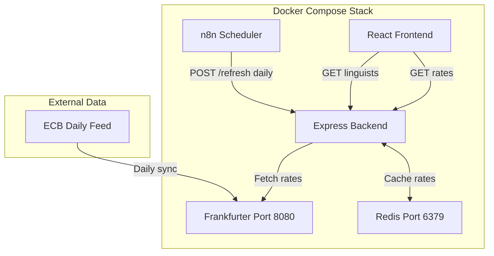
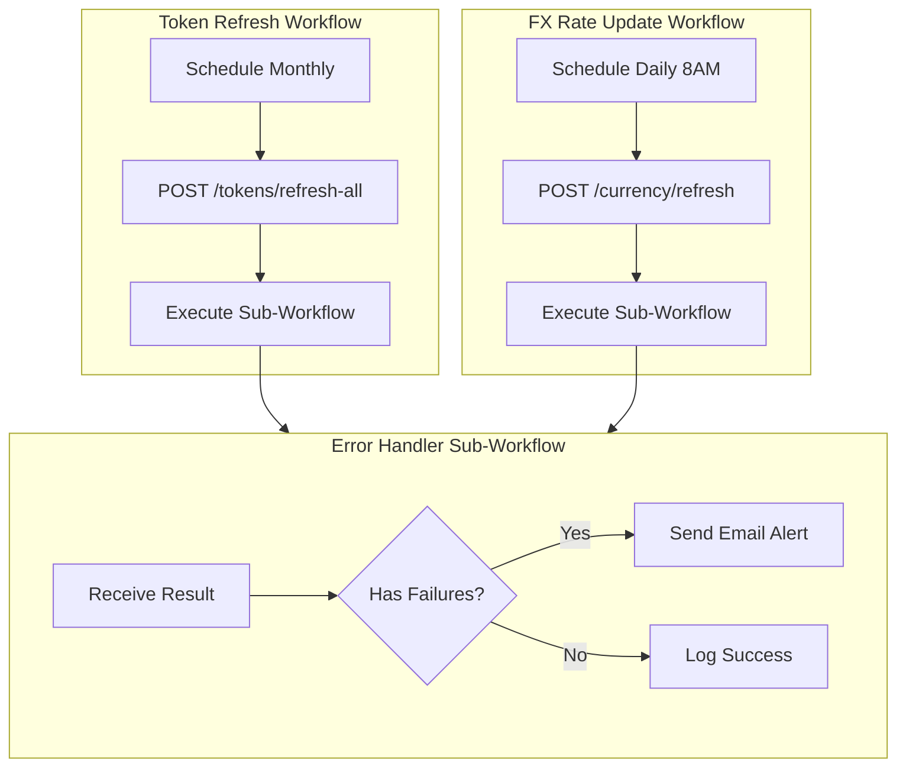

# FX Rate Conversion with Redis Cache

## Overview

Implement currency conversion using:

- **Frankfurter** (self-hosted) for ECB exchange rates
- **Redis** for persistent rate caching across server restarts
- **n8n** as scheduler only (triggers backend refresh endpoint)
- **Backend** fetches rates directly from Frankfurter (scheduled + on-demand fallback)
- **PM currency selector** for comparing linguists in preferred currency

## Architecture



## Key Design: Backend Fetches Frankfurter Directly

**Why this approach:**

1. **Centralized FX logic** - All rate fetching in one place (currencyService)
2. **On-demand fallback** - If Redis is empty, backend fetches fresh rates automatically
3. **Simpler n8n workflow** - Just a scheduler, no data transformation
4. **Easier testing** - Mock Frankfurter calls in unit tests
5. **Single code path** - Scheduled refresh and fallback use same fetch function

**Rate fetch triggers:**

| Trigger | When | Action |

|---------|------|--------|

| n8n scheduled | Daily 8AM UTC | POST `/api/currency/refresh` |

| On-demand fallback | Redis empty + rate needed | Auto-fetch from Frankfurter |

| Manual refresh | Admin action | POST `/api/currency/refresh` |

## Redis Data Persistence

**Q: Is Redis data lost when updating the container?**

**A: No**, with this configuration:

- `appendonly yes` enables persistence to disk
- Named volume `redis-data:/data` survives container recreation
- Data only lost if you explicitly `docker volume rm linguistnow-redis-data`

Normal operations that preserve data:

- `docker-compose pull redis && docker-compose up -d redis`
- `docker-compose restart redis`
- `docker-compose down && docker-compose up -d`

## Supported Currencies (14)

`USD, EUR, GBP, JPY, CNY, CAD, AUD, CHF, INR, BRL, MXN, KRW, ZAR, SGD`

Note: RUB removed (ECB suspended since March 2022). UAH not added (not in ECB reference rates).

---

## Phase 1: Infrastructure

### 1.1 Add Redis to Docker Compose

**Update**: [`docker-compose.yml`](docker-compose.yml)

```yaml
redis:
  image: redis:7-alpine
  container_name: linguistnow-redis
  restart: unless-stopped
  ports:
    - "${REDIS_PORT:-6379}:6379"
  volumes:
    - redis-data:/data
  command: redis-server --appendonly yes
  healthcheck:
    test: ["CMD", "redis-cli", "ping"]
    interval: 10s
    timeout: 5s
    retries: 5
  networks:
    - linguistnow-net
```

### 1.2 Add Frankfurter to Docker Compose

```yaml
frankfurter:
  image: frankfurter/frankfurter:latest
  container_name: linguistnow-frankfurter
  restart: unless-stopped
  ports:
    - "${FRANKFURTER_PORT:-8080}:8080"
  healthcheck:
    test: ["CMD", "wget", "--spider", "-q", "http://localhost:8080/latest"]
    interval: 60s
    timeout: 10s
    retries: 3
    start_period: 60s
  networks:
    - linguistnow-net
```

### 1.3 Update Backend Dependencies

Add Redis and Frankfurter as dependencies for the backend service:

```yaml
backend:
  # ... existing config ...
  depends_on:
    vault:
      condition: service_healthy
    redis:
      condition: service_healthy
    frankfurter:
      condition: service_healthy
  environment:
    # ... existing env vars ...
    - REDIS_URL=redis://redis:6379
    - FRANKFURTER_URL=http://frankfurter:8080
```

### 1.4 Add Volume for Redis

```yaml
volumes:
  # ... existing volumes ...
  redis-data:
    name: linguistnow-redis-data
```

---

## Phase 2: Backend Service

### 2.1 Add Redis Client and Frankfurter URL

**Install**: `pnpm --filter ./server add ioredis`

**Update**: [`server/env.ts`](server/env.ts)

```typescript
REDIS_URL: z.string().url().default('redis://localhost:6379'),
FRANKFURTER_URL: z.string().url().default('http://localhost:8080'),
```

### 2.2 Create Currency Service

**New file**: [`server/services/currencyService.ts`](server/services/currencyService.ts)

```typescript
import Redis from 'ioredis';
import { env } from '../env.js';

const RATES_KEY = 'fx:rates';
const RATES_TTL = 86400 * 2; // 48 hours (buffer for weekends)

interface ExchangeRates {
  base: string;
  date: string;
  rates: Record<string, number>;
  updatedAt: string;
}

// Redis client (lazy init)
let redis: Redis | null = null;

export function getRedisClient(): Redis { ... }

// Fetch fresh rates from Frankfurter and store in Redis
export async function refreshRates(): Promise<ExchangeRates> {
  const response = await fetch(`${env.FRANKFURTER_URL}/latest?base=USD`);
  const data = await response.json();
  await storeRates(data);
  return data;
}

// Get rates from Redis, auto-fetch if empty (on-demand fallback)
export async function getRates(): Promise<ExchangeRates> {
  const cached = await getCachedRates();
  if (cached) return cached;

  // Fallback: fetch fresh rates if cache is empty
  return await refreshRates();
}

export async function convert(amount: number, from: string, to: string): Promise<number>
export async function hasRates(): Promise<boolean>

// Internal helpers
async function storeRates(data: ExchangeRates): Promise<void>
async function getCachedRates(): Promise<ExchangeRates | null>
```

### 2.3 Create Currency Routes

**New file**: [`server/routes/currencyRoutes.ts`](server/routes/currencyRoutes.ts)

| Method | Endpoint | Purpose |

|--------|----------|---------|

| POST | `/api/currency/refresh` | Trigger rate refresh (called by n8n scheduler) |

| GET | `/api/currency/rates` | Return current rates (auto-fetches if empty) |

| GET | `/api/currency/convert` | Convert amount (`?amount=50&from=EUR&to=USD`) |

### 2.4 Register Routes

**Update**: [`server/server.ts`](server/server.ts)

```typescript
import currencyRoutes from "./routes/currencyRoutes.js";
app.use("/api/currency", currencyRoutes);
```

---

## Phase 3: Shared Types

**New file**: [`shared/src/currency.ts`](shared/src/currency.ts)

```typescript
export const SUPPORTED_CURRENCIES = [
  "USD",
  "EUR",
  "GBP",
  "JPY",
  "CNY",
  "CAD",
  "AUD",
  "CHF",
  "INR",
  "BRL",
  "MXN",
  "KRW",
  "ZAR",
  "SGD",
] as const;

export type SupportedCurrency = (typeof SUPPORTED_CURRENCIES)[number];

export const CURRENCY_SYMBOLS: Record<SupportedCurrency, string> = {
  USD: "$",
  EUR: "€",
  GBP: "£",
  JPY: "¥",
  CNY: "¥",
  CAD: "C$",
  AUD: "A$",
  CHF: "Fr",
  INR: "₹",
  BRL: "R$",
  MXN: "Mex$",
  KRW: "₩",
  ZAR: "R",
  SGD: "S$",
};

export function formatCurrency(amount: number, currency: string): string;
```

---

## Phase 4: Linguist Controller Update

**Update**: [`server/controllers/linguistsController.ts`](server/controllers/linguistsController.ts)

1. Add `displayCurrency` query parameter to `SearchLinguistsQuery`
2. Move rate filtering from Airtable formula to post-query JavaScript
3. Convert rates using `currencyService.convert()`
4. Include `hourlyRateConverted` in response

---

## Phase 5: Frontend Updates

### 5.1 Update Client Currency Utils

**Update**: [`client/src/utils/currency.ts`](client/src/utils/currency.ts)

- Remove RUB from CURRENCIES array
- Re-export shared types

### 5.2 Add Currency Selector to FilterBar

**Update**: [`client/src/components/organisms/FilterBar.tsx`](client/src/components/organisms/FilterBar.tsx)

- Add currency dropdown (default: USD)
- Pass `displayCurrency` to API
- Fix hardcoded `$` in rate slider labels
- Show "Rates converted to {currency}" indicator

---

## Phase 6: Schema and i18n

**Update**: [`server/airtable/schema.ts`](server/airtable/schema.ts) - Remove RUB

**Update**: All 11 locale files with new keys:

- `dashboard.filters.displayCurrency`
- `dashboard.filters.ratesConvertedTo`

---

## Phase 7: n8n Workflows (with Shared Sub-Workflow)

Refactor to use a shared sub-workflow for error handling, following DRY principle.

### 7.1 Architecture



### 7.2 Files

**New file**: [`n8n/Error_Handler_Subworkflow.json`](n8n/Error_Handler_Subworkflow.json)

Shared sub-workflow containing:

- Input: `{ success: boolean, failures: array, context: string }`
- IF node: Check `failures.length > 0`
- Email Send node: Alert on failures
- Set node: Log success

**New file**: [`n8n/FX_Rate_Update.json`](n8n/FX_Rate_Update.json)

1. **Schedule Trigger**: Daily 8:00 AM UTC (`0 8 * * *`)
2. **HTTP Request**: POST `http://backend:5000/api/currency/refresh`
3. **Execute Workflow**: Call Error Handler with context "FX Rate Update"

**Update**: [`n8n/Token_Refresh_Schedule.json`](n8n/Token_Refresh_Schedule.json)

Refactor to use shared sub-workflow:

1. Keep Schedule Trigger and HTTP Request
2. Replace IF + Email nodes with Execute Workflow node
3. Pass context "Token Refresh" to sub-workflow

### 7.3 Benefits

- **DRY**: Error handling logic in one place
- **Consistent**: Same email format for all scheduled tasks
- **Extensible**: Easy to add more scheduled tasks
- **Maintainable**: Update error handling once, applies everywhere

---

## Phase 8: Documentation

**New file**: [`docs/architecture/currency-conversion.md`](docs/architecture/currency-conversion.md)

---

## Redis Benefits for This Use Case

| Feature | Benefit |

| ------------ | ---------------------------------------------- |

| Persistence | `appendonly yes` survives container restarts |

| TTL | Auto-expire stale rates after 48 hours |

| Atomic ops | Safe concurrent access |

| Lightweight | Alpine image ~30MB |

| Future-ready | Can cache other data (linguist profiles, etc.) |

---

## Files Summary

| Action | File |

|--------|------|

| Update | `docker-compose.yml` (add Redis + Frankfurter) |

| Update | `server/package.json` (add ioredis) |

| Update | `server/env.ts` (add REDIS_URL + FRANKFURTER_URL) |

| Create | `server/services/currencyService.ts` |

| Create | `server/routes/currencyRoutes.ts` |

| Update | `server/server.ts` |

| Create | `shared/src/currency.ts` |

| Update | `shared/src/index.ts` |

| Update | `server/controllers/linguistsController.ts` |

| Update | `client/src/utils/currency.ts` |

| Update | `client/src/components/organisms/FilterBar.tsx` |

| Update | `server/airtable/schema.ts` |

| Update | `client/src/i18n/locales/*.json` (11 files) |

| Create | `n8n/Error_Handler_Subworkflow.json` (shared) |

| Create | `n8n/FX_Rate_Update.json` |

| Update | `n8n/Token_Refresh_Schedule.json` (use sub-workflow) |

| Create | `docs/architecture/currency-conversion.md` |
