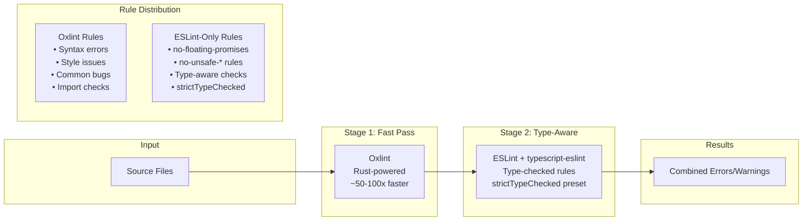

# Oxlint Hybrid Setup: Running Oxlint Alongside ESLint

## Overview

Add Oxlint as a fast first-pass linter while keeping ESLint for type-checked rules. This hybrid approach provides:

- **50-100x faster** initial linting feedback (Rust-powered)
- **Preserved type safety** via ESLint's `strictTypeChecked` rules
- **Reduced ESLint workload** by disabling rules oxlint handles
- **Better CI performance** with faster lint times
- **Gradual adoption path** to evaluate oxlint without breaking changes

## Architecture



## Why Hybrid Instead of Full Migration?

| Current Rule | Oxlint Support | Action || ----------------------------------------- | ----------------- | ----------------- || `@eslint/recommended` | ✅ 90%+ covered | Disable in ESLint || `strictTypeChecked` | ❌ Not supported | Keep in ESLint || `@typescript-eslint/no-floating-promises` | ❌ Requires types | Keep in ESLint || `@typescript-eslint/no-unsafe-*` | ❌ Requires types | Keep in ESLint || Basic syntax rules | ✅ Covered | Disable in ESLint || Import/export rules | ✅ Covered | Disable in ESLint |**Key insight**: Type-checked rules like `no-floating-promises` and `no-unsafe-*` require TypeScript's type information—oxlint cannot replicate these.

## Key Files to Modify

| File | Change || ------------------------- | --------------------------------------------------------------- || `package.json` | Add `oxlint` and `eslint-plugin-oxlint` dependencies || `eslint.config.mjs` | Import `eslint-plugin-oxlint` to auto-disable overlapping rules || `.github/workflows/*.yml` | Update CI to run oxlint first (optional) || `.lintstagedrc.js` | Add oxlint to pre-commit hooks || `oxlint.json` | (New) Oxlint configuration file |

## Implementation Details

### 1. Install Dependencies

```bash
# Add oxlint and the ESLint plugin for integration
pnpm add -D oxlint eslint-plugin-oxlint
```

### 2. Create Oxlint Configuration

Create `oxlint.json` in the project root:

```json
{
  "$schema": "https://raw.githubusercontent.com/oxc-project/oxc/main/npm/oxlint/configuration_schema.json",
  "rules": {
    "no-unused-vars": "warn",
    "no-console": "off",
    "eqeqeq": "error"
  },
  "ignorePatterns": [
    "**/dist/**",
    "**/dev-dist/**",
    "**/build/**",
    "**/node_modules/**",
    "**/coverage/**",
    "scripts/**"
  ],
  "plugins": ["typescript", "import", "react", "react-hooks"]
}
```

### 3. Update ESLint Configuration

Modify `eslint.config.mjs` to disable rules that oxlint handles:

```javascript
import eslint from "@eslint/js";
import tseslint from "typescript-eslint";
import globals from "globals";
import oxlint from "eslint-plugin-oxlint";

export default tseslint.config(
  eslint.configs.recommended,
  ...tseslint.configs.strictTypeChecked,
  // Auto-disable ESLint rules covered by oxlint
  oxlint.configs["flat/recommended"],
  {
    languageOptions: {
      parserOptions: {
        project: [
          "./server/tsconfig.json",
          "./client/tsconfig.json",
          "./shared/tsconfig.json",
        ],
        tsconfigRootDir: import.meta.dirname,
      },
      globals: {
        ...globals.browser,
        ...globals.node,
      },
    },
  },
  // ... rest of existing configuration
);
```

### 4. Add Package Scripts

Update root `package.json`:

```json
{
  "scripts": {
    "lint:ox": "oxlint .",
    "lint:eslint": "eslint .",
    "lint": "oxlint . && eslint .",
    "lint:fix": "oxlint --fix . && eslint . --fix"
  }
}
```

### 5. Update Pre-commit Hooks

If using `lint-staged`, update `.lintstagedrc.js`:

```javascript
module.exports = {
  "*.{ts,tsx}": ["oxlint --fix", "eslint --fix"],
  "*.{js,mjs,cjs}": ["oxlint --fix", "eslint --fix"],
};
```

### 6. Update CI Workflow (Optional)

For faster CI feedback, run oxlint first:

```yaml
jobs:
  lint:
    runs-on: ubuntu-latest
    steps:
    - uses: actions/checkout@v4
    - uses: pnpm/action-setup@v2
    - uses: actions/setup-node@v4
        with:
          node-version: "20"
          cache: "pnpm"
    - run: pnpm install

      # Fast oxlint check first - fails fast on obvious issues
    - name: Oxlint (fast pass)
        run: pnpm lint:ox

      # Full ESLint with type checking
    - name: ESLint (type-aware)
        run: pnpm lint:eslint
```

### 7. Update .gitignore

Add oxlint cache (if using):

```javascript
# Oxlint cache
.oxlint-cache
```

## Usage

| Command | Description || ------------------ | -------------------------------------- || `pnpm lint` | Run both oxlint and ESLint in sequence || `pnpm lint:ox` | Run oxlint only (fast feedback) || `pnpm lint:eslint` | Run ESLint only (type-aware checks) || `pnpm lint:fix` | Auto-fix issues with both linters |

## Expected Performance Improvement

| Metric | Before (ESLint only) | After (Hybrid) || --------------------- | -------------------- | ------------------- || Initial syntax errors | ~5-15s | ~0.1-0.3s (oxlint) || Full lint pass | ~5-15s | ~0.3s + ~3-8s || Pre-commit hooks | ~5-15s | Fast fail on syntax || CI lint step | ~15-30s | Parallel stages |> Note: Actual times depend on codebase size. Your project is small enough that ESLint is likely fast already, but oxlint provides instant feedback during development.

## Rule Coverage Comparison

### Rules Oxlint Handles (disable in ESLint)

The `eslint-plugin-oxlint` automatically disables these, but for reference:

- `no-unused-vars`
- `no-undef`
- `no-console`
- `eqeqeq`
- `no-empty`
- `no-extra-semi`
- `import/no-duplicates`
- `react/jsx-key`
- `react-hooks/rules-of-hooks`
- [500+ more rules](https://oxc.rs/docs/guide/usage/linter/rules.html)

### Rules ESLint Must Keep (type-aware)

These require TypeScript's type system and **cannot** be migrated:

- `@typescript-eslint/no-floating-promises`
- `@typescript-eslint/no-misused-promises`
- `@typescript-eslint/no-unsafe-assignment`
- `@typescript-eslint/no-unsafe-call`
- `@typescript-eslint/no-unsafe-member-access`
- `@typescript-eslint/no-unsafe-argument`
- `@typescript-eslint/no-unsafe-return`
- `@typescript-eslint/await-thenable`
- `@typescript-eslint/require-await`
- `@typescript-eslint/restrict-template-expressions`

## Future Considerations

### Path to Full Migration

Monitor oxlint's roadmap for type-aware rule support. When available:

1. Evaluate type-aware rule coverage
2. Test on a branch
3. Remove ESLint if all critical rules are covered

### oxfmt for Formatting

Consider replacing Prettier with oxfmt for consistent tooling:

```bash
pnpm add -D oxc
# Replace prettier with oxfmt in package.json scripts
```

## Cost

**Free and open-source:**

- `oxlint` - MIT license
- `eslint-plugin-oxlint` - MIT license

## Rollback Plan

If issues arise, reverting is simple:

1. Remove `oxlint.configs['flat/recommended'] `from `eslint.config.mjs`
2. Change `"lint"` script back to `"eslint ."`
3. Optionally remove `oxlint` dependency

The hybrid approach is non-breaking—ESLint continues to work as before, just faster.

## Notes

- Oxlint v1.0 was released June 2025 and is production-ready
- The plugin auto-disables ESLint rules to avoid duplicate warnings
- Oxlint runs in parallel by default (uses all CPU cores)
- No configuration required for basic usage—sensible defaults work well
