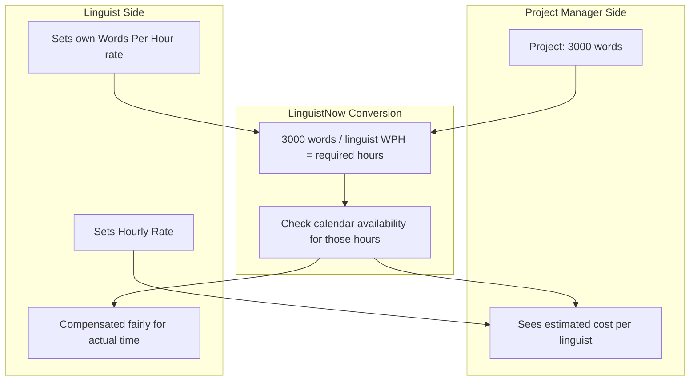
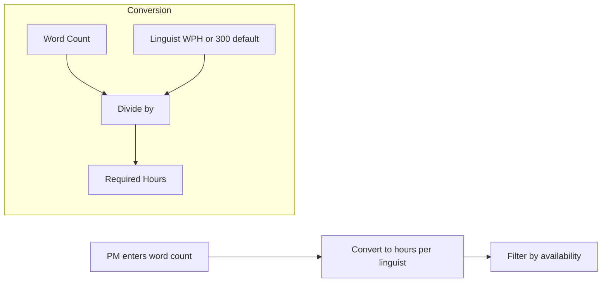

# Word Count-Based Linguist Filtering

## Overview

Enable Project Managers to filter linguists by project word count. The system will convert word count to required hours using each linguist's productivity rate (words per hour), falling back to a default of 300 words/hour. The UI will have a toggle to switch between entering hours directly or word count.

## Why This Feature: Fair Matchmaking Philosophy

### The Problem with Per-Word Pricing

The translation industry has traditionally used per-word pricing, but this model is increasingly viewed as outdated and unfair to linguists:

1. **Hidden labor**: Translation involves more than converting words - research, cultural adaptation, terminology consistency, and quality assurance take significant time that per-word rates don't capture.
2. **AI disruption**: With Machine Translation Post-Editing (MTPE), raw word counts no longer correlate with effort. A linguist post-editing MT output works differently than one translating from scratch.
3. **Quality disincentive**: Per-word pricing can pressure linguists to prioritize speed over quality, harming both the linguist's reputation and client outcomes.

### Our Approach: Hours-First with Word Count Convenience

LinguistNow uses an **hours-based compensation model** as the foundation, which:

- **Respects linguist time**: Compensation reflects actual effort, including research and quality work
- **Accounts for individual productivity**: Each linguist can set their own words-per-hour rate based on their efficiency, specialization, and work style
- **Provides PM convenience**: Project Managers can still estimate using word count (the metric they receive from clients), but the system converts this to hours using the linguist's productivity rate

### Industry Context (2024-2025)

| Compensation Model | Typical Rates (US) | Best For ||--------------------|-------------------|----------|| Per-Word | $0.10-$0.40/word | Simple, predictable projects || Hourly | $25-$47/hour | Complex content, research-heavy work || Project-Based | Flat fee | Large multi-faceted assignments |**Industry benchmark**: Professional translators typically produce 250-350 words/hour for quality human translation (accounting for research). Our default of **300 words/hour** reflects this industry standard.

### How This Creates Fair Matchmaking

**Benefits:**

- **For PMs**: Easy word-count-based filtering with per-linguist cost estimates
- **For Linguists**: Control over their productivity rate; paid for hours, not raw output
- **For the Platform**: Honest, transparent matching that builds trust

## Data Flow

## Implementation

### 1. Schema Changes

**Add to Airtable schema** ([server/airtable/schema.ts](server/airtable/schema.ts)):

- New field: `Words Per Hour` (Number, default 300)

**Add to shared types** ([shared/src/api.ts](shared/src/api.ts)):

- Add `wordsPerHour?: number` to `LinguistWithAvailability`
- Add `projectWordCount?: number` to `SearchLinguistsQuery`
- Add constant `DEFAULT_WORDS_PER_HOUR = 300`

### 2. Server Changes

**Update linguist controller** ([server/controllers/linguistsController.ts](server/controllers/linguistsController.ts)):

- Parse `projectWordCount` from query params
- For each linguist, calculate required hours: `wordCount / (linguist.wordsPerHour || 300)`
- Use calculated hours for availability filtering (existing `requiredHours` logic)
- Include `wordsPerHour` in linguist response

### 3. Client Changes

**Update FilterBar** ([client/src/components/FilterBar.tsx](client/src/components/FilterBar.tsx)):

- Replace project size input with toggle component (Hours / Words)
- When "Words" mode: send `projectWordCount` param
- When "Hours" mode: send `requiredHours` param (existing behavior)

**Update LinguistProfileSettings** ([client/src/components/LinguistProfileSettings.tsx](client/src/components/LinguistProfileSettings.tsx)):

- Add "Words Per Hour" input field for linguists to set their productivity rate
- Show hint text explaining the default (300 wph)

### 4. Internationalization

**Add i18n keys to all 11 locale files** (`client/src/i18n/locales/*.json`):

- `linguistProfile.wordsPerHour`: "Words Per Hour"
- `linguistProfile.wordsPerHourPlaceholder`: "Enter your productivity rate"
- `linguistProfile.wordsPerHourHint`: "Default: 300 words/hour"
- `dashboard.filters.projectSizeMode`: "Project Size"
- `dashboard.filters.modeHours`: "Hours"
- `dashboard.filters.modeWords`: "Words"
- `dashboard.filters.wordCountPlaceholder`: "Enter word count"
- `dashboard.filters.wordCountHint`: "Filters by estimated hours based on linguist productivity"

### 5. Documentation

**Create research document** ([docs/compensation-models.md](docs/compensation-models.md)):Document capturing the rationale and research behind our approach:

- Industry compensation models (per-word, hourly, project-based)
- Criticism of per-word pricing in the AI era
- Industry productivity benchmarks (words per hour/day)
