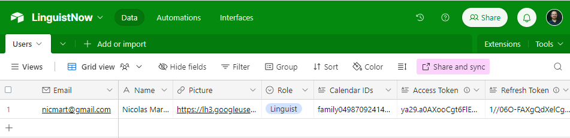
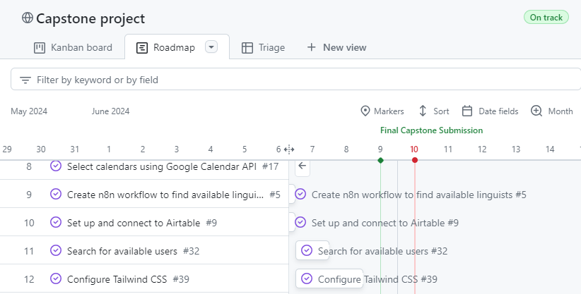
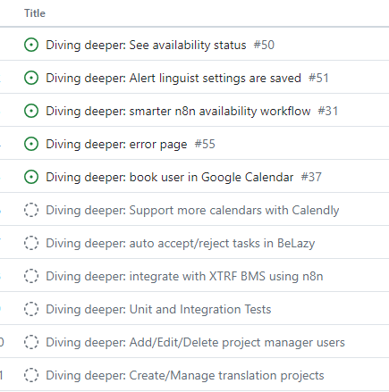

# Table of content

[Overview](#overview)<br>
[Install](#install)<br>
[Implementation](#implementation)<br>
[Roadmap](#roadmap)<br>
[Nice-to-haves](#nice-to-haves)<br>
[Behind the scene](#behind-the-scene)

# LinguistNow

## Overview

LinguistNow simplifies the hassle of finding available linguists for translation projects.

### Problem

Linguists, often freelancers, work for many translation agencies or language service providers (LSPs). Managing tasks based on their schedule is a nightmare both for them and the project managers assigning them work (ie. the "client").

Why?

- They have enter their availability manually in many apps for some, send it by email to others,
- They have to remember to notify them when going on holiday
- Invariably that availability is bound to be out of date as not relying on a single source of truth like their Google Calendar.
- Some linguists may hoard work, and accept tasks even before checking their calendar, to avoid someone else accepting it, and then have to contact the client, who then have to source someone else, incurring delays.

### User Profile

- Project managers in translation agencies or LSPs, who need to add linguists and then find those available to assign to translation projects.
- Linguists, also more commonly known as translators, who need to ensure project managers know they are available for work, as it's a competitive market where they need to get many clients as possible.

### Features

1. **User Authentication:**

   - Secure login and registration for project managers and linguists using Google OAuth2.
   - Role-based access control.

2. **Linguist Google Calendar profile**

   - Linguists select their calendars in user profile

3. **Project Scheduling:**

   - Project managers can find available linguist, using CRUD operations to add, edit, delete, and view their profiles.
   - Get linguist availability from Google Calendar using n8n integration

4. **Localization**
   - Using `react-intl` to support English, French, and Simplified Chinese interfaces, with language toggle functionality.

## Install

To install and run the LinguistNow application, follow these steps:

Follow the steps on https://github.com/nicmart-dev/linguistnow/wiki/Install-instructions

## Implementation

[Tech Stack](#tech-stack)<br>
[GitHub folder structure](#github-folder-structure)<br>
[APIs](#apis)<br>
[Sitemap, User journey and Screenshots](#sitemap-user-journey-and-screenshots)<br>
[Data](#data)<br>
[Auth](#auth)

### Tech Stack

- **Front-end:** React.js, React Router (for navigation), Tailwind CSS (for styling), Axios (for API calls)
- **Back-end:** Node.js, Express.js
- **Database:** Airtable
- **Authentication:** Google OAuth2 tokens
- **Localization:** [react-intl](https://www.npmjs.com/package/react-intl) library for internationalization, using AI translations
- **Datagrid** TanStack Table headless table library
- **Calendar Integration:** [n8n](https://www.npmjs.com/package/n8n) workflow automation library
- **Deployment:** Netlify (for front-end), Render (for back-end)

### GitHub folder structure

For ease of maintenance as a solo developer, I created a single repository for client and server.

```
your-repo/
│
├── client/
│ ├── src/
│ │ ├── components/
│ │ ├── pages/
│ │ └── ...
│ ├── public/
│ └── ...
│
├── server/
│ ├── controllers/
│ ├── models/
│ ├── routes/
│ └── ...
│
├── n8n/
│ ├── workflows/
│ ├── settings/
│ └── ...
│
├── README.md
├── .gitignore
├── package.json
└── ...
```

### APIs

I am using the following external APIs:

- Google APIs used:
  - by n8n to [check when busy](https://github.com/nicmart-dev/linguistnow/wiki/n8n-workflow-integration#check-when-busy) to get up to date availability and
  - by the Node server to get [calendar list](https://github.com/nicmart-dev/linguistnow/wiki/Integration-of-Google-Calendar-API)
- Connection to [Airtable](https://github.com/nicmart-dev/linguistnow/wiki/Store-user-data-in-Airtable) cloud-based database platform is managed through `airtable` package

### Sitemap, User journey and Screenshots

See https://github.com/nicmart-dev/linguistnow/wiki/Sitemap-and-user-journey

### Data

I am using a single Users table in Airtable. See [Airtable data structure documentation](https://github.com/nicmart-dev/linguistnow/wiki/Store-user-data-in-Airtable#airtable-data-structure).



### Auth

The app is using Google OAuth2 authentication. See related design information [here](https://github.com/nicmart-dev/linguistnow/wiki/Google-Authentication).

## Roadmap

I am using GitHub Project to manage the roadmap and Kanban board.
Please see the public roadmap [here](https://github.com/users/nicmart-dev/projects/1/views/6).



## Nice-to-haves

Please see the nice to have [backlog list](https://github.com/users/nicmart-dev/projects/1/views/8)

Examples:



# Behind the scene

## About me

This capstone project was developed by Nicolas Martinez as part of the 3-month Web Development Diploma Program at BrainStation.
It serves as a demonstration of newly acquired modern development skills, following a 20+ year journey of providing customer solutions.

My background is in the Localization & Translation industry spanning two decades, coupled with 7 years as a Technical Product Manager overseeing workflow management and productivity-oriented products.
