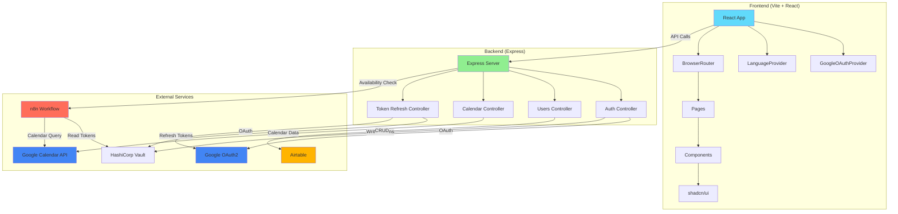
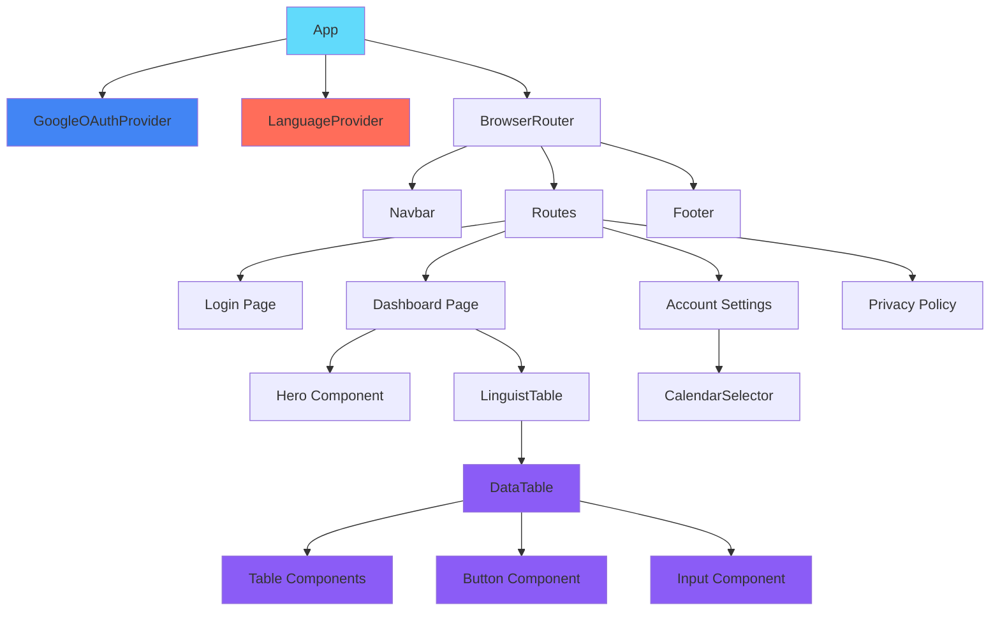
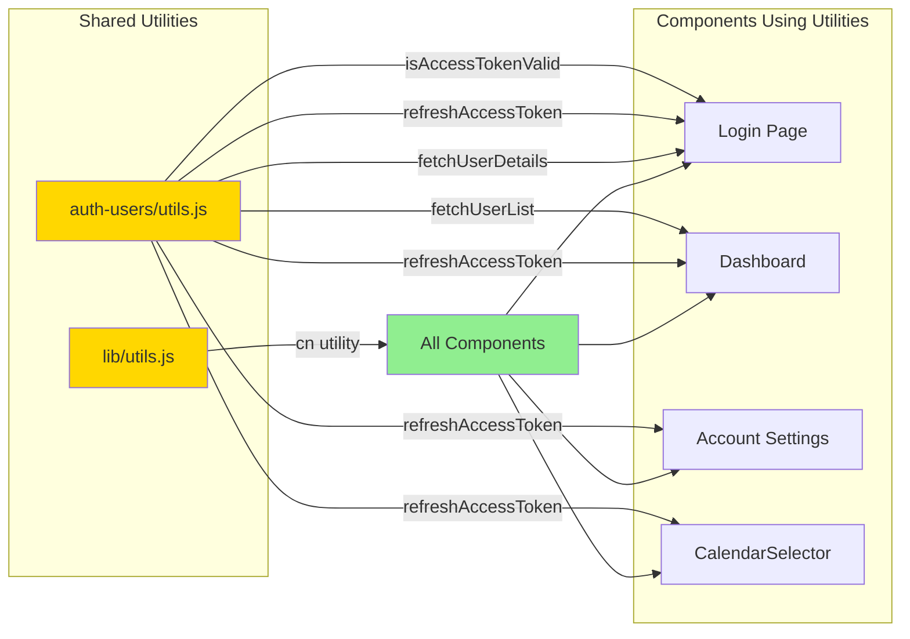
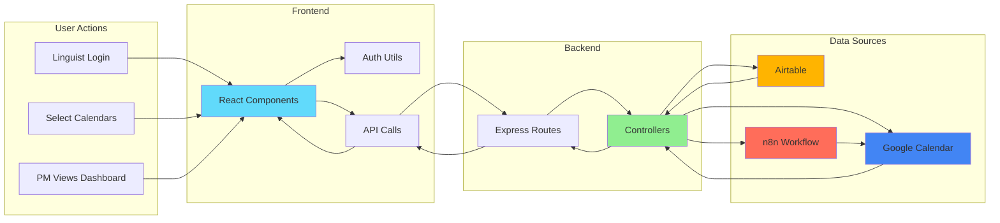
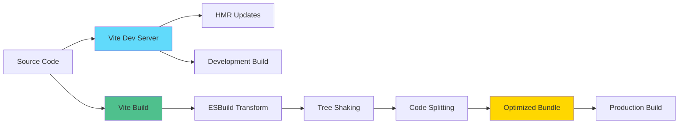

# Architecture Overview

This document provides a comprehensive overview of the LinguistNow application architecture, emphasizing component-based design, DRY (Don't Repeat Yourself) principles, and modern development practices.

## Table of Contents

- [Tech Stack](#tech-stack)
- [Project Structure](#project-structure)
- [Component Architecture](#component-architecture)
- [DRY Principles](#dry-principles)
- [Build System](#build-system)
- [Environment Configuration](#environment-configuration)

## Tech Stack

### Frontend

- **React 19** - Modern React with latest features
- **TypeScript** - Type-safe JavaScript with strict mode
- **Vite** - Fast build tool and dev server (migrated from Create React App)
- **Tailwind CSS v4** - Utility-first CSS framework with PostCSS
- **React Router v6** - Client-side routing
- **TanStack Table** - Powerful data table component
- **shadcn/ui** - High-quality component library built on Radix UI
- **react-intl** - Internationalization (i18n) support
- **Vitest** - Fast unit test framework
- **Zod** - Runtime type validation

### Backend

- **Node.js** - JavaScript runtime
- **TypeScript** - Type-safe JavaScript with strict mode
- **Express.js** - Web application framework
- **ES Modules (ESM)** - Modern JavaScript module system
- **tsx** - TypeScript execution for Node.js
- **google-auth-library** - Google OAuth2 authentication
- **Vitest** - Fast unit test framework
- **Zod** - Runtime type validation

### Database & Services

- **Airtable** - Cloud-based database (user profiles only, no sensitive data)
- **HashiCorp Vault** - Secure token storage (self-hosted)
- **n8n** - Workflow automation for calendar availability checks
- **Google Calendar API** - Calendar integration

## Project Structure

```
linguistnow/
├── client/                 # React frontend application (TypeScript)
│   ├── src/
│   │   ├── components/     # Reusable UI components (.tsx)
│   │   ├── pages/          # Route components (.tsx)
│   │   ├── auth-users/     # Authentication utilities (.ts)
│   │   ├── i18n/           # Internationalization (.ts/.tsx)
│   │   ├── lib/            # Shared utilities (.ts)
│   │   ├── test/           # Test setup files
│   │   └── assets/         # Static assets
│   ├── public/             # Public assets
│   ├── vite.config.ts      # Vite configuration (TypeScript)
│   ├── vitest.config.ts    # Vitest configuration
│   ├── tsconfig.json       # TypeScript configuration
│   └── tailwind.config.js  # Tailwind CSS configuration
│
├── server/                  # Express backend (TypeScript + ESM)
│   ├── controllers/        # Request handlers (.ts)
│   ├── routes/             # API routes (.ts)
│   ├── server.ts           # Server entry point (TypeScript)
│   ├── env.ts              # Environment validation (Zod)
│   ├── vitest.config.ts    # Vitest configuration
│   └── tsconfig.json       # TypeScript configuration
│
├── shared/                  # Shared types package
│   ├── src/
│   │   ├── user.ts         # User-related types
│   │   ├── api.ts          # API request/response types
│   │   ├── calendar.ts     # Calendar-related types
│   │   └── index.ts        # Package exports
│   └── tsconfig.json       # TypeScript configuration
│
└── docs/                    # Documentation
```

## System Architecture



## Component Architecture

### Design Philosophy

The application follows a **component-based architecture** with emphasis on:

1. **Reusability** - Components are designed to be reused across the application
2. **Composability** - Small, focused components that can be combined
3. **Separation of Concerns** - Clear boundaries between UI, logic, and data
4. **Maintainability** - Easy to understand and modify

### Component Hierarchy



### Core Components

#### UI Components (shadcn/ui)

Located in `client/src/components/`:

- **Button** - Reusable button with variants (default, outline, ghost, etc.)
- **Input** - Form input component
- **Table** - Table primitives (TableHeader, TableBody, TableRow, etc.)
- **DataTable** - Full-featured data table with sorting, filtering, pagination

#### Application Components

- **Navbar** - Navigation bar with language selector
- **Hero** - Landing page hero section
- **Footer** - Application footer
- **Skeleton** - Loading state component
- **CalendarSelector** - Calendar selection interface
- **LinguistTable** - Specialized table for linguist data

### Component Patterns

#### 1. Compound Components

The Table component uses compound component pattern:

```jsx
<Table>
  <TableHeader>
    <TableRow>
      <TableHead>Column</TableHead>
    </TableRow>
  </TableHeader>
  <TableBody>
    <TableRow>
      <TableCell>Data</TableCell>
    </TableRow>
  </TableBody>
</Table>
```

#### 2. Component Variants

Buttons use `class-variance-authority` for type-safe variants:

```jsx
<Button variant="outline" size="sm">
  Click me
</Button>
```

#### 3. Forward Refs

Components use `React.forwardRef` for proper ref forwarding:

```jsx
const Input = React.forwardRef(({ className, ...props }, ref) => {
  // Component implementation
});
```

## DRY Principles

### Shared Utilities Architecture



### Shared Utilities

#### Authentication Utilities (`client/src/auth-users/utils.js`)

Centralized authentication functions:

- `isAccessTokenValid()` - Validates Google OAuth tokens
- `refreshAccessToken()` - Refreshes expired tokens (server-side)
- `fetchUserDetails()` - Retrieves user from Airtable
- `fetchUserList()` - Gets all users
- `createUserIfNotFound()` - Creates new user on first login

**Benefits:**

- Single source of truth for auth logic
- Consistent error handling
- Easy to test and maintain

#### Utility Functions (`client/src/lib/utils.js`)

- `cn()` - Combines class names using `clsx` and `tailwind-merge`
- Ensures Tailwind classes are properly merged and deduplicated

### Path Aliases

Vite configuration provides clean import paths:

```javascript
// vite.config.js
resolve: {
  alias: {
    '@': path.resolve(__dirname, './src'),
    'components': path.resolve(__dirname, './src/components'),
    'utils': path.resolve(__dirname, './src/lib/utils.js'),
  }
}
```

Usage:

```javascript
import { cn } from "@/lib/utils";
import Button from "components/Button";
```

### Reusable Patterns

1. **API Calls** - Centralized in utility functions
2. **Error Handling** - Consistent patterns across components
3. **Loading States** - Reusable Skeleton component
4. **Form Validation** - Shared validation logic
5. **Token Management** - Centralized in auth utilities

## Data Flow



## Build System

### Vite Migration

The application was migrated from **Create React App** to **Vite** for:

- **Faster Development** - Instant HMR (Hot Module Replacement)
- **Better Performance** - Optimized builds with esbuild
- **Modern Tooling** - Native ES modules support
- **Smaller Bundle** - Tree-shaking and code splitting

### Build Flow



### Build Configuration

**Development:**

```bash
npm run dev  # Starts Vite dev server on port 3000
```

**Production:**

```bash
npm run build  # Creates optimized build in /build directory
```

### Tailwind CSS v4

Upgraded to Tailwind CSS v4 with:

- **PostCSS Integration** - Using `@tailwindcss/postcss` plugin
- **CSS Variables** - Theme customization via CSS variables
- **Improved Performance** - Faster compilation

## Environment Configuration

### Frontend Environment Variables

All frontend environment variables use `VITE_` prefix (Vite requirement):

```env
VITE_GOOGLE_CLIENT_ID=your-client-id
VITE_API_URL=http://localhost:8080
```

Access in code:

```javascript
import.meta.env.VITE_GOOGLE_CLIENT_ID;
```

### Backend Environment Variables

```env
GOOGLE_CLIENT_ID=your-client-id
GOOGLE_CLIENT_SECRET=your-client-secret
GOOGLE_REDIRECT_URI=http://localhost:8080
BACKEND_URL=http://localhost:8080
N8N_BASE_URL=http://localhost:5678
```

### Security Improvements

**Token Refresh on Server:**

- Client secret never exposed to frontend
- Token refresh handled server-side via `/api/auth/google/refresh`
- Secure credential management

## Best Practices

### Code Organization

1. **Feature-based structure** - Group related files together
2. **Barrel exports** - Use index files for clean imports
3. **Consistent naming** - PascalCase for components, camelCase for utilities

### Component Design

1. **Single Responsibility** - Each component has one clear purpose
2. **Props Interface** - Well-defined prop types
3. **Composition over Configuration** - Prefer composition patterns

### Performance

1. **Code Splitting** - Route-based lazy loading
2. **Memoization** - Use React.memo for expensive components
3. **Tree Shaking** - Only import what you need

## Type Safety

The project uses TypeScript with strict mode enabled for both client and server:

- **Shared Types**: `@linguistnow/shared` package provides type-safe API contracts
- **Runtime Validation**: Zod validates environment variables and API responses
- **Type Safety**: Full type coverage prevents runtime errors

See [TypeScript Guidelines](./typescript-guidelines.md) for detailed information.

## Testing

We follow Test-Driven Development (TDD) with Vitest:

- **Client Tests**: React components with jsdom environment
- **Server Tests**: API endpoints with Node.js environment
- **Coverage**: Aim for >80% code coverage

See [Testing and TDD](./testing-and-tdd.md) for workflow and examples.

## Related Documentation

- [TypeScript Guidelines](./typescript-guidelines.md) - TypeScript best practices
- [Testing and TDD](./testing-and-tdd.md) - Test-driven development workflow
- [Component Design](./style-using-tailwind-css-framework.md) - UI components and styling
- [Authentication](./google-authentication.md) - OAuth2 implementation
- [Install Instructions](./install-instructions.md) - Setup guide
