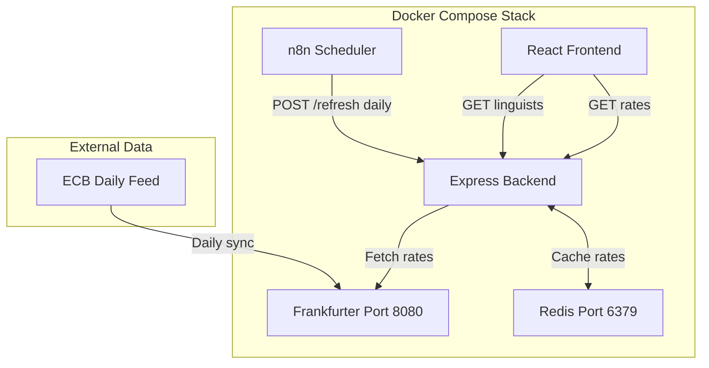

# Currency Conversion Architecture

## Overview

The currency conversion feature enables Project Managers to view linguist hourly rates in their preferred currency, facilitating easier comparison across linguists who may charge in different currencies.

## Architecture



## Key Design: Backend Fetches Frankfurter Directly

**Why this approach:**

1. **Centralized FX logic** - All rate fetching in one place (currencyService)
2. **On-demand fallback** - If Redis is empty, backend fetches fresh rates automatically
3. **Simpler n8n workflow** - Just a scheduler, no data transformation
4. **Easier testing** - Mock Frankfurter calls in unit tests
5. **Single code path** - Scheduled refresh and fallback use same fetch function

**Rate fetch triggers:**

| Trigger            | When                      | Action                       |
| ------------------ | ------------------------- | ---------------------------- |
| n8n scheduled      | Daily 8AM UTC             | POST `/api/currency/refresh` |
| On-demand fallback | Redis empty + rate needed | Auto-fetch from Frankfurter  |
| Manual refresh     | Admin action              | POST `/api/currency/refresh` |

## Redis Data Persistence

**Q: Is Redis data lost when updating the container?**

**A: No**, with this configuration:

- `appendonly yes` enables persistence to disk
- Named volume `redis-data:/data` survives container recreation
- Data only lost if you explicitly `docker volume rm linguistnow-redis-data`

Normal operations that preserve data:

- `docker-compose pull redis && docker-compose up -d redis`
- `docker-compose restart redis`
- `docker-compose down && docker-compose up -d`

## Supported Currencies (14)

`USD, EUR, GBP, JPY, CNY, CAD, AUD, CHF, INR, BRL, MXN, KRW, ZAR, SGD`

Note: RUB removed (ECB suspended since March 2022). UAH not added (not in ECB reference rates).

## Components

### Backend Service (`server/services/currencyService.ts`)

- **`refreshRates()`** - Fetches fresh rates from Frankfurter and stores in Redis
- **`getRates()`** - Gets rates from Redis, auto-fetches if empty
- **`convert()`** - Converts amount between currencies
- **`hasRates()`** - Checks if rates are cached

### API Routes (`server/routes/currencyRoutes.ts`)

| Method | Endpoint                | Purpose                                        |
| ------ | ----------------------- | ---------------------------------------------- |
| POST   | `/api/currency/refresh` | Trigger rate refresh (called by n8n scheduler) |
| GET    | `/api/currency/rates`   | Return current rates (auto-fetches if empty)   |
| GET    | `/api/currency/convert` | Convert amount (`?amount=50&from=EUR&to=USD`)  |
| GET    | `/api/currency/check`   | Check if rates are cached                      |

### Linguist Controller Updates

- Added `displayCurrency` query parameter to `SearchLinguistsQuery`
- Rate filtering moved from Airtable formula to post-query JavaScript when `displayCurrency` is set
- Rates converted using `currencyService.convert()`
- `hourlyRateConverted` included in response

### Frontend Updates

- Currency selector added to FilterBar (default: USD)
- Hardcoded `$` signs replaced with dynamic currency symbols
- "Rates converted to {currency}" indicator shown when conversion is active

## n8n Workflows

### Error Handler Subworkflow (`n8n/Error_Handler_Subworkflow.json`)

Shared sub-workflow for consistent error handling across scheduled tasks:

- Input: `{ success: boolean, failures: array, context: string }`
- IF node: Check `failures.length > 0`
- Email Send node: Alert on failures
- Set node: Log success

### FX Rate Update (`n8n/FX_Rate_Update.json`)

1. **Schedule Trigger**: Daily 8:00 AM UTC (`0 8 * * *`)
2. **HTTP Request**: POST `http://backend:5000/api/currency/refresh`
3. **Execute Workflow**: Call Error Handler with context "FX Rate Update"

### Token Refresh (Refactored)

Refactored to use shared sub-workflow:

1. Keep Schedule Trigger and HTTP Request
2. Replace IF + Email nodes with Execute Workflow node
3. Pass context "Token Refresh" to sub-workflow

## Benefits

- **DRY**: Error handling logic in one place
- **Consistent**: Same email format for all scheduled tasks
- **Extensible**: Easy to add more scheduled tasks
- **Maintainable**: Update error handling once, applies everywhere

## Redis Benefits for This Use Case

| Feature      | Benefit                                        |
| ------------ | ---------------------------------------------- |
| Persistence  | `appendonly yes` survives container restarts   |
| TTL          | Auto-expire stale rates after 48 hours         |
| Atomic ops   | Safe concurrent access                         |
| Lightweight  | Alpine image ~30MB                             |
| Future-ready | Can cache other data (linguist profiles, etc.) |

## Usage

### For Project Managers

1. Select display currency from dropdown in FilterBar
2. All linguist rates are automatically converted to selected currency
3. Rate filtering applies to converted rates
4. Indicator shows "Rates converted to {currency}" when active

### For Administrators

- Monitor n8n workflows for FX rate refresh failures
- Manual refresh: POST to `/api/currency/refresh`
- Check cache status: GET `/api/currency/check`

## Testing

### Unit Tests

**Run currency service tests:**

```bash
pnpm --filter ./server test currencyService
```

**Run currency routes tests:**

```bash
pnpm --filter ./server test currencyRoutes
```

**Run all tests:**

```bash
pnpm --filter ./server test
```

### Test Coverage

Tests cover:

- Redis caching (get/store operations)
- Frankfurter API integration
- Currency conversion logic (USD, non-USD, same currency)
- Error handling (API failures, Redis errors, unsupported currencies)
- Route handlers (all endpoints with success/error cases)

**View coverage:**

```bash
pnpm --filter ./server test --coverage
```

### Integration Testing

**Test full flow:**

1. Start services: `docker-compose up -d`
2. Wait for health checks to pass
3. Trigger refresh: `curl -X POST http://localhost:5000/api/currency/refresh`
4. Check rates: `curl http://localhost:5000/api/currency/rates`
5. Test conversion: `curl "http://localhost:5000/api/currency/convert?amount=100&from=USD&to=EUR"`

## Troubleshooting

### Rates not updating

1. Check n8n workflow is active and running
2. Verify Frankfurter container is healthy
3. Check Redis connection: `docker exec linguistnow-redis redis-cli ping`
4. Manual refresh: `curl -X POST http://localhost:5000/api/currency/refresh`

### Conversion errors

- Verify currency codes are supported (check `SUPPORTED_CURRENCIES`)
- Check Redis has rates: `docker exec linguistnow-redis redis-cli get fx:rates`
- Review server logs for conversion errors

### Testing Issues

**Tests failing:**

- Ensure all dependencies are installed: `pnpm install`
- Check Redis mock is working (tests don't require real Redis)
- Verify Frankfurter mock is set up correctly

**Coverage below threshold:**

- Run tests with coverage: `pnpm --filter ./server test --coverage`
- Review coverage report in `server/coverage/index.html`
- Add tests for uncovered branches
