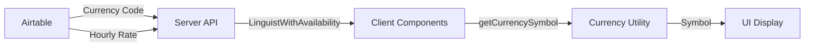
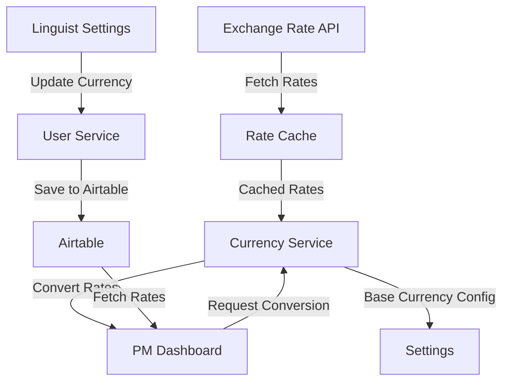
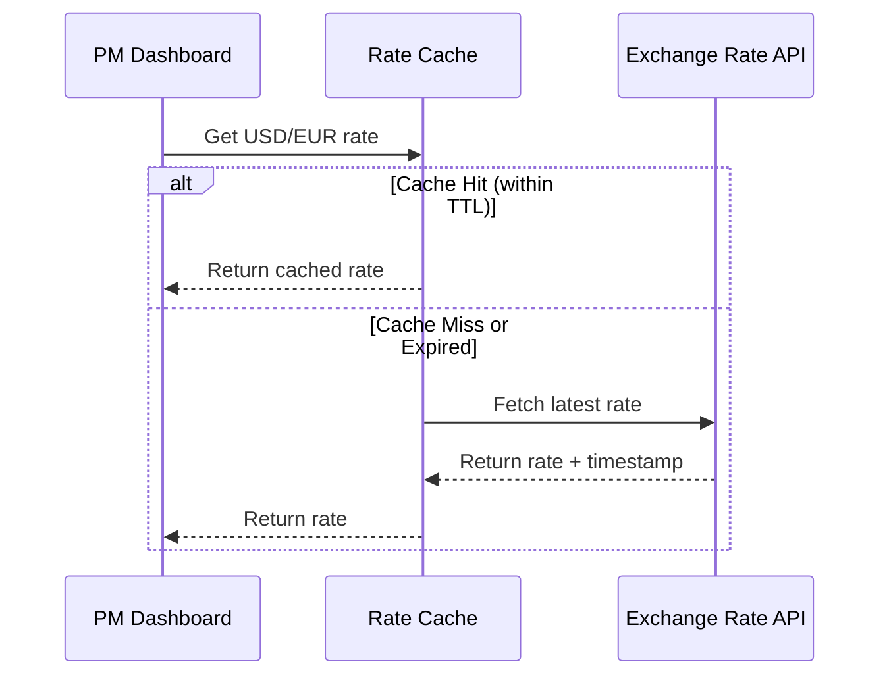

# Currency Support

## Overview

LinguistNow supports multi-currency hourly rates to accommodate linguists from different countries and regions. This document describes the current implementation and the planned currency exchange feature.

## Current Implementation

### Supported Currencies

The system currently supports 15 major currencies:

- **USD** ($) - US Dollar
- **EUR** (€) - Euro
- **GBP** (£) - British Pound
- **JPY** (¥) - Japanese Yen
- **CNY** (¥) - Chinese Yuan
- **CAD** (C$) - Canadian Dollar
- **AUD** (A$) - Australian Dollar
- **CHF** (CHF) - Swiss Franc
- **INR** (₹) - Indian Rupee
- **BRL** (R$) - Brazilian Real
- **MXN** (Mex$) - Mexican Peso
- **KRW** (₩) - South Korean Won
- **RUB** (₽) - Russian Ruble
- **ZAR** (R) - South African Rand
- **SGD** (S$) - Singapore Dollar

### Data Storage

Currency information is stored in Airtable:

- **Hourly Rate** field: `currency` type - stores the numeric rate value
- **Currency** field: `singleSelect` type - stores the ISO 4217 currency code (e.g., "USD", "EUR")

### Current Limitations

1. **No Currency Conversion**: Rates are displayed in their original currency without conversion
2. **No Comparison**: Project Managers cannot compare rates across different currencies
3. **Read-Only Currency Selection**: Linguists can set their hourly rate but cannot change their currency (currency field is read-only in the UI)
4. **Manual Currency Selection**: Currency must be set manually in Airtable; no automatic detection

### Display

- **Linguist Settings Page**: Shows hourly rate with currency symbol (e.g., "$20.00/hr", "€20.00/hr")
- **PM Dashboard**: Displays hourly rates with their respective currency symbols
- **Data Table**: Shows formatted rate with currency symbol (e.g., "$20.00/hr")

## Architecture

### Currency Utility

A shared utility (`client/src/utils/currency.ts`) provides:

- `CURRENCIES` array: Complete list of supported currencies with codes, symbols, and names
- `getCurrencySymbol(currencyCode)`: Function to get currency symbol from ISO 4217 code

```typescript
export interface Currency {
  code: string;
  symbol: string;
  name: string;
}

export function getCurrencySymbol(currencyCode?: string): string;
```

### Data Flow



### Component Integration

- **LinguistCard**: Uses `getCurrencySymbol()` to display rate with symbol
- **DataTable Columns**: Uses `getCurrencySymbol()` for table cell rendering
- **LinguistProfileSettings**: Uses `CURRENCIES` array for currency dropdown

## Future: Currency Exchange Support

### Planned Features

#### 1. Real-Time Exchange Rates

- Integrate with a currency exchange rate API (e.g., ExchangeRate-API, Fixer.io, or Open Exchange Rates)
- Cache exchange rates with appropriate TTL (e.g., 1 hour for free tiers, 5 minutes for paid tiers)
- Support for historical rates if needed for reporting

#### 2. Currency Conversion in PM Dashboard

- Convert all linguist rates to a base currency (configurable, default: USD)
- Display both original and converted rates
- Allow PMs to filter and sort by converted rates
- Show conversion rate and last updated timestamp

#### 3. Linguist Currency Selection

- Enable currency dropdown in Linguist Settings (currently read-only)
- Allow linguists to change their currency
- Automatically convert existing rate when currency changes (optional, with confirmation)

#### 4. Cost Efficiency Analysis

- Calculate cost per hour in base currency for all available linguists
- Sort linguists by cost efficiency (rate / availability hours)
- Highlight most cost-effective options
- Filter by maximum budget in base currency

### Proposed Architecture



### Implementation Plan

#### Phase 1: Exchange Rate Integration

- [ ] Add exchange rate API client
- [ ] Implement rate caching (Redis or in-memory)
- [ ] Create currency conversion service
- [ ] Add rate refresh mechanism

#### Phase 2: PM Dashboard Conversion

- [ ] Add base currency selector to dashboard
- [ ] Convert all rates to base currency
- [ ] Display both original and converted rates
- [ ] Add conversion rate metadata

#### Phase 3: Enhanced Filtering

- [ ] Filter by maximum budget (in base currency)
- [ ] Sort by cost efficiency
- [ ] Highlight cost-effective options
- [ ] Add cost comparison tooltips

#### Phase 4: Linguist Currency Management

- [ ] Enable currency dropdown in settings
- [ ] Add currency change confirmation
- [ ] Optional rate conversion on currency change
- [ ] Update validation and error handling

### Technical Considerations

#### Exchange Rate API Selection

**Recommended Options:**

1. **ExchangeRate-API** (Free tier: 1,500 requests/month)
   - Simple REST API
   - Good for development and small deployments

2. **Fixer.io** (Free tier: 100 requests/month)
   - More comprehensive
   - Historical data available

3. **Open Exchange Rates** (Free tier: 1,000 requests/month)
   - Good documentation
   - Reliable service

**Considerations:**

- Rate limits and pricing
- Data freshness requirements
- Fallback mechanisms for API failures
- Compliance with API terms of service

#### Caching Strategy



#### Base Currency Configuration

- Default: USD (configurable via environment variable)
- Allow PMs to select their preferred base currency
- Store preference in user settings or session

#### Error Handling

- Graceful degradation: Show original rates if conversion fails
- Clear error messages for API failures
- Fallback to last known rates if API is unavailable
- Logging for monitoring and debugging

### User Experience

#### PM Dashboard

**Current State:**

```
Linguist A: $20.00/hr (USD)
Linguist B: €18.00/hr (EUR)
Linguist C: £15.00/hr (GBP)
```

**With Currency Exchange:**

```
Base Currency: USD

Linguist A: $20.00/hr (USD) = $20.00/hr
Linguist B: €18.00/hr (EUR) ≈ $19.80/hr (1.10 USD/EUR)
Linguist C: £15.00/hr (GBP) ≈ $19.50/hr (1.30 USD/GBP)

Sort by: Cost Efficiency (Lowest First)
```

#### Linguist Settings

**Current State:**

- Currency field: Read-only (disabled)
- Helper text: "Currency selection will be available with currency exchange support"

**Future State:**

- Currency field: Enabled dropdown
- On currency change: Optional rate conversion prompt
- Display: "Changing from USD to EUR. Convert $20.00 to €18.00? (Rate: 1.11)"

### Data Model Updates

#### Server-Side

```typescript
// New fields in LinguistWithAvailability
interface LinguistWithAvailability {
  // ... existing fields
  hourlyRate?: number;
  currency?: string;
  convertedRate?: number; // Rate in base currency
  conversionRate?: number; // Exchange rate used
  baseCurrency?: string; // Base currency for conversion
}
```

#### Client-Side

```typescript
// New state in Dashboard
interface DashboardState {
  baseCurrency: string;
  exchangeRates: Record<string, number>;
  ratesLastUpdated: Date;
}
```

### API Endpoints (Future)

```
GET /api/currency/rates
  - Returns current exchange rates
  - Cached response

GET /api/currency/rates/:base
  - Returns rates for specific base currency
  - Example: /api/currency/rates/USD

POST /api/currency/convert
  - Convert amount from one currency to another
  - Body: { amount: number, from: string, to: string }
  - Returns: { converted: number, rate: number }
```

### Security Considerations

- Validate currency codes to prevent injection
- Sanitize exchange rate API responses
- Rate limit conversion requests
- Monitor for unusual conversion patterns
- Store API keys securely (environment variables, Vault)

### Performance Considerations

- Cache exchange rates aggressively (1-5 minute TTL)
- Batch convert rates server-side
- Lazy load conversion data in dashboard
- Use memoization for repeated conversions
- Consider CDN caching for static rate data

## Migration Path

### Phase 1: Preparation

1. Enable currency field in Linguist Settings (remove read-only)
2. Add exchange rate API integration (backend only)
3. Test conversion logic with sample data

### Phase 2: Gradual Rollout

1. Add base currency selector to dashboard (default: USD)
2. Show converted rates alongside original rates
3. Allow PMs to toggle between original and converted views

### Phase 3: Full Feature

1. Enable filtering and sorting by converted rates
2. Add cost efficiency calculations
3. Enable currency changes in Linguist Settings
4. Add conversion history and audit logging

## Related Documentation

- [Dashboard Design](./dashboard-design.md) - PM dashboard architecture
- [Linguist Settings Design](./linguist-settings-design.md) - Linguist profile settings
- [Store User Data in Airtable](../integrations/store-user-data-in-airtable.md) - Airtable schema

## References

- [ISO 4217 Currency Codes](https://www.iso.org/iso-4217-currency-codes.html)
- [ExchangeRate-API Documentation](https://www.exchangerate-api.com/docs)
- [Fixer.io Documentation](https://fixer.io/documentation)
