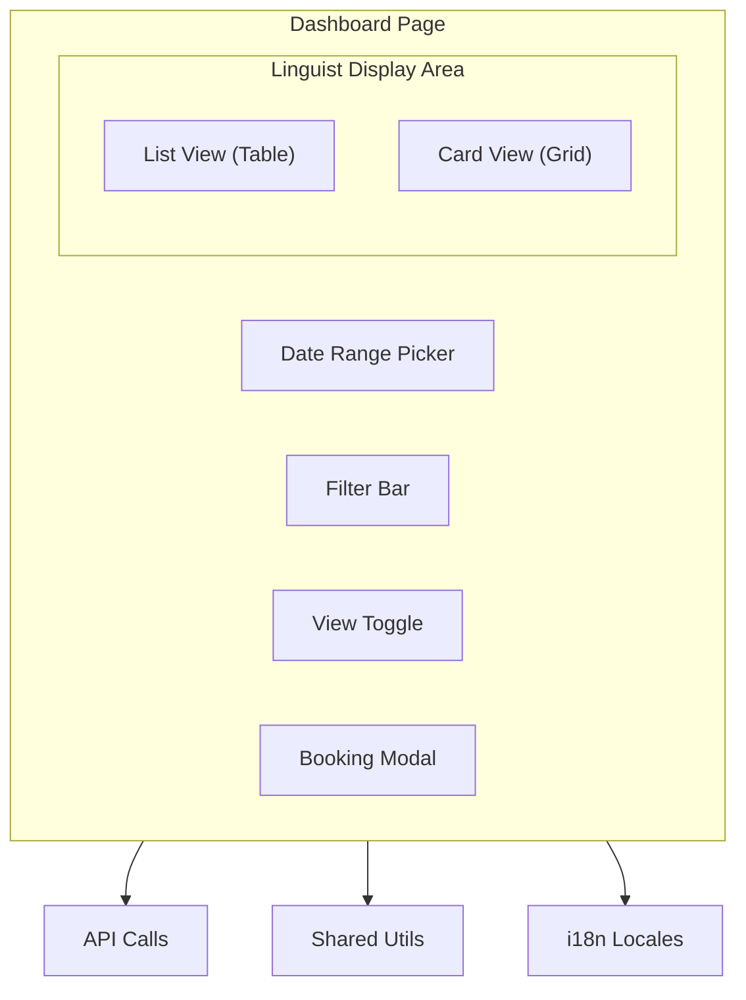
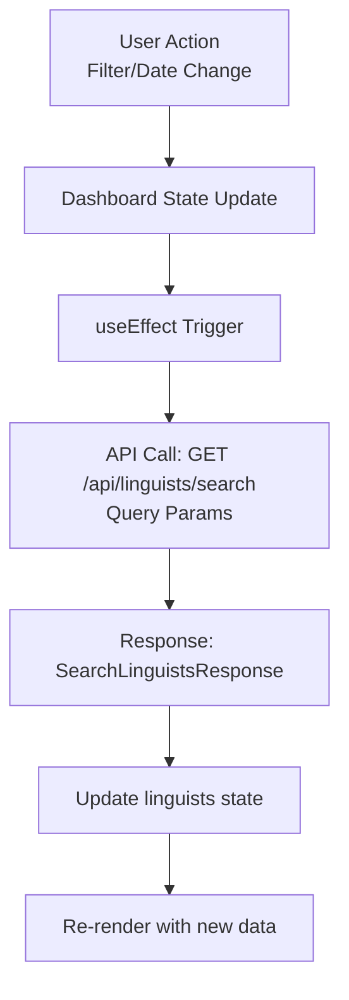
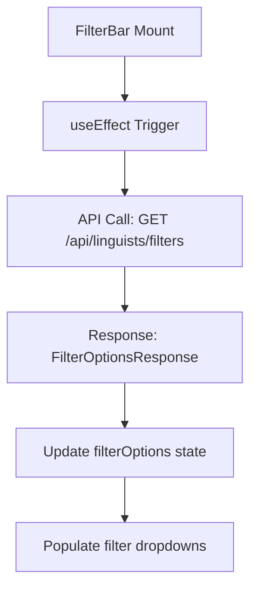
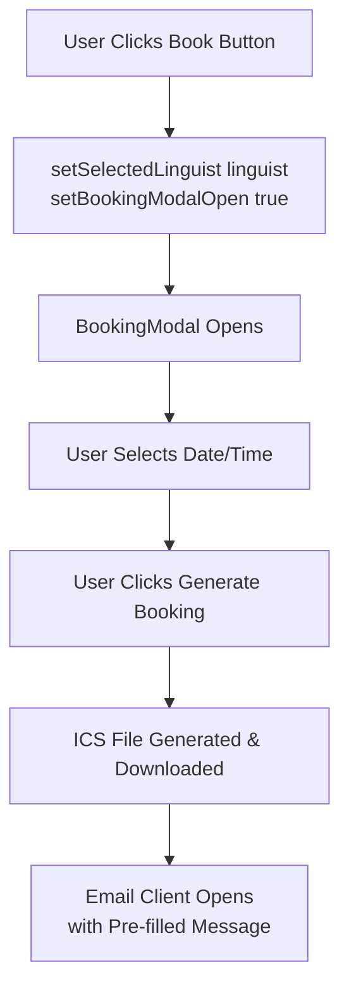
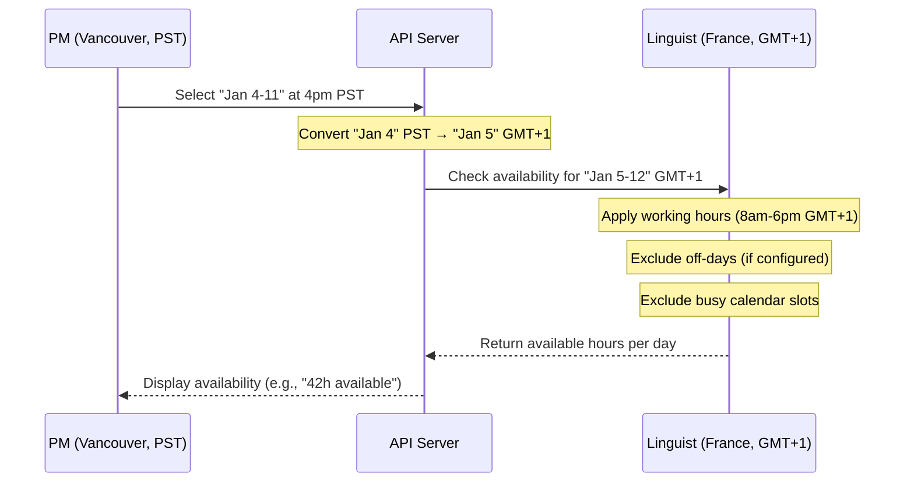

# Dashboard Design Document

## Overview

The **Project Manager Dashboard** is the core feature of LinguistNow, enabling project managers to search, filter, and book available linguists for translation projects. The dashboard provides real-time availability information by integrating with linguists' Google Calendars.

## Table of Contents

- [Purpose](#purpose)
- [Architecture](#architecture)
- [Key Features](#key-features)
- [Component Structure](#component-structure)
- [Data Flow](#data-flow)
- [State Management](#state-management)
- [API Integration](#api-integration)
- [User Interactions](#user-interactions)
- [Technical Implementation](#technical-implementation)
- [Future Enhancements](#future-enhancements)

## Purpose

The dashboard solves the core problem of finding available linguists by:

1. **Real-time Availability**: Checks linguists' Google Calendars to show current availability
2. **Advanced Filtering**: Allows filtering by languages, specialization, rates, ratings, and availability
3. **Date Range Selection**: Enables selecting future date ranges for project planning
4. **Multiple View Modes**: Provides both list (table) and card views for different preferences
5. **Direct Booking**: Allows project managers to book linguists and generate calendar invites

## Architecture

### High-Level Architecture



### Component Hierarchy

```mermaid
graph TD
    Dashboard["Dashboard (Page)"]

    Dashboard --> Hero["Hero"]

    Dashboard --> DateRangePicker["DateRangePicker"]
    DateRangePicker --> DateInput1["DateInput (x2)"]
    DateRangePicker --> Calendar["Calendar (react-day-picker)"]
    DateRangePicker --> PresetButtons["Preset Buttons"]

    Dashboard --> FilterBar["FilterBar"]
    FilterBar --> LanguageSelect["Language Select"]
    FilterBar --> SpecializationSelect["Specialization Select"]
    FilterBar --> RateSlider["Rate Range Slider"]
    FilterBar --> RatingSelect["Rating Select"]
    FilterBar --> ProjectSizeInput["Project Size Input"]
    FilterBar --> AvailabilityToggle["Availability Toggle"]

    Dashboard --> ViewToggle["View Mode Toggle (Tabs)"]

    Dashboard --> LinguistDisplay["Linguist Display"]
    LinguistDisplay --> LinguistTable["LinguistTable (List View)"]
    LinguistDisplay --> LinguistCards["LinguistCard[] (Card View)"]
    LinguistCards --> BookingButton["Booking Button"]

    Dashboard --> BookingModal["BookingModal"]
    BookingModal --> DateSelection["Date Selection"]
    BookingModal --> TimeSelection["Time Selection"]
    BookingModal --> ICSGenerator["ICS Generator"]
```



## Key Features

### 1. Date Range Picker

**Purpose**: Select future date ranges for availability checking.

**Features**:

- **Preset Options**: Quick selection for common ranges (Next 7/14/30 days, Next Week, Next Month)
- **Custom Range**: Manual date selection with calendar interface
- **Locale-Aware**: Respects locale-specific week start days (Sunday vs Monday)
- **Future Dates Only**: Prevents selection of past dates
- **Two-Month Calendar**: Shows two months side-by-side for easier range selection

**Technical Details**:

- Uses `react-day-picker` for calendar UI
- Integrates with `date-fns` for date formatting
- Leverages shared `getWeekStartsOn()` utility for locale consistency
- Preset calculations use extracted `getPresetRange()` utility (testable)

**User Flow**:

1. User clicks date range picker button
2. Popover opens with calendar and presets
3. User selects preset OR manually picks dates
4. Dates are formatted and applied to filters
5. Search automatically triggers with new date range

### 2. Filter Bar

**Purpose**: Filter linguists by multiple criteria.

**Filter Options**:

| Filter         | Type         | Description                                                            |
| -------------- | ------------ | ---------------------------------------------------------------------- |
| Languages      | Multi-select | Filter by language pairs (e.g., "English → French")                    |
| Specialization | Multi-select | Filter by translation specialization                                   |
| Hourly Rate    | Range Slider | Filter by minimum/maximum hourly rate                                  |
| Minimum Rating | Select       | Filter by star rating (1-5)                                            |
| Project Size   | Number Input | Filter by required hours for project (auto-calculated from date range) |
| Availability   | Toggle       | Show only available linguists                                          |

**Project Size Auto-Calculation**:

The "Project Size" field is automatically set and updated based on the selected date range:

- **Default Calculation**: Uses `calculateEstimatedHours()` which assumes 8 hours per working day (Monday-Friday)
- **Formula**: `workingDays × 8 hours = estimatedHours`
- **Example**: 7-day range (5 working days) = 40 hours
- **Auto-Update**: When PM changes the date range, `requiredHours` is automatically recalculated
- **Manual Override**: PM can still manually edit the value if needed
- **Purpose**: Ensures filtering matches the estimated project size, reducing manual input

**Features**:

- **Dynamic Options**: Filter options loaded from API (`/api/linguists/filters`)
- **Active Filter Badges**: Visual indicators for selected filters
- **Clear All**: One-click reset of all filters
- **Responsive Grid**: Adapts to screen size (1-3 columns)

**Technical Details**:

- Uses Radix UI Select components for dropdowns
- Slider component for rate range
- Badge components for active filter display
- Filters are combined into single API query

### 3. View Modes

**List View (Table)**:

- Tabular format with sortable columns
- Shows: Name, Languages, Specialization, Rate, Rating, Availability Status
- Best for: Quick scanning and comparison

**Card View (Grid)**:

- Card-based layout (1-2 columns responsive)
- Shows: Profile picture, name, languages, specialization, rate, rating, availability
- Includes booking button for available linguists
- Best for: Visual browsing and detailed review

**Features**:

- Toggle between views with tabs
- View preference could be persisted (future enhancement)
- Both views show same data, different presentation

### 4. Booking Modal

**Purpose**: Book a linguist and generate calendar invite.

**Features**:

- Date and time selection
- Generates `.ics` file for calendar import
- Pre-fills email with booking details
- Includes attachment note for calendar file

**User Flow**:

1. Click "Book" button on available linguist
2. Modal opens with date/time pickers
3. User selects booking date and time
4. User clicks "Generate Booking"
5. ICS file downloads
6. Email client opens with pre-filled message
7. User attaches ICS file and sends

## Component Structure

### Dashboard.tsx

**Responsibilities**:

- Main state management (filters, linguists, view mode)
- API calls to search endpoint
- Coordinating child components
- Handling filter changes and date range updates

**State**:

```typescript
- linguists: LinguistWithAvailability[]
- loading: boolean
- viewMode: 'list' | 'card'
- filters: SearchLinguistsQuery
- selectedLinguist: LinguistWithAvailability | null
- bookingModalOpen: boolean
```

### DateRangePicker.tsx

**Responsibilities**:

- Date range selection UI
- Preset calculations
- Locale-aware date formatting
- Integration with shared date utilities

**Props**:

```typescript
{
  startDate?: string  // ISO date string (YYYY-MM-DD)
  endDate?: string    // ISO date string (YYYY-MM-DD)
  onDateChange: (startDate, endDate) => void
}
```

### FilterBar.tsx

**Responsibilities**:

- Filter UI components
- Fetching filter options from API
- Managing active filter state
- Clear filters functionality

**Props**:

```typescript
{
  filters: SearchLinguistsQuery
  onFiltersChange: (filters) => void
  onClearFilters: () => void
}
```

### LinguistTable.tsx & LinguistCard.tsx

**Responsibilities**:

- Display linguist data in respective formats
- Show availability status
- Handle booking button clicks

## Data Flow

### Search Flow



### Filter Options Flow



### Booking Flow



## State Management

### Local State (React Hooks)

The dashboard uses React hooks for state management:

- **useState**: Component-level state (filters, linguists, view mode)
- **useEffect**: Side effects (API calls, filter updates)
- **useMemo**: Computed values (default dates, weekStartsOn)

### State Updates

1. **Filter Changes**: Updates `filters` state → triggers API call
2. **Date Range Changes**: Updates `filters.startDate` and `filters.endDate` → triggers API call
3. **View Mode Toggle**: Updates `viewMode` state → re-renders display
4. **Booking Action**: Updates `selectedLinguist` and `bookingModalOpen` → opens modal

### Default State

```typescript
filters: {
  startDate: tomorrow (ISO string)
  endDate: 7 days from today (ISO string)
  page: 1
  limit: 20
}
```

## API Integration

### Timezone Conversion and Availability Calculation

**Problem**: PMs select availability dates from their own timezone perspective, but each linguist has their own timezone, working hours, and off-days. We need to correctly convert the PM's selected dates to each linguist's timezone and apply their availability preferences.

**Solution**: Multi-step timezone conversion and availability calculation:

1. **PM Date Selection**: PM selects calendar dates (e.g., "Jan 4" to "Jan 11") from their timezone (e.g., Vancouver, PST)
2. **Timezone Conversion**: Convert PM's calendar dates to linguist's timezone
   - Example: PM in Vancouver selects "Jan 4" at 4pm PST
   - In France (GMT+1), it's already "Jan 5" at 1am
   - So for the French linguist, we check "Jan 5", not "Jan 4"
3. **Working Hours Application**: Within the converted date range, apply linguist's working hours (e.g., 8am-6pm in their timezone)
4. **Off-Days Filtering**: Exclude linguist's configured off-days (e.g., weekends, holidays)
5. **Busy Slot Exclusion**: Remove time slots where linguist has calendar events
6. **Hours Calculation**: Sum available hours per day, then total across the date range

**Implementation Details**:

- **Date Conversion**: `calculateAvailability()` in `server/services/availabilityService.ts` receives `pmTimezone` (PM's timezone) and `timezone` (linguist's timezone)
- **Calendar Date Mapping**: PM's calendar dates are converted to linguist's calendar dates using `fromZonedTime()` and `toZonedTime()` from `date-fns-tz`
- **Working Hours**: Applied in linguist's timezone using `excludeNonWorkingHours()`
- **Off-Days**: Applied using `excludeOffDays()` based on linguist's configured off-days (empty array = no off-days)
- **Hours Per Day**: Calculated by splitting multi-day slots across days and capping each day to working hours boundaries

**Example Flow**:



**Key Points**:

- PM's calendar dates are **converted** to linguist's calendar dates, not just timezone-adjusted
- This ensures we check the correct calendar days in the linguist's timezone
- Working hours and off-days are always applied in the linguist's timezone
- The calculation respects timezone boundaries and DST transitions

### Automatic Token Refresh

The dashboard leverages automatic token refresh to ensure uninterrupted availability checking:

- **Transparent Refresh**: When checking linguist availability, expired access tokens are automatically refreshed before API calls
- **Shared Token Storage**: Tokens are stored in Vault and shared between dashboard and linguist settings pages
- **DRY Principle**: Token refresh happens once per user, benefiting both endpoints
- **User Impact**: PMs never see "session expired" errors for access token expiration (1 hour expiry)
- **Implementation**: Uses `withAutoRefresh()` utility from `server/utils/tokenRefresh.ts`

**Flow:**

1. Dashboard requests availability check for a linguist
2. Server calls `withAutoRefresh(userEmail, getFreeBusy)`
3. If access token expired → automatically refreshed and saved to Vault
4. Availability check proceeds with fresh token
5. Result: PM sees accurate availability without interruption

**Note**: Users only need to re-authenticate if their refresh token is invalid/expired (6 months of inactivity).

### Search Endpoint

**Endpoint**: `GET /api/linguists/search`

**Query Parameters**:

- `languages`: Comma-separated language pairs
- `specialization`: Comma-separated specializations
- `minRate`: Minimum hourly rate
- `maxRate`: Maximum hourly rate
- `minRating`: Minimum rating (1-5)
- `availableOnly`: Boolean (true/false)
- `requiredHours`: Number of hours required
- `timezone`: Timezone string
- `startDate`: ISO date string (YYYY-MM-DD)
- `endDate`: ISO date string (YYYY-MM-DD)
- `page`: Page number (pagination)
- `limit`: Results per page

**Response**:

```typescript
{
  linguists: LinguistWithAvailability[]
  total: number
  page: number
  limit: number
}
```

### Filters Endpoint

**Endpoint**: `GET /api/linguists/filters`

**Response**:

```typescript
{
  languages: string[]
  specializations: string[]
  rateRange: {
    min: number
    max: number
  }
}
```

## User Interactions

### Primary Actions

1. **Select Date Range**
   - Click date picker → Select preset or custom range → Apply

2. **Apply Filters**
   - Select filter options → Results update automatically

3. **Change View Mode**
   - Click list/card tab → View switches

4. **Book Linguist**
   - Click "Book" button → Select date/time → Generate booking

5. **Clear Filters**
   - Click "Clear" button → All filters reset to defaults

### Error Handling

- **API Errors**: Logged to console, empty results shown
- **Loading States**: Skeleton component displayed during fetch
- **No Results**: Friendly message displayed

## Technical Implementation

### Internationalization

All user-facing strings are externalized to i18n locale files:

- Date formatting uses `date-fns` with locale objects
- Week start day respects locale (via `getWeekStartsOn()`)
- All UI text uses `t()` function from `react-i18next`

### Date Handling

- **Shared Utilities**: `getWeekStartsOn()`, `getDateFnsLocale()` in `@linguistnow/shared`
- **Preset Calculations**: Extracted to `client/src/utils/date-presets.ts` for testability
- **Formatting**: Uses `date-fns` `format()` with locale-specific patterns
- **Timezone Conversion**: PM's calendar dates are converted to linguist's timezone before availability calculation
  - PM selects dates from their timezone (e.g., "Jan 4" in Vancouver)
  - Dates are converted to linguist's timezone (e.g., "Jan 5" in France if it's already past midnight)
  - Working hours and off-days are applied in linguist's timezone
- **Project Hours Calculation**: `calculateEstimatedHours()` in `client/src/utils/project-hours-calculator.ts`
  - Counts working days (Monday-Friday) in the date range
  - Multiplies by 8 hours per day
  - Used to auto-populate the "Project Size" filter

### Type Safety

- **Shared Types**: `SearchLinguistsQuery`, `LinguistWithAvailability` from `@linguistnow/shared`
- **TypeScript Strict Mode**: Full type coverage
- **Component Props**: Explicitly typed interfaces

### Performance

- **Debouncing**: Could be added for filter inputs (future enhancement)
- **Memoization**: `useMemo` for computed values
- **Pagination**: Server-side pagination to limit data transfer
- **Lazy Loading**: Filter options loaded once on mount

### Accessibility

- **Keyboard Navigation**: Full keyboard support via Radix UI components
- **Screen Readers**: Proper ARIA labels and roles
- **Focus Management**: Proper focus handling in modals and popovers

## Future Enhancements

### Planned Features

1. **Advanced Date Selection**
   - Recurring date patterns
   - Multiple date ranges
   - Timezone-aware scheduling

2. **Enhanced Filtering**
   - Saved filter presets
   - Filter history
   - Advanced search (full-text)

3. **Improved Views**
   - Map view (geographic)
   - Timeline view (availability over time)
   - Comparison view (side-by-side)

4. **Booking Improvements**
   - Recurring bookings
   - Bulk booking
   - Booking templates

5. **Performance**
   - Filter debouncing
   - Virtual scrolling for large lists
   - Caching of filter options

6. **User Experience**
   - View preference persistence
   - Recent searches
   - Favorite linguists
   - Export results (CSV/PDF)

## Related Documentation

- [Architecture Overview](./architecture-overview.md) - Overall system architecture
- [API Documentation](../api/api-documentation.md) - API endpoint details
- [Google Calendar Integration](../integrations/integration-of-google-calendar-api.md) - Calendar API implementation
- [Internationalization](../development/internationalization-using-i18next.md) - i18n implementation
- [Testing and TDD](../development/testing-and-tdd.md) - Testing approach
