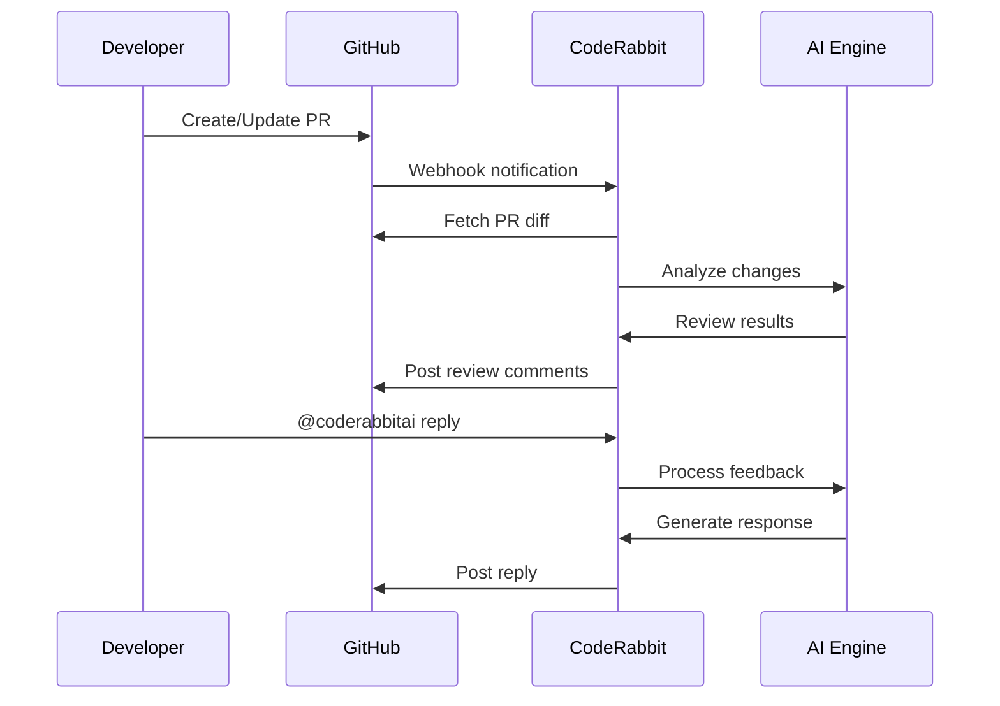

# Automated Code Reviews Using CodeRabbit

CodeRabbit provides AI-powered code reviews for pull requests, automatically analyzing changes for bugs, security issues, and code quality.

## Table of Contents

- [Overview](#overview)
- [Why CodeRabbit over GitHub Copilot?](#why-coderabbit-over-github-copilot)
- [Architecture](#architecture)
- [Configuration](#configuration)
  - [Repository Configuration](#repository-configuration-coderabbityaml)
  - [Organization Settings](#organization-settings-web-ui)
- [Path-Specific Instructions](#path-specific-instructions)
- [Security Review Rules](#security-review-rules)
- [Interacting with CodeRabbit](#interacting-with-coderabbit)
- [Auto-Labeling](#auto-labeling)
- [Filtered Paths](#filtered-paths)
- [Skipped PRs](#skipped-prs)
- [Troubleshooting](#troubleshooting)
- [Related Documentation](#related-documentation)

## Overview

| Aspect            | Details                                                  |
| ----------------- | -------------------------------------------------------- |
| **What it does**  | Automated AI code reviews on PRs                         |
| **Pricing**       | Free for open source, paid for private repos             |
| **Integration**   | GitHub App                                               |
| **Configuration** | `.coderabbit.yaml` in repo root + org settings in web UI |
| **Documentation** | [docs.coderabbit.ai](https://docs.coderabbit.ai/)        |

## Why CodeRabbit over GitHub Copilot?

For open source projects, CodeRabbit offers significant advantages:

| Feature                      | CodeRabbit                | GitHub Copilot Code Review            |
| ---------------------------- | ------------------------- | ------------------------------------- |
| **OSS Pricing**              | Free                      | Requires subscription ($10+/mo)       |
| **Primary Focus**            | Dedicated PR code reviews | Code completion (review is secondary) |
| **Path-specific rules**      | Yes (`.coderabbit.yaml`)  | Limited                               |
| **Auto-labeling PRs**        | Yes                       | No                                    |
| **Learning from feedback**   | Yes (knowledge base)      | No                                    |
| **Sequence diagrams in PRs** | Yes                       | No                                    |
| **Custom review profile**    | Yes (chill/assertive)     | No                                    |
| **Tool integrations**        | ESLint, Hadolint, etc.    | Limited                               |

**Key reasons we chose CodeRabbit:**

1. **Free for open source** - No subscription required for public repositories
2. **Purpose-built for reviews** - Not a side feature of a coding assistant
3. **Highly customizable** - Path-specific instructions match our project structure
4. **Security-focused** - Enforces input validation, ReDoS prevention, and more
5. **Learns from feedback** - Improves over time based on team responses

## Architecture



## Configuration

### Repository Configuration (`.coderabbit.yaml`)

The repository configuration file defines project-specific review settings:

```yaml
# yaml-language-server: $schema=https://coderabbit.ai/integrations/schema.v2.json
language: en-US
early_access: true

reviews:
  profile: chill # Less aggressive reviews
  high_level_summary: true # Auto-generate PR summaries
  sequence_diagrams: true # Visual flow diagrams
  path_instructions: # Directory-specific rules
    - path: "client/**"
      instructions: |
        - Use i18n for all user-facing strings
    - path: "server/**"
      instructions: |
        - Validate all request inputs
```

### Organization Settings (Web UI)

Additional settings configured at [app.coderabbit.ai/settings](https://app.coderabbit.ai/settings):

| Setting                 | Value                       | Purpose                   |
| ----------------------- | --------------------------- | ------------------------- |
| `labeling_instructions` | security, i18n, needs-tests | Auto-label PRs by content |
| `tools.eslint`          | enabled                     | Run ESLint checks         |
| `tools.hadolint`        | enabled                     | Lint Dockerfiles          |
| `tools.shellcheck`      | enabled                     | Lint shell scripts        |
| `tools.yamllint`        | enabled                     | Lint YAML files           |

## Path-Specific Instructions

CodeRabbit applies different review rules based on file paths:

| Path                         | Key Rules                                          |
| ---------------------------- | -------------------------------------------------- |
| `client/src/components/**`   | i18n required, React hooks, accessibility          |
| `client/src/i18n/locales/**` | All 11 locales must be updated                     |
| `server/controllers/**`      | Input validation, ReDoS prevention, path traversal |
| `server/services/**`         | Unit tests required, TDD principles                |
| `server/routes/**`           | Swagger documentation required                     |
| `shared/src/**`              | API First, avoid breaking changes                  |
| `docs/**`                    | Use Mermaid diagrams                               |
| `**/*.test.ts`               | TDD, edge cases, mock external dependencies        |
| `**/Dockerfile`              | Multi-stage builds, security best practices        |

## Security Review Rules

CodeRabbit enforces these security practices for server code:

```typescript
// ✅ Input validation (required)
const { code } = req.body;
if (!code || typeof code !== "string" || code.trim().length === 0) {
  return res.status(400).json({ error: "Invalid authorization code" });
}

// ✅ ReDoS prevention (required)
if (email.trim().length > 254) return false;
return /^[^\s@]+@[^\s@]+\.[^\s@]+$/.test(email.trim());

// ✅ Path traversal prevention (required)
if (
  userEmail.includes("..") ||
  userEmail.includes("/") ||
  userEmail.includes("\\")
) {
  throw new Error("Invalid email: path traversal characters");
}

// ✅ Log sanitization (required)
const safeInput = userInput.replace(/%/g, "%%");
console.log(`Processing: ${safeInput}`);
```

## Interacting with CodeRabbit

### In PR Comments

| Command                       | Action                    |
| ----------------------------- | ------------------------- |
| `@coderabbitai summary`       | Generate PR summary       |
| `@coderabbitai review`        | Request re-review         |
| `@coderabbitai resolve`       | Resolve all conversations |
| `@coderabbitai configuration` | Show current config       |
| `@coderabbitai help`          | Show available commands   |

### Providing Feedback

Reply to CodeRabbit comments to:

- Explain why a suggestion doesn't apply
- Ask for clarification
- Request alternative solutions

CodeRabbit learns from feedback and improves future reviews.

## Auto-Labeling

PRs are automatically labeled based on content:

| Label             | Trigger                                            |
| ----------------- | -------------------------------------------------- |
| `security`        | Input validation, auth, or sanitization changes    |
| `i18n`            | Internationalization string or locale file changes |
| `breaking-change` | Changes to `shared/` types or public APIs          |
| `needs-tests`     | New functionality without corresponding test files |

## Filtered Paths

These paths are ignored to reduce noise:

- `**/dist/**` - Build output
- `**/build/**` - Build output
- `**/coverage/**` - Test coverage reports
- `**/node_modules/**` - Dependencies
- `**/*.lock` - Lock files
- `**/pnpm-lock.yaml` - pnpm lock file
- `**/*.min.js` - Minified JavaScript
- `**/*.min.css` - Minified CSS

## Skipped PRs

PRs with these title keywords are not reviewed:

- `WIP` - Work in progress
- `DO NOT MERGE` - Not ready for merge
- `[skip ci]` - CI skip marker

## Troubleshooting

### Reviews Not Appearing

1. Check that CodeRabbit GitHub App is installed
2. Verify PR targets a configured base branch (`main` or `develop`)
3. Ensure PR title doesn't contain skip keywords
4. Check if PR is a draft (drafts are skipped)

### Too Many Comments

1. Switch to `profile: chill` for less aggressive reviews
2. Add paths to `path_filters` to ignore noisy files
3. Use `@coderabbitai resolve` to batch-resolve comments

### Incorrect Suggestions

1. Reply to the comment explaining the issue
2. CodeRabbit learns from feedback
3. Add path-specific instructions to prevent future occurrences

## Related Documentation

- [Testing and TDD](./testing-and-tdd.md) - Testing guidelines enforced by CodeRabbit
- [TypeScript Guidelines](./typescript-guidelines.md) - Type safety rules
- [Internationalization](./internationalization-using-i18next.md) - i18n requirements
- [API Documentation](./api-documentation.md) - Swagger documentation standards
