# Deploy LinguistNow to Production

This guide covers deploying LinguistNow to a **Synology DS425+ NAS with Portainer** for container management. The deployment includes:

- **Frontend**: React application served by Nginx
- **Backend**: Node.js Express API server
- **n8n**: Workflow automation for calendar availability checks

---

## Table of Contents

- [Prerequisites](#prerequisites)
- [Architecture Overview](#architecture-overview)
- [Step 1: Configure GitHub Repository Secrets (For CI/CD)](#step-1-configure-github-repository-secrets-for-cicd)
- [Step 2: Update Google OAuth Configuration](#step-2-update-google-oauth-configuration)
- [Step 3: Install Portainer on Synology](#step-3-install-portainer-on-synology)
- [Step 4: Choose Deployment Method](#step-4-choose-deployment-method)
  - [Understanding Vite Build-time Variables](#understanding-vite-build-time-variables)
  - [Option A: Use Pre-built Images](#option-a-use-pre-built-images-quick-start--testing)
  - [Option B: Build Frontend Locally](#option-b-build-frontend-locally-with-custom-urls-production)
  - [Option C: Use docker-compose.yml](#option-c-use-docker-composeyml-to-build-everything)
- [Step 5: Configure Environment Variables](#step-5-configure-environment-variables)
  - [Required Backend Environment Variables](#required-backend-environment-variables)
  - [Frontend Build-time Variables](#frontend-build-time-variables-only-when-building)
- [Step 6: Deploy with Portainer](#step-6-deploy-with-portainer)
  - [Option A: Quick Deploy with Pre-built Images](#option-a-quick-deploy-with-pre-built-images)
  - [Option B: Deploy via Git Repository](#option-b-deploy-via-git-repository-builds-from-source)
  - [Option C: Deploy via docker-compose CLI](#option-c-deploy-via-docker-compose-cli-ssh)
- [Step 7: Configure n8n Workflow](#step-7-configure-n8n-workflow)
- [Step 8: Verify Deployment](#step-8-verify-deployment)
  - [Check Container Health](#check-container-health)
  - [Test the Application](#test-the-application)
  - [Test OAuth Flow](#test-oauth-flow)
- [Step 9: Configure External Access](#step-9-configure-external-access-choose-one)
  - [Option A: Cloudflare Tunnel (Recommended)](#option-a-cloudflare-tunnel-recommended)
  - [Option B: Synology's Built-in Reverse Proxy](#option-b-synologys-built-in-reverse-proxy)
- [Troubleshooting](#troubleshooting)
- [Maintenance](#maintenance)
- [Security Recommendations](#security-recommendations)

---

## Prerequisites

1. **Synology NAS** (DS425+ or similar with Docker support)
2. **Container Manager** or **Docker** package installed on Synology
3. **Portainer** installed for container management (recommended)
4. **Google OAuth credentials** configured (see [Set up OAuth in Google Cloud](./set-up-oauth-in-google-cloud.md))
5. **Airtable database** set up (see [Install Instructions](./install-instructions.md#airtable-database))

---

## Architecture Overview

```mermaid
flowchart TB
    subgraph NAS["🖥️ Synology DS425+ NAS"]
        subgraph Portainer["📦 Portainer"]
            subgraph Network["🔗 Docker Network"]
                Frontend["🌐 Frontend<br/>(Nginx)<br/>:3000"]
                Backend["⚙️ Backend<br/>(Express)<br/>:5000"]
                N8N["🔄 n8n<br/>(Workflow)<br/>:5678"]
            end
        end
    end

    Frontend <--> Backend
    Backend <--> N8N
```



---

## Step 1: Configure GitHub Repository Secrets (For CI/CD)

If you fork this repository and want the GitHub Actions workflow to build Docker images with your production URLs, configure these repository secrets:

1. Go to your GitHub repository → **Settings** → **Secrets and variables** → **Actions**

2. Click **New repository secret** and add:

   | Secret Name             | Description                 | Example                            |
   | ----------------------- | --------------------------- | ---------------------------------- |
   | `VITE_API_URL`          | Your backend API public URL | `https://api.yourdomain.com`       |
   | `VITE_BASE_URL`         | Your frontend public URL    | `https://app.yourdomain.com`       |
   | `VITE_GOOGLE_CLIENT_ID` | Google OAuth client ID      | `123...apps.googleusercontent.com` |

3. After adding secrets, push to `main` or manually trigger the workflow

4. The published Docker images will have your production URLs baked in

> **Note**: Without these secrets, images are built with `localhost` URLs (suitable for local testing only).

---

## Step 2: Update Google OAuth Configuration

Before deploying, update your Google OAuth settings to use your production URLs.

1. Go to [Google Cloud Console - Credentials](https://console.cloud.google.com/apis/credentials)

2. Edit your OAuth 2.0 Client ID

3. Add your production URLs to **Authorized JavaScript origins**:

   ```
   https://linguistnow.yourdomain.com
   http://your-synology-ip:3000
   ```

4. Add your production URLs to **Authorized redirect URIs**:

   ```
   https://linguistnow.yourdomain.com
   http://your-synology-ip:3000
   ```

5. Click **Save**

> **Note**: If using a reverse proxy with HTTPS, use the HTTPS URLs. The redirect URI must exactly match the `FRONTEND_URL` / `VITE_BASE_URL` in your environment configuration.

---

## Step 3: Install Portainer on Synology

If you haven't already installed Portainer:

1. Open **Container Manager** (or Docker) on your Synology DSM

2. Go to **Registry** and search for `portainer/portainer-ce`

3. Download the latest image

4. Create a container with these settings:

   - **Port**: Map local port `9443` to container port `9443`
   - **Volume**: Map `/docker/portainer` to `/data`

5. Access Portainer at `https://your-synology-ip:9443`

---

## Step 4: Choose Deployment Method

### Understanding Vite Build-time Variables

> ⚠️ **Important**: The frontend uses Vite, which **bakes environment variables into the static files at build time**. This means:
>
> - Setting `VITE_*` environment variables at runtime (in Portainer) has **no effect**
> - The pre-built Docker image uses `localhost` URLs by default
> - For production URLs, you must **rebuild the frontend image** with your URLs

### Option A: Use Pre-built Images (Quick Start / Testing)

Pre-built images are published to GitHub Container Registry:

```bash
ghcr.io/nicmart-dev/linguistnow-backend:latest   # ✅ Works with runtime env vars
ghcr.io/nicmart-dev/linguistnow-frontend:latest  # ⚠️ Has localhost URLs baked in
```

**Use this if**:

- You're testing locally or on localhost
- You have a reverse proxy that makes the app accessible at localhost URLs
- You plan to rebuild the frontend later

### Option B: Build Frontend Locally with Custom URLs (Production)

For production with custom domains, clone the repo and build:

```bash
# Clone repository
git clone https://github.com/nicmart-dev/linguistnow.git
cd linguistnow

# Build frontend with your production URLs
docker build -t linguistnow-frontend:custom ./client \
  --build-arg VITE_API_URL=https://api.yourdomain.com \
  --build-arg VITE_BASE_URL=https://app.yourdomain.com \
  --build-arg VITE_GOOGLE_CLIENT_ID=your_client_id
```

Then reference `linguistnow-frontend:custom` in your Portainer stack.

### Option C: Use docker-compose.yml to Build Everything

Use the main `docker-compose.yml` to build all images from source with your environment variables. This ensures all URLs are correctly configured.

---

## Step 5: Configure Environment Variables

### Required Backend Environment Variables

These are set at **runtime** and work with pre-built images:

| Variable                         | Description                                 | Example                            |
| -------------------------------- | ------------------------------------------- | ---------------------------------- |
| `FRONTEND_URL`                   | Public URL of frontend (for OAuth redirect) | `http://192.168.1.100:3030`        |
| `BACKEND_URL`                    | Public URL of backend API                   | `http://192.168.1.100:5050`        |
| `GOOGLE_CLIENT_ID`               | From Google Cloud Console                   | `123...apps.googleusercontent.com` |
| `GOOGLE_CLIENT_SECRET`           | From Google Cloud Console                   | `GOCSPX-...`                       |
| `AIRTABLE_PERSONAL_ACCESS_TOKEN` | From Airtable                               | `pat_...`                          |
| `AIRTABLE_BASE_ID`               | From Airtable URL                           | `app...`                           |
| `N8N_BASE_URL`                   | n8n instance URL                            | `http://n8n:5678` or external URL  |
| `N8N_WEBHOOK_PATH`               | Webhook path (optional)                     | `/webhook/calendar-check`          |

### Frontend Build-time Variables (Only When Building)

These are only used when **building** the frontend image:

| Variable                | Description              | Example                            |
| ----------------------- | ------------------------ | ---------------------------------- |
| `VITE_API_URL`          | Backend API URL          | `http://192.168.1.100:5050`        |
| `VITE_BASE_URL`         | Frontend public URL      | `http://192.168.1.100:3030`        |
| `VITE_GOOGLE_CLIENT_ID` | Same as GOOGLE_CLIENT_ID | `123...apps.googleusercontent.com` |

---

## Step 6: Deploy with Portainer

### Option A: Quick Deploy with Pre-built Images

Copy this stack configuration into Portainer's Web Editor:

```yaml
services:
  backend:
    image: ghcr.io/nicmart-dev/linguistnow-backend:latest
    container_name: linguistnow-backend
    restart: unless-stopped
    ports:
      - "5050:5000"
    environment:
      - PORT=5000
      - NODE_ENV=production
      - FRONTEND_URL=${FRONTEND_URL}
      - BACKEND_URL=${BACKEND_URL}
      - GOOGLE_CLIENT_ID=${GOOGLE_CLIENT_ID}
      - GOOGLE_CLIENT_SECRET=${GOOGLE_CLIENT_SECRET}
      - AIRTABLE_PERSONAL_ACCESS_TOKEN=${AIRTABLE_PERSONAL_ACCESS_TOKEN}
      - AIRTABLE_BASE_ID=${AIRTABLE_BASE_ID}
      - N8N_BASE_URL=${N8N_BASE_URL}
      - N8N_WEBHOOK_PATH=${N8N_WEBHOOK_PATH:-/webhook/calendar-check}
    healthcheck:
      test:
        ["CMD", "wget", "-q", "--spider", "http://localhost:5000/api/health"]
      interval: 30s
      timeout: 10s
      retries: 3
    networks:
      - linguistnow-net

  frontend:
    image: ghcr.io/nicmart-dev/linguistnow-frontend:latest
    container_name: linguistnow-frontend
    restart: unless-stopped
    ports:
      - "3030:80"
    depends_on:
      backend:
        condition: service_healthy
    healthcheck:
      test: ["CMD", "wget", "-q", "--spider", "http://localhost/health"]
      interval: 30s
      timeout: 10s
      retries: 3
    networks:
      - linguistnow-net

networks:
  linguistnow-net:
    driver: bridge
```

Then add these environment variables in Portainer:

```
FRONTEND_URL=http://your-synology-ip:3030
BACKEND_URL=http://your-synology-ip:5050
GOOGLE_CLIENT_ID=your_client_id
GOOGLE_CLIENT_SECRET=your_client_secret
AIRTABLE_PERSONAL_ACCESS_TOKEN=pat_xxxxx
AIRTABLE_BASE_ID=appxxxxx
N8N_BASE_URL=http://your-n8n-url:5678
```

> ⚠️ **Remember**: The pre-built frontend uses localhost URLs. For production domains, rebuild the frontend image with your URLs.

### Option B: Deploy via Git Repository (Builds from Source)

This method builds images from source, allowing you to customize the frontend URLs:

1. In Portainer, go to **Stacks** → **Add Stack**

2. Select **Repository**

3. Enter your repository URL:

   ```
   https://github.com/nicmart-dev/linguistnow
   ```

4. Set **Compose path** to: `docker-compose.yml`

5. Enable **Automatic updates** if desired

6. Add these environment variables (including the VITE\_\* build-time variables):

   ```
   FRONTEND_URL=http://your-synology-ip:3000
   VITE_BASE_URL=http://your-synology-ip:3000
   VITE_API_URL=http://your-synology-ip:5000
   VITE_GOOGLE_CLIENT_ID=your_client_id
   GOOGLE_CLIENT_ID=your_client_id
   GOOGLE_CLIENT_SECRET=your_client_secret
   AIRTABLE_PERSONAL_ACCESS_TOKEN=pat_xxxxx
   AIRTABLE_BASE_ID=appxxxxx
   N8N_BASE_URL=http://n8n:5678
   ```

7. Click **Deploy the stack**

### Option C: Deploy via docker-compose CLI (SSH)

SSH into your Synology and run:

```bash
# Navigate to the project directory
cd /volume1/docker/linguistnow

# Clone the repository (first time only)
git clone https://github.com/nicmart-dev/linguistnow.git .

# Copy and configure environment
cp example.env .env
nano .env  # Edit with your values

# Build and deploy
docker-compose up -d --build
```

---

## Step 7: Configure n8n Workflow

After deployment, configure the n8n workflow:

1. Access n8n at `http://your-synology-ip:5678`

2. Create an account or log in

3. Import the workflow from `n8n/Determine_Google_Calendar_availability.json`:

   - Click **Workflow** menu → **Import from file**
   - Select the JSON file

4. Configure the webhook credentials:

   - Open the **Check if busy** node
   - Create a new **Header Auth** credential
   - Name: `Authorization`
   - Value (Expression): `{{ $('Webhook').item.json["headers"]["authorization"] }}`

5. **Activate the workflow** using the toggle in the top-right corner

6. Copy the production webhook URL (shown in the Webhook node)

> **Important**: Make sure the webhook URL in n8n matches your `N8N_EXTERNAL_URL` environment variable.

---

## Step 8: Verify Deployment

### Check Container Health

In Portainer, verify all containers show as **healthy**:

- `linguistnow-backend` - Should show healthy after ~10 seconds
- `linguistnow-frontend` - Should show healthy after ~5 seconds
- `linguistnow-n8n` - Should show healthy after ~30 seconds

### Test the Application

1. **Frontend**: Open `http://your-synology-ip:3030` in a browser
2. **Backend API**: Visit `http://your-synology-ip:5050/api/health`
3. **n8n**: Access `http://your-synology-ip:5678`

### Test OAuth Flow

1. Click **Sign in with Google** on the frontend
2. Complete the Google authentication
3. Verify you're redirected back and logged in

---

## Step 9: Configure External Access (Choose One)

To access your deployment from the internet with HTTPS, choose one of these options:

### Option A: Cloudflare Tunnel (Recommended)

[Cloudflare Tunnel](https://developers.cloudflare.com/cloudflare-one/connections/connect-networks/) provides secure external access without exposing ports or managing SSL certificates.

**Architecture:**

```mermaid
flowchart LR
    Internet["🌍 Internet"]
    CF["☁️ Cloudflare Edge"]
    Tunnel["🔒 cloudflared<br/>(Tunnel)"]

    subgraph Docker["🐳 Docker Network"]
        Frontend["linguistnow-frontend<br/>:80"]
        Backend["linguistnow-backend<br/>:5000"]
        N8N["n8n<br/>:5678"]
    end

    Internet --> CF
    CF --> Tunnel
    Tunnel --> Frontend
    Tunnel --> Backend
    Tunnel --> N8N
```



**Setup:**

1. Create a Cloudflare Tunnel in [Zero Trust Dashboard](https://one.dash.cloudflare.com/)

2. Run `cloudflared` as a Docker container on the same network as your app

3. Configure public hostnames pointing to container names:

   | Public Hostname      | Service URL                       |
   | -------------------- | --------------------------------- |
   | `app.yourdomain.com` | `http://linguistnow-frontend:80`  |
   | `api.yourdomain.com` | `http://linguistnow-backend:5000` |
   | `n8n.yourdomain.com` | `http://linguistnow-n8n:5678`     |

4. **Important**: Rebuild the frontend with your public URLs:

   ```bash
   VITE_API_URL=https://api.yourdomain.com
   VITE_BASE_URL=https://app.yourdomain.com
   ```

5. Update Google OAuth authorized redirect URIs to match your public frontend URL

**Benefits:**

- No port forwarding required
- Automatic SSL certificates
- DDoS protection
- Works behind CGNAT or restricted networks

### Option B: Synology's Built-in Reverse Proxy

1. Go to **Control Panel** → **Login Portal** → **Advanced** → **Reverse Proxy**

2. Create rules for each service:

   | Description          | Source                           | Destination             |
   | -------------------- | -------------------------------- | ----------------------- |
   | LinguistNow Frontend | `https://app.yourdomain.com:443` | `http://localhost:3030` |
   | LinguistNow API      | `https://api.yourdomain.com:443` | `http://localhost:5050` |
   | LinguistNow n8n      | `https://n8n.yourdomain.com:443` | `http://localhost:5678` |

3. Enable **HSTS** for added security

4. Configure SSL certificates (Let's Encrypt or your own)

5. Set up port forwarding on your router (ports 80 and 443)

---

## Troubleshooting

### Container Won't Start

Check logs in Portainer or via CLI:

```bash
docker-compose logs backend
docker-compose logs frontend
docker-compose logs n8n
```

### OAuth Redirect Error

- Verify `GOOGLE_REDIRECT_URI` matches exactly what's in Google Console
- Ensure `FRONTEND_URL` and `VITE_BASE_URL` are identical
- Check that the URL is listed in Google Console's Authorized redirect URIs

### n8n Webhook Not Working

- Verify `N8N_EXTERNAL_URL` is accessible from the backend container
- Check that the workflow is activated
- Verify the webhook path matches `N8N_WEBHOOK_PATH`

### Health Check Failures

- Backend: Ensure port 5000 is accessible and `/api/health` returns 200
- Frontend: Ensure Nginx is running and `/health` returns 200
- n8n: Wait up to 30 seconds for initial startup

### Connection Refused Between Services

- Verify all containers are on the same Docker network (`linguistnow-network`)
- Use Docker service names (e.g., `http://n8n:5678`) for internal communication
- Use external URLs for browser-accessible endpoints

---

## Maintenance

### Updating the Application

```bash
# Pull latest code
git pull origin main

# Rebuild and restart containers
docker-compose up -d --build
```

Or in Portainer, click **Pull and redeploy** on the stack.

### Viewing Logs

```bash
# All services
docker-compose logs -f

# Specific service
docker-compose logs -f backend
```

### Backup n8n Data

The n8n data is stored in a Docker volume. To backup:

```bash
docker run --rm -v linguistnow-n8n-data:/data -v $(pwd):/backup alpine tar cvf /backup/n8n-backup.tar /data
```

---

## Security Recommendations

1. **Enable HTTPS** via reverse proxy with valid SSL certificates
2. **Enable n8n basic auth** in production:
   ```bash
   N8N_BASIC_AUTH_ACTIVE=true
   N8N_BASIC_AUTH_USER=admin
   N8N_BASIC_AUTH_PASSWORD=strong_password_here
   ```
3. **Restrict external access** to n8n if only used internally
4. **Regular updates**: Keep Docker images and Synology DSM updated
5. **Firewall rules**: Only expose necessary ports (3000, 5000, 5678)
