# Deploy LinguistNow to Production

This guide covers deploying LinguistNow to production using **Docker and Portainer**. While examples reference Synology NAS, the steps apply to any Docker host with Portainer.

The LinguistNow stack includes:

- **Frontend**: React application served by Nginx
- **Backend**: Node.js Express API server
- **Shared Package**: TypeScript library (built and bundled into frontend/backend, not a separate container)

## Prerequisites

Before deploying LinguistNow, ensure the following are set up:

1. **Docker host** (Synology NAS, Linux server, cloud VM, etc.)
2. **Docker** and **Docker Compose** installed
3. **Portainer** installed for container management (recommended)
4. **Google OAuth credentials** configured (see [Google Authentication Setup](./google-authentication.md#setup-google-oauth-configuration))
5. **Airtable database** set up (see [Install Instructions](./install-instructions.md#airtable-database))

### Shared Infrastructure (Deploy First)

LinguistNow requires these shared services to be running:

| Service             | Purpose                        | Deployment Guide                                                                                                                                                |
| ------------------- | ------------------------------ | --------------------------------------------------------------------------------------------------------------------------------------------------------------- |
| **HashiCorp Vault** | Secure OAuth token storage     | [Vault Integration Guide](./vault-integration-guide.md#deploy-vault) (deploy), then [Production Mode](./vault-integration-guide.md#production-mode) (configure) |
| **n8n**             | Calendar availability workflow | [n8n Workflow Integration](./n8n-workflow-integration.md#3-deploy-n8n)                                                                                          |

---

## Table of Contents

- [Architecture Overview](#architecture-overview)
- [Step 1: Configure GitHub Repository Secrets (For CI/CD)](#step-1-configure-github-repository-secrets-for-cicd) _(optional)_
- [Step 2: Update Google OAuth Configuration](#step-2-update-google-oauth-configuration)
- [Step 3: Install Portainer](#step-3-install-portainer)
- [Step 4: Deploy LinguistNow](#step-4-deploy-linguistnow)
- [Step 5: Verify Deployment](#step-5-verify-deployment)
- [Step 6: Configure External Access](#step-6-configure-external-access-choose-one)
- [Troubleshooting](#troubleshooting)
- [Maintenance](#maintenance)
- [Security Recommendations](#security-recommendations)
- [Appendix: Local Development with Docker](#appendix-local-development-with-docker)

---

## Architecture Overview

```mermaid
flowchart TB
    subgraph Host["🖥️ Docker Host"]
        subgraph SharedInfra["📦 Shared Infrastructure (deploy first)"]
            Vault["🔐 Vault<br/>(docker-compose.vault.yml)<br/>:8200"]
            N8N["🔄 n8n<br/>(separate stack)<br/>:5678"]
        end
        subgraph LinguistNow["📦 LinguistNow Stack"]
            Frontend["🌐 Frontend<br/>(Nginx)<br/>:3000<br/><br/>Includes:<br/>- React app<br/>- Shared types<br/>(bundled)"]
            Backend["⚙️ Backend<br/>(Node.js)<br/>:5000<br/><br/>Includes:<br/>- Express API<br/>- Shared types<br/>(built)"]
        end
    end

    Frontend <--> Backend
    Backend <--> N8N
    Backend -->|Write Tokens| Vault
    N8N -->|Read Tokens<br/>via Community Node| Vault
```



**Note**: The `@linguistnow/shared` package is a TypeScript library containing shared types and utilities. It is:

- **Built during the Docker build process** (compiled to JavaScript)
- **Bundled into the frontend** static files by Vite
- **Included in the backend** container as a dependency
- **Not a separate service** - no container needed, just a build-time dependency

---

## Step 1: Configure GitHub Repository Secrets (For CI/CD)

If you fork this repository and want the GitHub Actions workflow to build Docker images with your production URLs, configure these repository secrets:

1. Go to your GitHub repository → **Settings** → **Secrets and variables** → **Actions**

2. Click **New repository secret** and add:

   | Secret Name             | Description                 | Example                            |
   | ----------------------- | --------------------------- | ---------------------------------- |
   | `VITE_API_URL`          | Your backend API public URL | `https://api.yourdomain.com`       |
   | `VITE_BASE_URL`         | Your frontend public URL    | `https://app.yourdomain.com`       |
   | `VITE_GOOGLE_CLIENT_ID` | Google OAuth client ID      | `123...apps.googleusercontent.com` |

3. After adding secrets, push to `main` or manually trigger the workflow

4. The published Docker images will have your production URLs baked in

> **Note**: Without these secrets, images are built with `localhost` URLs (suitable for local testing only).

---

## Step 2: Update Google OAuth Configuration

Before deploying, update your Google OAuth settings to use your production URLs.

1. Go to [Google Cloud Console - Credentials](https://console.cloud.google.com/apis/credentials)

2. Edit your OAuth 2.0 Client ID

3. Add your production URLs to **Authorized JavaScript origins**:

   ```
   https://linguistnow.yourdomain.com
   http://your-docker-host:3000
   ```

4. Add your production URLs to **Authorized redirect URIs**:

   ```
   https://linguistnow.yourdomain.com
   http://your-docker-host:3000
   ```

5. Click **Save**

> **Note**: If using a reverse proxy with HTTPS, use the HTTPS URLs. The redirect URI must exactly match the `FRONTEND_URL` / `VITE_BASE_URL` in your environment configuration.

---

## Step 3: Install Portainer

If you haven't already installed Portainer:

```bash
docker run -d -p 9443:9443 --name portainer \
  --restart=always \
  -v /var/run/docker.sock:/var/run/docker.sock \
  -v portainer_data:/data \
  portainer/portainer-ce:latest
```

Access Portainer at `https://your-docker-host:9443`

> **Synology NAS**: Use Container Manager to pull `portainer/portainer-ce` and create a container with port `9443:9443` and volume `/docker/portainer:/data`.

---

## Step 4: Deploy LinguistNow

### Recommended: Deploy with docker-compose.prod.yml

This deploys LinguistNow connecting to external Vault and n8n (deployed as prerequisites).

1. **Ensure shared infrastructure is running:**
   - Vault: Deploy via [Vault Integration Guide](./vault-integration-guide.md#deploy-vault), then configure for [Production Mode](./vault-integration-guide.md#production-mode)
   - n8n: See [n8n Workflow Integration - Deploy n8n](./n8n-workflow-integration.md#3-deploy-n8n)

2. In Portainer, go to **Stacks** → **Add Stack**

3. Select **Repository**

4. Configure:
   - **Repository URL**: `https://github.com/nicmart-dev/linguistnow`
   - **Compose path**: `docker-compose.prod.yml`
   - **Stack name**: `linguistnow`

5. Add **environment variables**:

   ```env
   # Required
   FRONTEND_URL=https://linguistnow.yourdomain.com
   GOOGLE_CLIENT_ID=your_google_client_id
   GOOGLE_CLIENT_SECRET=your_google_client_secret
   AIRTABLE_PERSONAL_ACCESS_TOKEN=pat_xxxxx
   AIRTABLE_BASE_ID=appxxxxx
   N8N_BASE_URL=https://n8n.yourdomain.com

   # Vault (from prerequisite setup)
   VAULT_TOKEN=<token-from-vault-setup>
   ```

6. Click **Deploy the stack**

> **Note**: The `docker-compose.prod.yml` file:
>
> - Uses pre-built images from GitHub Container Registry
> - Connects to external `shared_net` network
> - Does NOT include n8n or Vault (assumes shared infrastructure)

> ⚠️ **Frontend URLs**: The pre-built frontend uses localhost URLs. For production domains, either:
>
> - Configure GitHub Actions secrets to build with your URLs, or
> - Rebuild the frontend locally with `--build-arg VITE_API_URL=...`

---

### Alternative: Deploy via Git Repository (Builds from Source)

Use this method if you need to build images from source with custom frontend URLs.

> **Note**: This uses `docker-compose.yml` which includes ALL services (n8n, Vault). Use this for self-contained deployments.
>
> **Build Process**: During the Docker build:
>
> - The `@linguistnow/shared` package is compiled (TypeScript → JavaScript)
> - Frontend build bundles the shared package into static files
> - Backend build includes the shared package as a dependency
> - No separate container is needed for the shared package

1. In Portainer, go to **Stacks** → **Add Stack**

2. Select **Repository**

3. Configure:
   - **Repository URL**: `https://github.com/nicmart-dev/linguistnow`
   - **Compose path**: `docker-compose.yml`

4. Enable **Automatic updates** if desired

5. Add environment variables:

   ```env
   FRONTEND_URL=http://your-docker-host:3000
   VITE_BASE_URL=http://your-docker-host:3000
   VITE_API_URL=http://your-docker-host:5000
   VITE_GOOGLE_CLIENT_ID=your_client_id
   GOOGLE_CLIENT_ID=your_client_id
   GOOGLE_CLIENT_SECRET=your_client_secret
   AIRTABLE_PERSONAL_ACCESS_TOKEN=pat_xxxxx
   AIRTABLE_BASE_ID=appxxxxx
   N8N_BASE_URL=http://n8n:5678
   VAULT_TOKEN=dev-token
   ```

6. Click **Deploy the stack**

---

### Alternative: Deploy via docker-compose CLI (SSH)

SSH into your Docker host and run:

```bash
# Navigate to the project directory
cd /volume1/docker/linguistnow

# Clone the repository (first time only)
git clone https://github.com/nicmart-dev/linguistnow.git .

# Copy and configure environment
cp example.env .env
nano .env  # Edit with your values

# Build and deploy
docker-compose up -d --build
```

---

## Step 5: Verify Deployment

### Check Container Health

In Portainer, verify all containers show as **healthy**:

- `linguistnow-backend` - Should show healthy after ~10 seconds
- `linguistnow-frontend` - Should show healthy after ~5 seconds

### Test the Application

1. **Frontend**: Open `http://your-docker-host:3000` in a browser
2. **Backend API**: Visit `http://your-docker-host:5000/api/health`

### Test OAuth Flow

1. Click **Sign in with Google** on the frontend
2. Complete the Google authentication
3. Verify you're redirected back and logged in
4. Check Vault for stored tokens (see [Vault Integration Guide](./vault-integration-guide.md#troubleshooting))

---

## Step 6: Configure External Access (Choose One)

To access your deployment from the internet with HTTPS, choose one of these options:

### Option A: Cloudflare Tunnel (Recommended)

[Cloudflare Tunnel](https://developers.cloudflare.com/cloudflare-one/connections/connect-networks/) provides secure external access without exposing ports or managing SSL certificates.

**Architecture:**

```mermaid
flowchart LR
    Internet["🌍 Internet"]
    CF["☁️ Cloudflare Edge"]
    Tunnel["🔒 cloudflared<br/>(Tunnel)"]

    subgraph Docker["🐳 Docker Network"]
        Frontend["linguistnow-frontend<br/>:80"]
        Backend["linguistnow-backend<br/>:5000"]
        N8N["n8n<br/>:5678"]
    end

    Internet --> CF
    CF --> Tunnel
    Tunnel --> Frontend
    Tunnel --> Backend
    Tunnel --> N8N
```



**Setup:**

1. Create a Cloudflare Tunnel in [Zero Trust Dashboard](https://one.dash.cloudflare.com/)

2. Run `cloudflared` as a Docker container on the same network as your app

3. Configure public hostnames pointing to container names:

   | Public Hostname      | Service URL                       |
   | -------------------- | --------------------------------- |
   | `app.yourdomain.com` | `http://linguistnow-frontend:80`  |
   | `api.yourdomain.com` | `http://linguistnow-backend:5000` |
   | `n8n.yourdomain.com` | `http://n8n:5678`                 |

4. **Important**: Rebuild the frontend with your public URLs:

   ```bash
   VITE_API_URL=https://api.yourdomain.com
   VITE_BASE_URL=https://app.yourdomain.com
   ```

5. Update Google OAuth authorized redirect URIs to match your public frontend URL

**Benefits:**

- No port forwarding required
- Automatic SSL certificates
- DDoS protection
- Works behind CGNAT or restricted networks

### Option B: Synology's Built-in Reverse Proxy

1. Go to **Control Panel** → **Login Portal** → **Advanced** → **Reverse Proxy**

2. Create rules for each service:

   | Description          | Source                           | Destination             |
   | -------------------- | -------------------------------- | ----------------------- |
   | LinguistNow Frontend | `https://app.yourdomain.com:443` | `http://localhost:3000` |
   | LinguistNow API      | `https://api.yourdomain.com:443` | `http://localhost:5000` |
   | n8n                  | `https://n8n.yourdomain.com:443` | `http://localhost:5678` |

3. Enable **HSTS** for added security

4. Configure SSL certificates (Let's Encrypt or your own)

5. Set up port forwarding on your router (ports 80 and 443)

---

## Troubleshooting

### Container Won't Start

Check logs in Portainer or via CLI:

```bash
docker-compose logs backend
docker-compose logs frontend
```

### OAuth Redirect Error

- Verify `GOOGLE_REDIRECT_URI` matches exactly what's in Google Console
- Ensure `FRONTEND_URL` and `VITE_BASE_URL` are identical
- Check that the URL is listed in Google Console's Authorized redirect URIs

### n8n Webhook Not Working

- Verify `N8N_BASE_URL` is accessible from the backend container
- Check that the workflow is activated
- Verify the webhook path matches `N8N_WEBHOOK_PATH`

### Health Check Failures

- Backend: Ensure port 5000 is accessible and `/api/health` returns 200
- Frontend: Ensure Nginx is running and `/health` returns 200

### Connection Refused Between Services

- Verify all containers are on the same Docker network (`shared_net`)
- Use Docker service names (e.g., `http://shared-vault:8200`) for internal communication
- Use external URLs for browser-accessible endpoints

---

## Maintenance

### Updating the Application

```bash
# Pull latest code
git pull origin main

# Install dependencies (if running locally)
pnpm install

# Rebuild and restart containers
docker-compose up -d --build
```

Or in Portainer, click **Pull and redeploy** on the stack.

### Viewing Logs

```bash
# All services
docker-compose logs -f

# Specific service
docker-compose logs -f backend
```

---

## Security Recommendations

1. **Enable HTTPS** via reverse proxy with valid SSL certificates
2. **Enable n8n basic auth** in production:
   ```bash
   N8N_BASIC_AUTH_ACTIVE=true
   N8N_BASIC_AUTH_USER=admin
   N8N_BASIC_AUTH_PASSWORD=strong_password_here
   ```
3. **Restrict external access** to n8n and Vault if only used internally
4. **Regular updates**: Keep Docker images and host OS updated
5. **Firewall rules**: Only expose necessary ports (3000, 5000)

---

## Appendix: Local Development with Docker

> **Note**: This section is for local testing and development. For production deployment, follow the main guide above.

### Quick Start

For local testing, `docker-compose.yml` includes all services (Frontend, Backend, n8n, Vault) in one stack:

```bash
# Clone and setup
git clone https://github.com/nicmart-dev/linguistnow.git
cd linguistnow
cp example.env .env
cp server/example.env server/.env
cp client/example.env client/.env

# Edit .env with your credentials, then:
docker-compose up -d --build
docker-compose logs -f
```

Access at:

- **Frontend**: http://localhost:3000
- **Backend API**: http://localhost:5000
- **n8n**: http://localhost:5678
- **Vault**: http://localhost:8200

### Docker Compose Files

| File                       | Purpose                                         |
| -------------------------- | ----------------------------------------------- |
| `docker-compose.yml`       | Full stack for local development (all services) |
| `docker-compose.prod.yml`  | Production (pre-built images, external network) |
| `docker-compose.vault.yml` | Vault only (shared infrastructure)              |

**Note**: The `@linguistnow/shared` package is not a separate service. It's a library dependency that:

- Gets built during the Docker build process
- Is bundled into the frontend static files
- Is included in the backend container
- Does not require its own container or service definition

### Environment Variables

For local development, configure environment variables in `.env` files. Required variables include:

- `FRONTEND_URL`, `BACKEND_URL`, `GOOGLE_CLIENT_ID`, `GOOGLE_CLIENT_SECRET`
- `AIRTABLE_PERSONAL_ACCESS_TOKEN`, `AIRTABLE_BASE_ID`
- `N8N_BASE_URL`, `VAULT_ADDR`, `VAULT_TOKEN`
- `VITE_API_URL`, `VITE_BASE_URL`, `VITE_GOOGLE_CLIENT_ID` (build-time)

**Key difference**: `docker-compose.yml` builds from source, so `VITE_*` variables are used at build time. See [Step 1: Configure GitHub Repository Secrets](#step-1-configure-github-repository-secrets-for-cicd) for details on Vite build-time variables.
