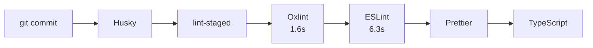

# Git Hooks with Husky

This document describes the Git hooks configuration using Husky and lint-staged for automated code quality checks.

## Table of Contents

- [Overview](#overview)
- [Pre-commit Hook](#pre-commit-hook)
- [Pre-push Hook](#pre-push-hook)
- [Linting Commands](#linting-commands)
- [Bypassing Hooks](#bypassing-hooks)
- [Troubleshooting](#troubleshooting)

## Overview

This project uses [Husky](https://typicode.github.io/husky/) to automatically run quality checks before commits and pushes. This ensures code quality and prevents CI failures.



## Pre-commit Hook

The pre-commit hook runs automatically when you run `git commit`. It performs:

### 1. Lint-staged (on staged files only)

Runs linters with auto-fix on staged files only — fast because it only checks changed files.

| Step | Tool         | Time  | What it catches                                        |
| ---- | ------------ | ----- | ------------------------------------------------------ |
| 1    | **Oxlint**   | 1.6s  | Syntax errors, style issues, common bugs               |
| 2    | **ESLint**   | 6.3s  | Type-aware issues (no-floating-promises, no-unsafe-\*) |
| 3    | **Prettier** | ~0.5s | Code formatting                                        |

**File patterns** (from `.lintstagedrc.js`):

```javascript
module.exports = {
  "*.{ts,tsx}": ["oxlint --fix", "eslint --fix", "prettier --write"],
  "*.{js,mjs,cjs}": ["oxlint --fix", "eslint --fix", "prettier --write"],
  "*.{json,md}": ["prettier --write"],
};
```

### 2. TypeScript Type Checking

Validates types for client and server packages:

```bash
pnpm --filter client exec tsc --noEmit
pnpm --filter server exec tsc --noEmit
```

### Fast Failure

If Oxlint finds errors, the commit is blocked immediately (1.6s) without waiting for ESLint (6.3s). This saves time when there are obvious syntax issues.

### Configuration

**`.husky/pre-commit`**:

```bash
pnpm lint-staged
pnpm --filter client exec tsc --noEmit
pnpm --filter server exec tsc --noEmit
```

## Pre-push Hook

The pre-push hook runs automatically when you run `git push`. It performs the same checks as CI:

| Step | Command        | What it does                               |
| ---- | -------------- | ------------------------------------------ |
| 1    | `pnpm lint`    | Full Oxlint + ESLint on entire codebase    |
| 2    | `tsc --noEmit` | TypeScript type checking (client + server) |
| 3    | `pnpm test`    | Run all tests (client + server)            |

This hook ensures that code pushed to the repository will pass CI checks. If any check fails, the push is blocked until issues are resolved.

### Configuration

**`.husky/pre-push`**:

```bash
pnpm lint
pnpm --filter client exec tsc --noEmit
pnpm --filter server exec tsc --noEmit
pnpm --filter client test -- --run
pnpm --filter server test -- --run
```

## Linting Commands

| Command            | Description        | Time | When to Use                           |
| ------------------ | ------------------ | ---- | ------------------------------------- |
| `pnpm lint:ox`     | Oxlint only        | 1.6s | Quick syntax check during development |
| `pnpm lint:eslint` | ESLint only        | 6.3s | Type-aware checks only                |
| `pnpm lint`        | Oxlint + ESLint    | ~8s  | Full check before commit/push         |
| `pnpm lint:fix`    | Auto-fix with both | ~8s  | Fix all auto-fixable issues           |

See [linting.md](./linting.md) for detailed linting documentation and performance benchmarks.

## Bypassing Hooks

If you need to bypass hooks in an emergency:

```bash
# Skip pre-commit hook
git commit --no-verify -m "your message"

# Skip pre-push hook
git push --no-verify
```

**Warning**: Only bypass hooks when absolutely necessary. Code that bypasses hooks will likely fail in CI and block PRs.

## Troubleshooting

### Hooks aren't running

1. Ensure Husky is installed: `pnpm install`
2. Verify hooks are executable: `ls -la .husky/`
3. Check that the `prepare` script ran: `pnpm prepare`

### lint-staged fails

- Check that prettier is installed at root: `pnpm list prettier`
- Ensure your staged files match the patterns in `.lintstagedrc.js`

### Oxlint not found

- Ensure oxlint is installed: `pnpm list oxlint`
- Try reinstalling: `pnpm install`

### ESLint type errors

- Ensure TypeScript is building: `pnpm --filter @linguistnow/shared build`
- Check tsconfig paths are correct

## Related Documentation

- [Linting Setup](./linting.md) - Detailed linting configuration and benchmarks
- [CONTRIBUTING.md](../../CONTRIBUTING.md) - Commit guidelines and branch naming
