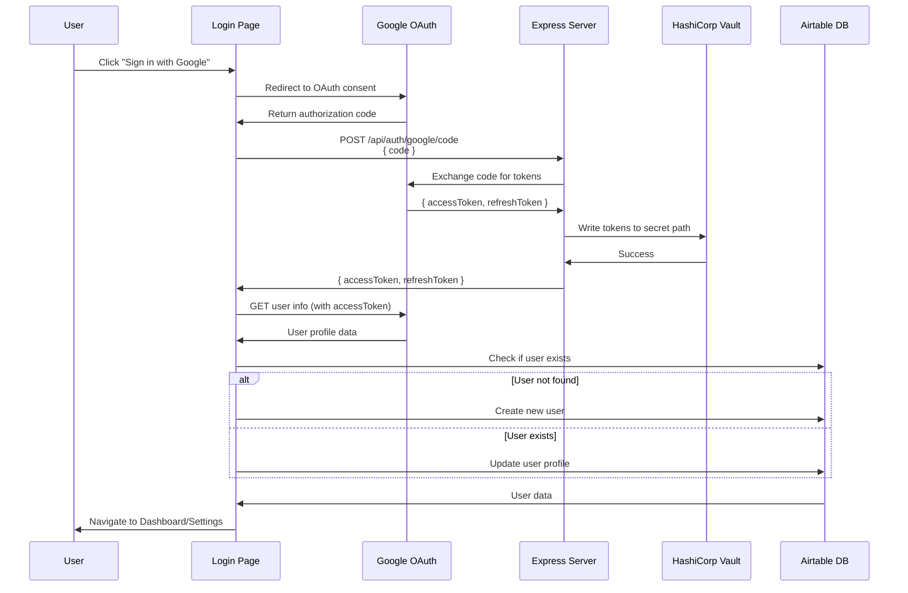
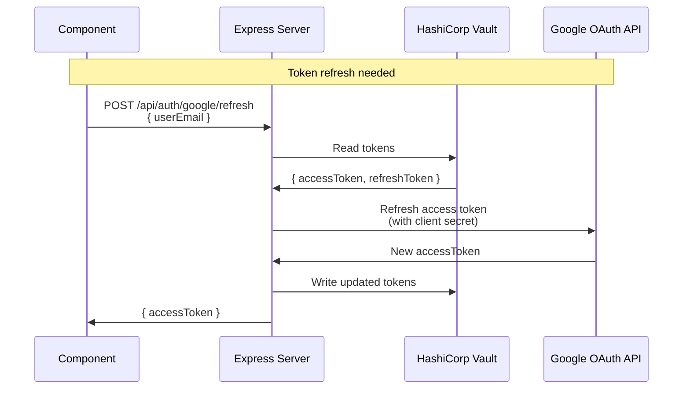
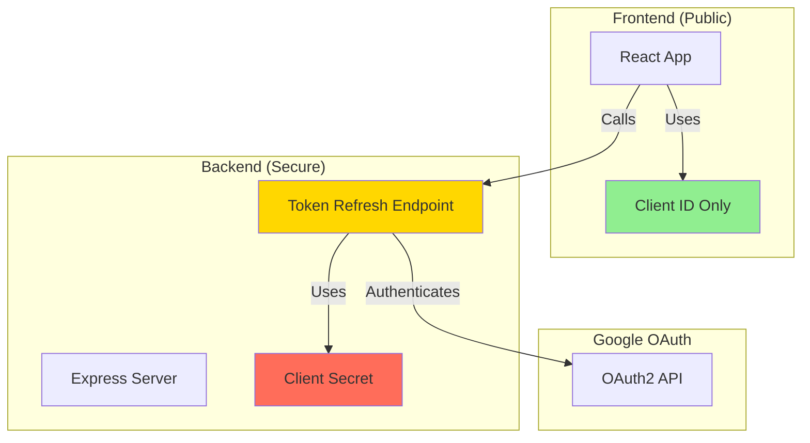

### Overview

This design outlines how Google Authentication, as configured [here](./set-up-oauth-in-google-cloud.md) is integrated into:

- the React application (built with **Vite** and **TypeScript/TSX**) using the `@react-oauth/google` package, and Google OAuth2 authorization flow with both access and refresh tokens.
  Considering the limited time, that package was implemented, preferring a simpler, more streamlined approach to OAuth integration which suits React application.

## Table of Contents

- [Authentication Flow](#authentication-flow)
  - [Components](#components)
    - [App Component](#app-component)
    - [Login page](#login-page)
    - [Dashboard page](#dashboard-page)
- [Token Refresh Flow](#token-refresh-flow)
- [Security Improvements](#security-improvements)
  - [Server-Side Token Refresh](#server-side-token-refresh)
  - [Security Architecture](#security-architecture)
  - [Implementation Details](#implementation-details)
  - [Environment Variables](#environment-variables)
- [Authentication Persistence](#authentication-persistence)
  - [How It Works](#how-it-works)
  - [Benefits](#benefits)
  - [Implementation](#implementation)
- [DRY Principles in Authentication](#dry-principles-in-authentication)
  - [Utility Functions](#utility-functions)

## Authentication Flow



  <details>
    <summary>Show Pros/Cons</summary>
  
  **google-auth-library:**

**Pros:**

Broad Usage: `google-auth-library` is a general-purpose library for working with Google APIs. It's not tied to any specific framework, making it suitable for various use cases beyond React.
Customization: Provides fine-grained control over the authentication flow and allows integration with any frontend or backend technology.
Comprehensive Features: Offers a wide range of features for handling authentication, including support for multiple authentication flows, token management, and verification.

**Cons:**

More Complex: Implementing authentication with `google-auth-library` typically requires more manual configuration and coding, especially if integrating with a frontend framework like React.
Requires Backend: Since it's a server-side library, it's primarily used for backend authentication flows. You would need to build your own frontend integration to handle user interactions and token exchange.

**@react-oauth/google:**

**Pros:**

Specifically for React: `@react-oauth/google` is tailored for React applications, providing a more straightforward integration process for React developers.
Pre-built Components: Offers pre-built React components (like `GoogleOAuthProvider` and `useGoogleLogin`) that abstract away much of the OAuth implementation complexity.
Simplified Setup: Provides a more opinionated approach, reducing the amount of boilerplate code required to set up OAuth authentication in a React application.

**Cons:**

Limited Customization: While `@react-oauth/google` streamlines the OAuth integration process, it may offer less flexibility and customization compared to using a more general-purpose library like `google-auth-library`.
Tied to React: Since it's specifically designed for React, it may not be suitable if you're working with other frontend frameworks or need to integrate authentication across multiple platforms.

**Which One to Choose?**

For React Projects: If you're building a React application and prefer a simpler, more streamlined approach to OAuth integration, `@react-oauth/google` may be a better choice.
For Complex Requirements: If your project involves more complex authentication scenarios, requires integration with other frameworks or technologies, or needs fine-grained control over the authentication flow, `google-auth-library` may be more suitable.
Ultimately, the best choice depends on your project's specific needs, your team's familiarity with the libraries, and your preferences regarding customization and flexibility. If you prioritize ease of use and React-specific integrations, `@react-oauth/google` may be a better fit. If you require more control and flexibility, especially for non-React components or complex authentication scenarios, `google-auth-library` may be the preferred option.

  </details>

- the [n8n workflow](./n8n-workflow-integration.md#check-when-busy) when checking for availability.

### Components

### App Component

- Manages access and refresh OAuth tokens in `userDetails` state and route redirection.
- Uses `GoogleOAuthProvider` to wrap the app around [Google client id](./set-up-oauth-in-google-cloud.md#google-api-client-id-setup-instructions) stored in `.env` variable.
- **Authentication Persistence**: On app mount, checks `localStorage` for stored user email and automatically restores authentication state by fetching user details from the API. This allows users to remain logged in across page refreshes.
- Implements `isRestoringAuth` state to show a loading indicator while authentication is being restored, preventing premature route navigation.
- Implements `PrivateRoute` for protecting routes that require login (ie. account settings, and dashboard pages)

### Login page

- Renders Google sign-in button and on click invoke `useGoogleLogin` of `@react-oauth/google` library.
- Handles successful and failed sign-in attempts.
- Get user info from Google
- Create/get matching user in Airtable (profile data only - tokens stored in Vault)
- Sends authorization code to backend which stores tokens securely in HashiCorp Vault
- **Persistence**: After successful login, stores the user's email in `localStorage` to enable authentication persistence across page refreshes.

### Dashboard page

- Get list of linguists at page load from Airtable
- For each linguist, check their availability using n8n workflow, sending `Calendar IDs` and `userEmail`
- n8n workflow reads access token from Vault using `userEmail` and uses it in [Check when busy](./n8n-workflow-integration.md#check-when-busy) action node
- Token refresh is handled automatically by background service (no client-side refresh needed)

## Token Refresh Flow

### On-Demand Refresh (when needed)



### Background Refresh (preventive)

A scheduled n8n workflow calls `POST /api/tokens/refresh-all` monthly to refresh all tokens proactively, preventing 6-month inactivity expiration.

## Security Improvements

### Server-Side Token Refresh

**Previous Implementation:**

- Client secret was exposed in frontend code
- Token refresh handled client-side

**Current Implementation:**

- Client secret stored securely on server
- Token refresh endpoint: `POST /api/auth/google/refresh`
- Frontend calls server endpoint with refresh token
- Server uses `google-auth-library` to refresh tokens securely

**Benefits:**

- ✅ Client secret never exposed to browser
- ✅ Centralized token management
- ✅ Easier to rotate credentials
- ✅ Better security audit trail

### Security Architecture



### Implementation Details

**Server Endpoint** (`server/controllers/authController.js`):

```javascript
const refreshAccessToken = async (req, res) => {
  const { refreshToken } = req.body;
  // Uses server-side google-auth-library
  // Keeps client secret secure
};
```

**Note**: Token refresh is now handled entirely server-side. The client no longer manages tokens directly - they are stored in HashiCorp Vault and accessed by the backend and n8n workflow.

### Environment Variables

**Frontend** (`.env`):

```env
VITE_GOOGLE_CLIENT_ID=your-client-id
VITE_API_URL=http://localhost:8080
# Note: No client secret in frontend
```

**Backend** (`.env`):

```env
GOOGLE_CLIENT_ID=your-client-id
GOOGLE_CLIENT_SECRET=your-client-secret  # Server-side only
GOOGLE_REDIRECT_URI=http://localhost:8080
```

## Authentication Persistence

The application implements session persistence using browser `localStorage` to maintain user authentication across page refreshes.

### How It Works

1. **On Login**: After successful authentication, the user's email is stored in `localStorage` as `userEmail`.
2. **On App Mount**: The `App` component checks `localStorage` for a stored email on mount:
   - If found, fetches user details from the API to restore the session
   - Shows a loading state (`isRestoringAuth`) while restoring authentication
   - Prevents route navigation until authentication state is fully restored
3. **On Logout**: The stored email is removed from `localStorage`, requiring a new login.

### Benefits

- ✅ Users remain logged in after page refreshes
- ✅ Better user experience - no need to re-authenticate frequently
- ✅ Secure - only email is stored, tokens are fetched fresh from the server
- ✅ Automatic cleanup on logout

### Implementation

**App Component** (`client/src/App.tsx`):

```typescript
useEffect(() => {
  const storedEmail = localStorage.getItem("userEmail");
  if (storedEmail) {
    fetchUserDetails(storedEmail, (user) => {
      setUserDetails(user);
      setIsRestoringAuth(false);
    }).catch(() => {
      localStorage.removeItem("userEmail");
      setIsRestoringAuth(false);
    });
  } else {
    setIsRestoringAuth(false);
  }
}, []);
```

**Login Component** (`client/src/pages/Login.tsx`):

```typescript
// After successful login
localStorage.setItem("userEmail", userInfo.email);
```

**Logout Component** (`client/src/pages/Logout.tsx`):

```typescript
localStorage.removeItem("userEmail");
```

## DRY Principles in Authentication

All authentication logic is centralized in `client/src/auth-users/utils.ts`:

- **Single Source of Truth** - All auth functions in one place
- **Reusability** - Functions used across Login, Dashboard, and Settings
- **Consistency** - Same error handling and patterns everywhere
- **Maintainability** - Changes made in one location

### Utility Functions

1. `fetchUserDetails(email, setUserDetails)` - Gets user from Airtable
2. `fetchUserList()` - Retrieves all users
3. `createUserIfNotFound(userInfo, setUserDetails)` - Creates new users

**Note:** Token validation and refresh utilities have been removed from the client. Token management is now handled server-side with Vault storage.

## Related Documentation

- [PWA Installation Guide](./PWA-Installation.md) - Information about installing LinguistNow as a Progressive Web App
