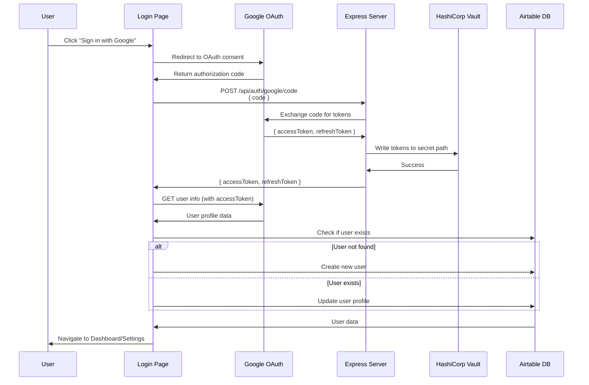
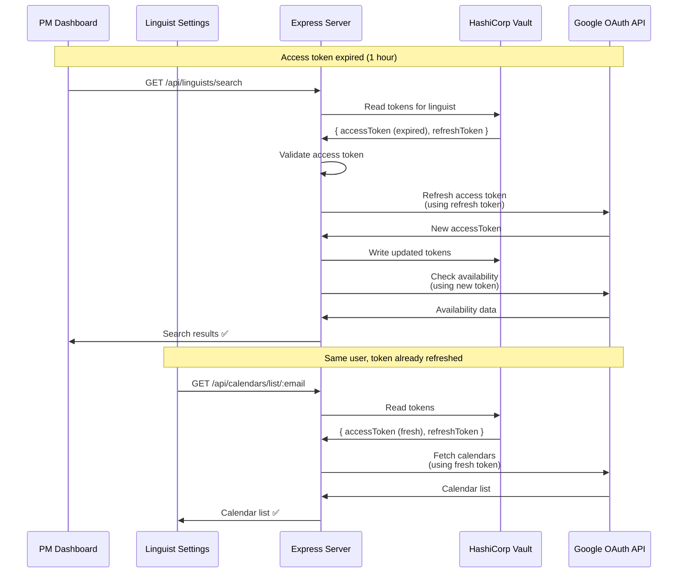
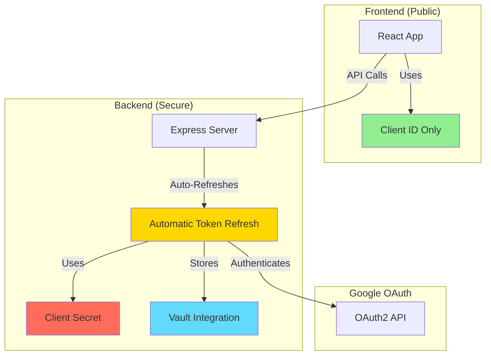

# Google Authentication

This document covers both the setup and implementation of Google Authentication in LinguistNow. The React application (built with **Vite** and **TypeScript/TSX**) uses the `@react-oauth/google` package for OAuth2 authorization flow with both access and refresh tokens. This package was chosen for its simpler, more streamlined approach to OAuth integration which suits React applications.

## Table of Contents

- [Setup: Google OAuth Configuration](#setup-google-oauth-configuration)
  - [Create Project](#create-project)
  - [Configure Consent Screen](#configure-consent-screen)
  - [Create Credentials](#create-credentials)
  - [Configure Application](#configure-application)
- [Authentication Flow](#authentication-flow)
  - [Components](#components)
    - [App Component](#app-component)
    - [Login page](#login-page)
    - [Dashboard page](#dashboard-page)
- [Token Refresh Flow](#token-refresh-flow)
- [Security Improvements](#security-improvements)
  - [Server-Side Token Refresh](#server-side-token-refresh)
  - [Security Architecture](#security-architecture)
  - [Implementation Details](#implementation-details)
  - [Environment Variables](#environment-variables)
- [Authentication Persistence](#authentication-persistence)
  - [How It Works](#how-it-works)
  - [Benefits](#benefits)
  - [Implementation](#implementation)
- [DRY Principles in Authentication](#dry-principles-in-authentication)
  - [Utility Functions](#utility-functions)

## Setup: Google OAuth Configuration

The React app and Express server use OAuth 2.0 Client ID and secret created for Google authentication. The client ID and secret can always be accessed from Credentials in APIs & Services: https://console.cloud.google.com/apis/credentials

### Create Project

1. Go to https://console.cloud.google.com/apis/dashboard

2. Click `CREATE PROJECT` button, choose any name

### Configure Consent Screen

1. Click `CONFIGURE CONSENT SCREEN` button or go to your OAuth Consent Screen https://console.cloud.google.com/apis/credentials/consent

2. Select `External` and click `CREATE` button

3. Fill in mandatory fields and click `SAVE AND CONTINUE` button, and click that button again in the `Scopes` screen

4. Add your account email as test user with `ADD USERS` button, click `SAVE AND CONTINUE` button

**Note:** Please set up at least 2 Google accounts to use as test users, one of which we will later [set up in Airtable](./install-instructions.md#set-up-new-users) with `Project Manager` role (the other being created automatically upon first login in the app with `Linguist` role).

### Create Credentials

1. Go to Credentials page https://console.cloud.google.com/apis/credentials

2. Click `Create credentials` button and select `OAuth client ID`

3. In the Application type dropdown, select `Web application` and give it a recognizable name like `google-auth-library`

4. Under `Authorized redirect URIs`, select + ADD URI. Paste in `http://localhost:3000`.
   **Important**: The redirect URI must be `http://localhost:3000` (the frontend URL), not the backend URL.
   You may also want to set `http://localhost:3000`, `http://localhost:8080`, `http://localhost` in `Authorized JavaScript origins` field too.

5. Select `CREATE` button

6. In the OAuth client created modal that appears, click `DOWNLOAD JSON`

### Configure Application

**Prerequisite:** Complete [install](./install-instructions.md#install-front-end-and-backend) of React app and server.

1. Download JSON from `google-auth-library` credential (which you downloaded from an earlier step, or from https://console.cloud.google.com/apis/credentials) to `server\config\oauth2.keys.json`

2. Navigate to `server` and `client` directories, and copy `example.env` as `.env` file in each case

3. Extract the `client_id` and `client_secret` from `oauth2.keys.json`:
   - For `client\.env`: Set `VITE_GOOGLE_CLIENT_ID` to the `client_id` value
   - For `server\.env`: Set `GOOGLE_CLIENT_ID` to the `client_id` value and `GOOGLE_CLIENT_SECRET` to the `client_secret` value
   - For `server\.env`: Set `FRONTEND_URL=http://localhost:3000` (this must match the redirect URI configured in Google Cloud Console)
   - For `server\.env`: Set `GOOGLE_REDIRECT_URI=${FRONTEND_URL}` or `GOOGLE_REDIRECT_URI=http://localhost:3000`

**Important**: The `GOOGLE_REDIRECT_URI` in the server `.env` file must match the `Authorized redirect URIs` configured in Google Cloud Console (which should be `http://localhost:3000`, the frontend URL).

## Authentication Flow



  <details>
    <summary>Show Pros/Cons</summary>
  
  **google-auth-library:**

**Pros:**

Broad Usage: `google-auth-library` is a general-purpose library for working with Google APIs. It's not tied to any specific framework, making it suitable for various use cases beyond React.
Customization: Provides fine-grained control over the authentication flow and allows integration with any frontend or backend technology.
Comprehensive Features: Offers a wide range of features for handling authentication, including support for multiple authentication flows, token management, and verification.

**Cons:**

More Complex: Implementing authentication with `google-auth-library` typically requires more manual configuration and coding, especially if integrating with a frontend framework like React.
Requires Backend: Since it's a server-side library, it's primarily used for backend authentication flows. You would need to build your own frontend integration to handle user interactions and token exchange.

**@react-oauth/google:**

**Pros:**

Specifically for React: `@react-oauth/google` is tailored for React applications, providing a more straightforward integration process for React developers.
Pre-built Components: Offers pre-built React components (like `GoogleOAuthProvider` and `useGoogleLogin`) that abstract away much of the OAuth implementation complexity.
Simplified Setup: Provides a more opinionated approach, reducing the amount of boilerplate code required to set up OAuth authentication in a React application.

**Cons:**

Limited Customization: While `@react-oauth/google` streamlines the OAuth integration process, it may offer less flexibility and customization compared to using a more general-purpose library like `google-auth-library`.
Tied to React: Since it's specifically designed for React, it may not be suitable if you're working with other frontend frameworks or need to integrate authentication across multiple platforms.

**Which One to Choose?**

For React Projects: If you're building a React application and prefer a simpler, more streamlined approach to OAuth integration, `@react-oauth/google` may be a better choice.
For Complex Requirements: If your project involves more complex authentication scenarios, requires integration with other frameworks or technologies, or needs fine-grained control over the authentication flow, `google-auth-library` may be more suitable.
Ultimately, the best choice depends on your project's specific needs, your team's familiarity with the libraries, and your preferences regarding customization and flexibility. If you prioritize ease of use and React-specific integrations, `@react-oauth/google` may be a better fit. If you require more control and flexibility, especially for non-React components or complex authentication scenarios, `google-auth-library` may be the preferred option.

  </details>

- the [n8n workflow](./n8n-workflow-integration.md#check-when-busy) when checking for availability.

### Components

### App Component

- Manages access and refresh OAuth tokens in `userDetails` state and route redirection.
- Uses `GoogleOAuthProvider` to wrap the app around Google client ID (configured in [Setup](#setup-google-oauth-configuration)) stored in `.env` variable.
- **Authentication Persistence**: On app mount, checks `localStorage` for stored user email and automatically restores authentication state by fetching user details from the API. This allows users to remain logged in across page refreshes.
- Implements `isRestoringAuth` state to show a loading indicator while authentication is being restored, preventing premature route navigation.
- Implements `PrivateRoute` for protecting routes that require login (ie. account settings, and dashboard pages)

### Login page

- Renders Google sign-in button and on click invoke `useGoogleLogin` of `@react-oauth/google` library.
- Handles successful and failed sign-in attempts.
- Get user info from Google
- Create/get matching user in Airtable (profile data only - tokens stored in Vault)
- Sends authorization code to backend which stores tokens securely in HashiCorp Vault
- **Persistence**: After successful login, stores the user's email in `localStorage` to enable authentication persistence across page refreshes.

### Dashboard page

- Get list of linguists at page load from Airtable
- For each linguist, check their availability using Express server's direct Google Calendar API integration
- Express server automatically refreshes expired access tokens before making API calls
- Token refresh is transparent to users - no session expiration errors for access token expiry

### Linguist Settings page

- Linguists can view and select their Google Calendars for availability checking
- Express server automatically refreshes expired access tokens when fetching calendar lists
- Token refresh is transparent to users - calendar selector remains functional even after access token expiration
- Users only need to re-authenticate if their refresh token is invalid/expired (6 months of inactivity)

## Token Refresh Flow

### Automatic Access Token Refresh (On-Demand)

The Express server automatically refreshes expired access tokens during API calls, ensuring uninterrupted service for both PM dashboard and linguist settings pages.



**Key Benefits:**

- ✅ **Transparent to users**: No "session expired" errors for access token expiration
- ✅ **DRY principle**: Token refreshed once in Vault, both endpoints benefit
- ✅ **Efficient**: Only refreshes when needed (token expired or about to expire)
- ✅ **Consistent**: Same refresh logic used for dashboard and settings pages

**Implementation:**

- `server/utils/tokenRefresh.ts` provides `getValidAccessToken()` and `withAutoRefresh()` utilities
- Both `calendarController.listCalendars()` and `linguistsController.checkLinguistAvailability()` use these utilities
- Tokens are validated before use and automatically refreshed if expired
- Refreshed tokens are immediately saved to Vault for reuse

### Background Refresh (Preventive)

A scheduled n8n workflow calls `POST /api/tokens/refresh-all` monthly to refresh all **refresh tokens** proactively, preventing 6-month inactivity expiration.

**Important**: This workflow prevents **refresh token expiration** (6 months of inactivity). For **access token expiration** (every hour), the Express server automatically refreshes tokens on-demand during API calls. See `server/utils/tokenRefresh.ts` for implementation details.

## Security Improvements

### Server-Side Token Refresh

**Previous Implementation:**

- Client secret was exposed in frontend code
- Token refresh handled client-side

**Current Implementation:**

- Client secret stored securely on server
- Automatic token refresh handled server-side during API calls
- Server uses `google-auth-library` to refresh tokens securely
- Tokens stored in HashiCorp Vault for centralized management

**Benefits:**

- ✅ Client secret never exposed to browser
- ✅ Centralized token management
- ✅ Easier to rotate credentials
- ✅ Better security audit trail

### Security Architecture



### Implementation Details

**Automatic Token Refresh** (`server/utils/tokenRefresh.ts`):

```typescript
export async function getValidAccessToken(userEmail: string): Promise<string> {
  // Read tokens from Vault
  // Validate access token
  // If expired, refresh automatically
  // Save refreshed token to Vault
  // Return valid token
}
```

**Note**: Token refresh is handled entirely server-side during API calls. The client never manages tokens directly - they are stored in HashiCorp Vault and automatically refreshed by the Express server when needed.

### Environment Variables

**Frontend** (`.env`):

```env
VITE_GOOGLE_CLIENT_ID=your-client-id
VITE_API_URL=http://localhost:8080
# Note: No client secret in frontend
```

**Backend** (`.env`):

```env
GOOGLE_CLIENT_ID=your-client-id
GOOGLE_CLIENT_SECRET=your-client-secret  # Server-side only
GOOGLE_REDIRECT_URI=http://localhost:8080
```

## Authentication Persistence

The application implements session persistence using browser `localStorage` to maintain user authentication across page refreshes.

### How It Works

1. **On Login**: After successful authentication, the user's email is stored in `localStorage` as `userEmail`.
2. **On App Mount**: The `App` component checks `localStorage` for a stored email on mount:
   - If found, fetches user details from the API to restore the session
   - Shows a loading state (`isRestoringAuth`) while restoring authentication
   - Prevents route navigation until authentication state is fully restored
3. **On Logout**: The stored email is removed from `localStorage`, requiring a new login.

### Benefits

- ✅ Users remain logged in after page refreshes
- ✅ Better user experience - no need to re-authenticate frequently
- ✅ Secure - only email is stored, tokens are fetched fresh from the server
- ✅ Automatic cleanup on logout

### Implementation

**App Component** (`client/src/App.tsx`):

```typescript
useEffect(() => {
  const storedEmail = localStorage.getItem("userEmail");
  if (storedEmail) {
    fetchUserDetails(storedEmail, (user) => {
      setUserDetails(user);
      setIsRestoringAuth(false);
    }).catch(() => {
      localStorage.removeItem("userEmail");
      setIsRestoringAuth(false);
    });
  } else {
    setIsRestoringAuth(false);
  }
}, []);
```

**Login Component** (`client/src/pages/Login.tsx`):

```typescript
// After successful login
localStorage.setItem("userEmail", userInfo.email);
```

**Logout Component** (`client/src/pages/Logout.tsx`):

```typescript
localStorage.removeItem("userEmail");
```

## DRY Principles in Authentication

All authentication logic is centralized in `client/src/auth-users/utils.ts`:

- **Single Source of Truth** - All auth functions in one place
- **Reusability** - Functions used across Login, Dashboard, and Settings
- **Consistency** - Same error handling and patterns everywhere
- **Maintainability** - Changes made in one location

### Utility Functions

1. `fetchUserDetails(email, setUserDetails)` - Gets user from Airtable
2. `fetchUserList()` - Retrieves all users
3. `createUserIfNotFound(userInfo, setUserDetails)` - Creates new users

**Note:** Token validation and refresh utilities have been removed from the client. Token management is now handled server-side with Vault storage.

## Related Documentation

- [Integration of Google Calendar API](./integration-of-google-calendar-api.md) - How authentication tokens are used for calendar availability checks
- [PWA Installation Guide](./PWA-Installation.md) - Information about installing LinguistNow as a Progressive Web App
