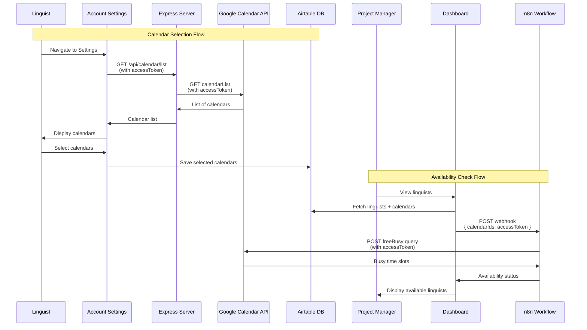

# Overview
The integration of the Google Calendar API into the application allows linguists to select their calendars in their account settings, and project managers to return list of linguists with their availability against each user saved calendar list. 

## Calendar Integration Flow

## Check availability in n8n

The app calls n8n workflow, and for a given user list of calendar ids and access token, 
 the action node [if user is busy](./n8n-workflow-integration.md#check-when-busy) for a given time window. 

## Fetch and save calendar lists

This part is handled by the React and Express server. 

1. **Authentication:** The code includes [authentication logic](./set-up-oauth-in-google-cloud.md) to obtain access tokens from Google OAuth. This involves requesting necessary scope, including `https://www.googleapis.com/auth/calendar.readonly`, to access calendar data.

2. **API Endpoint:** The [CalendarSelector](https://github.com/nicmart-dev/linguistnow/blob/main/client/src/components/CalendarSelector.jsx) component makes HTTP requests to the Google Calendar API endpoint `https://www.googleapis.com/calendar/v3/users/me/calendarList` to fetch a list of calendars associated with the authenticated user.

3. **Error Handling:** Error handling mechanisms are implemented to handle cases where the Google Calendar API is not enabled or returns errors. This includes displaying appropriate error messages to users and providing instructions for enabling the API.

4. **Calendar Selection:** The code includes functionality for users to select or deselect calendars within the application interface. This involves updating the UI based on user interactions and managing the state of selected calendars.

5. **Data Persistence:** Upon selecting calendars, the code saves the selected calendar data to [Airtable base](./store-user-data-in-airtable.md#airtable-data-structure). This ensures that users' calendar preferences are retained across sessions.
