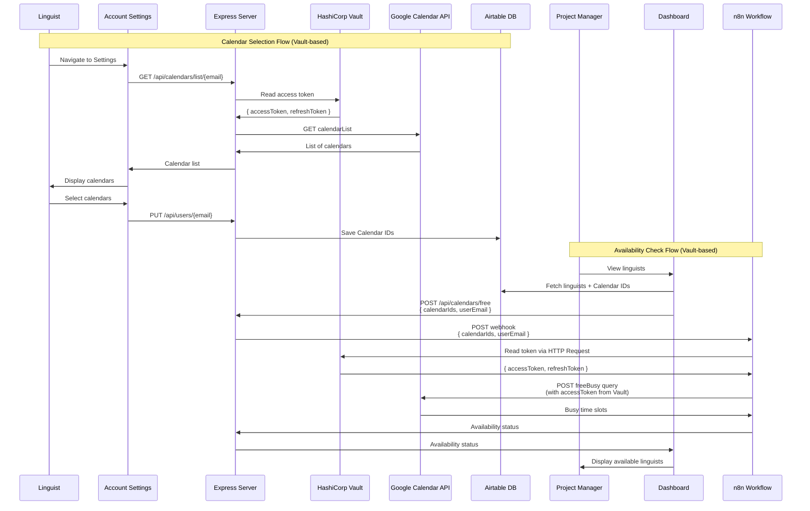
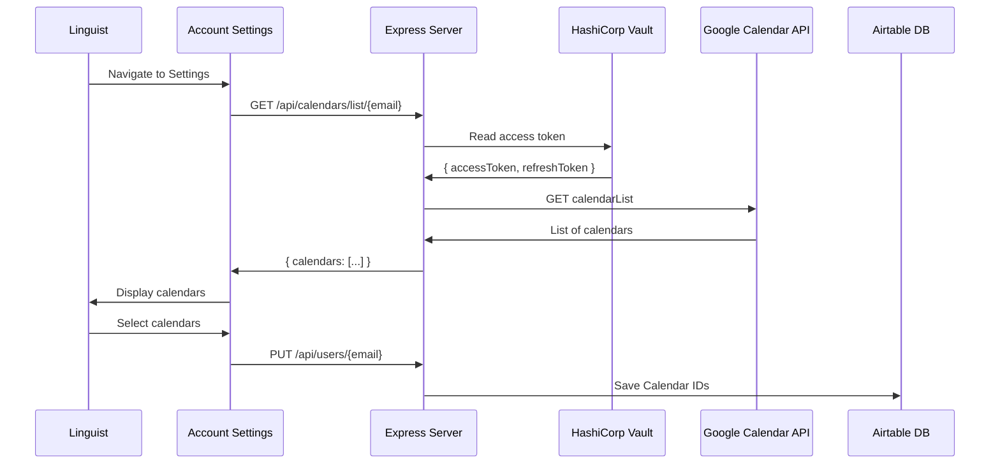

# Integration of Google Calendar API

## Table of Contents

- [Overview](#overview)
- [Calendar Integration Flow](#calendar-integration-flow)
- [Check Availability in n8n](#check-availability-in-n8n)
- [Fetch and Save Calendar Lists](#fetch-and-save-calendar-lists)

---

## Overview

The integration of the Google Calendar API into the application allows linguists to select their calendars in their account settings, and project managers to return list of linguists with their availability against each user saved calendar list.

## Calendar Integration Flow

## Check Availability in n8n

The app calls n8n workflow with a user's email and calendar IDs. The workflow reads the access token from HashiCorp Vault using the userEmail, then uses the action node [if user is busy](./n8n-workflow-integration.md#check-when-busy) for a given time window. Tokens are stored securely in Vault and never passed through API calls.

## Fetch and Save Calendar Lists

This part is handled by the React frontend and Express server.

1. **Authentication:** The code includes [authentication logic](./set-up-oauth-in-google-cloud.md) to obtain access tokens from Google OAuth. This involves requesting necessary scope, including `https://www.googleapis.com/auth/calendar.readonly`, to access calendar data. **Tokens are stored in HashiCorp Vault**, not in the database.

2. **API Endpoint:** The [CalendarSelector](https://github.com/nicmart-dev/linguistnow/blob/main/client/src/components/CalendarSelector.tsx) component fetches calendars via the backend endpoint `GET /api/calendars/list/{userEmail}`. The backend reads the access token from Vault and calls the Google Calendar API.

3. **Error Handling:** Error handling mechanisms are implemented to handle cases where the token is expired, not found in Vault, or the Google Calendar API returns errors. Appropriate error messages are displayed to users.

4. **Calendar Selection:** The code includes functionality for users to select or deselect calendars within the application interface. This involves updating the UI based on user interactions and managing the state of selected calendars.

5. **Data Persistence:** Upon selecting calendars, the selected calendar IDs are saved to [Airtable](./store-user-data-in-airtable.md#airtable-data-structure). This ensures that users' calendar preferences are retained across sessions. **Note**: Only calendar IDs are stored in Airtable; tokens are stored in Vault.
