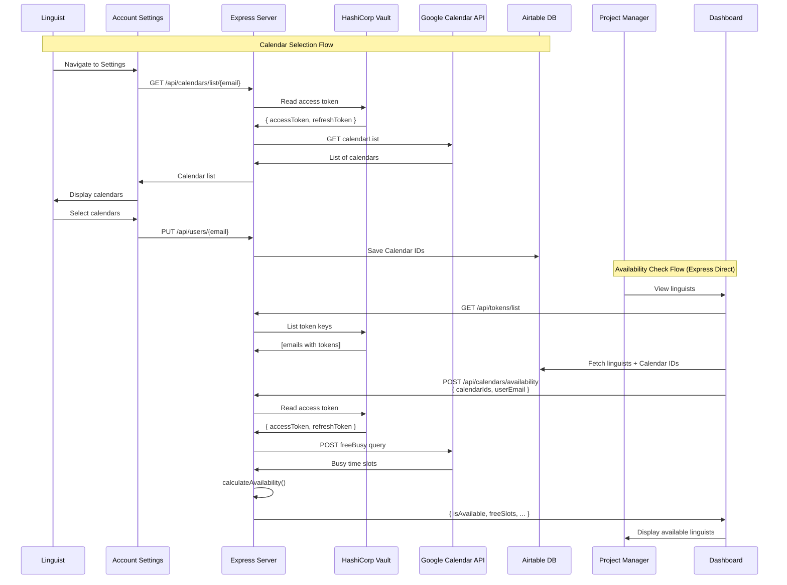
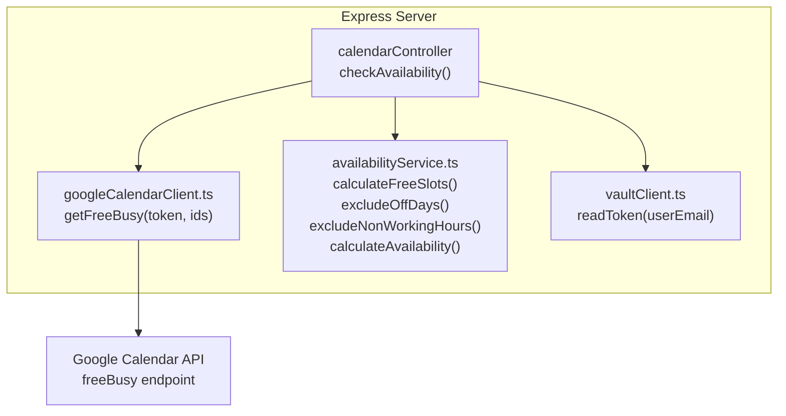

# Integration of Google Calendar API

## Overview

The integration of the Google Calendar API allows linguists to select their calendars, and project managers to view linguist availability.

**Architecture:**

- Availability checks handled **directly by Express** (no n8n)
- OAuth tokens stored in **HashiCorp Vault**
- Only calendar IDs stored in Airtable

## Calendar Integration Flow



## Availability Calculation

For detailed information about availability calculation logic, including timezone conversion, working hours application, and off-days filtering, see [Dashboard Design](../architecture/dashboard-design.md#timezone-conversion-and-availability-calculation).

**Quick Reference:**

The `availabilityService.ts` determines if a linguist is available based on:

- **Timezone Conversion**: PM's selected calendar dates are converted to linguist's timezone
- **Working Hours**: Applied in linguist's timezone (default: 08:00-18:00)
- **Off-Days**: Excluded from availability (empty array = no off-days)
- **Busy Slots**: Removed from free time calculation
- **Minimum Hours**: Linguist must have ≥ `minHoursPerDay` free hours on every working day

## Express Server Architecture



## API Reference

### Check Availability

**Endpoint:** `POST /api/calendars/availability`

**Request:**

```json
{
  "calendarIds": ["primary", "work@group.calendar.google.com"],
  "userEmail": "linguist@example.com",
  "timezone": "America/Los_Angeles",
  "workingHoursStart": "08:00",
  "workingHoursEnd": "18:00",
  "minHoursPerDay": 8,
  "offDays": [0, 6]
}
```

**Response (200):**

```json
{
  "isAvailable": true,
  "freeSlots": [
    { "start": "2024-01-15T16:00:00Z", "end": "2024-01-16T02:00:00Z" }
  ],
  "totalFreeHours": 40,
  "workingDays": 5,
  "hoursPerDay": { "2024-01-15": 10, "2024-01-16": 8 }
}
```

**Errors:** `400` validation | `401` token expired | `404` no token | `503` Vault unavailable

## Related

- [Vault Integration Guide](./vault-integration-guide.md) - Token storage
- [Google Authentication](./google-authentication.md) - OAuth flow
- [n8n Workflow Integration](./n8n-workflow-integration.md) - Token refresh schedule
