# Vault Integration Guide

This guide covers deploying HashiCorp Vault as shared infrastructure for secure OAuth token storage.

## Table of Contents

- [Architecture Overview](#architecture-overview)
- [Deploy Vault](#deploy-vault)
- [Initialize Vault](#initialize-vault)
- [Express Server Integration](#express-server-integration)
- [Testing](#testing)
- [Troubleshooting](#troubleshooting)

---

## Architecture Overview

Vault is deployed as **shared infrastructure** separate from application stacks:

```mermaid
flowchart TB
    subgraph SharedInfra["Shared Infrastructure"]
        Vault["🔐 Vault<br/>(docker-compose.vault.yml)"]
    end

    subgraph Apps["Application Stacks"]
        Express["📱 LinguistNow Express"]
        FutureApp["📱 Future Apps"]
    end

    Express -->|Read/Write Tokens| Vault
    FutureApp -.->|Future| Vault
```



**Key Points:**

- **Express server handles all Vault operations** (read/write tokens)
- OAuth tokens are stored at `secret/linguistnow/tokens/{userEmail}`
- Vault is accessed via the `node-vault` library in `server/utils/vaultClient.ts`

**Why separate deployment?**

- Vault is critical infrastructure - should have independent lifecycle
- Multiple apps can share the same Vault instance
- Update apps without affecting Vault availability

---

## Deploy Vault

### Using docker-compose.vault.yml

1. **Create shared network** (if not exists):

   ```bash
   sudo docker network create shared_net
   ```

2. **Deploy via Portainer:**
   - Go to **Stacks** → **Add Stack**
   - **Repository URL**: `https://github.com/nicmart-dev/linguistnow`
   - **Compose path**: `docker-compose.vault.yml`
   - **Stack name**: `shared-vault`
   - **Environment variables**:
     ```env
     VAULT_DEV_TOKEN=dev-token
     ```

3. **Or deploy via CLI:**

   ```bash
   curl -O https://raw.githubusercontent.com/nicmart-dev/linguistnow/main/docker-compose.vault.yml
   docker-compose -f docker-compose.vault.yml up -d
   ```

---

## Initialize Vault

### Development Mode (Local Development)

In dev mode, Vault is ready immediately - **no additional setup required**:

- KV v2 secrets engine is **automatically enabled at `secret/`**
- Use `dev-token` as your `VAULT_TOKEN` (the root token)
- No policies or separate tokens needed

**Environment variables for local dev (in `server/.env`):**

```env
VAULT_ADDR=http://localhost:8200   # or http://vault:8200 in Docker
VAULT_TOKEN=dev-token
```

That's it! You can now run the application locally.

> **Verify Vault is running** (optional):
>
> ```bash
> curl http://localhost:8200/v1/sys/health
> ```

---

### Production Mode

For production, you need to:

1. Create a restricted policy for LinguistNow
2. Generate a scoped token (not the root token)
3. Optionally switch from dev mode to production mode

#### Step 1: Create Policy for LinguistNow

**Option A: Using Vault UI** (recommended)

1. Open Vault UI at `http://your-docker-host:8200`
2. Log in with the root token (`dev-token` or your production root token)
3. Go to **Policies** → **ACL Policies**
4. Click **Create ACL policy +**
5. Set **Name**: `linguistnow-backend`
6. Paste this policy:

   ```hcl
   path "secret/data/linguistnow/*" {
     capabilities = ["create", "read", "update", "delete", "list"]
   }
   path "secret/metadata/linguistnow/*" {
     capabilities = ["list", "read", "delete"]
   }
   ```

7. Click **Create policy**

**Option B: Using CLI**

```bash
# Create policy file
cat > /tmp/linguistnow-policy.hcl <<EOF
path "secret/data/linguistnow/*" {
  capabilities = ["create", "read", "update", "delete", "list"]
}
path "secret/metadata/linguistnow/*" {
  capabilities = ["list", "read", "delete"]
}
EOF

# Copy to container and apply
sudo docker cp /tmp/linguistnow-policy.hcl shared-vault:/tmp/linguistnow-policy.hcl
sudo docker exec -it shared-vault sh -c "VAULT_ADDR=http://127.0.0.1:8200 vault policy write linguistnow-backend /tmp/linguistnow-policy.hcl"
```

#### Step 2: Generate Scoped Token

Token creation requires the Vault CLI. Use Portainer Console or SSH:

**Option A: Single command from host** (recommended)

```bash
sudo docker exec -it shared-vault sh -c "VAULT_ADDR=http://127.0.0.1:8200 vault token create -policy=linguistnow-backend -period=768h"
```

**Option B: Portainer Console** (no SSH required)

1. Open Portainer → **Containers** → **shared-vault**
2. Click **Console** → Select `/bin/sh` → **Connect**
3. Run inside the container (you'll see `/ #` prompt):

   ```bash
   export VAULT_ADDR=http://127.0.0.1:8200
   vault token create -policy=linguistnow-backend -period=768h
   ```

This outputs:

```
Key                  Value
---                  -----
token                hvs.CAESI...
token_policies       ["default" "linguistnow-backend"]
```

Save the `token` value for the LinguistNow stack's `VAULT_TOKEN` environment variable.

#### Step 3: Enable Persistent Storage

By default, `docker-compose.vault.yml` runs in dev mode (in-memory storage). For production, you need persistent storage so data survives container restarts.

**Update your Vault stack in Portainer:**

1. Go to **Stacks** → **shared-vault** → **Editor**

2. **Add Watchtower exclusion label** (prevents auto-updates that would require manual unseal):

   ```yaml
   labels:
     - "com.centurylinklabs.watchtower.enable=false"
   ```

3. **Update environment variables** - remove dev mode vars, add production vars:

   ```yaml
   environment:
     # Remove these dev mode variables:
     # - VAULT_DEV_ROOT_TOKEN_ID=${VAULT_DEV_TOKEN:-dev-token}
     # - VAULT_DEV_LISTEN_ADDRESS=0.0.0.0:8200

     # Add these production variables:
     - VAULT_ADDR=http://127.0.0.1:8200
     - VAULT_API_ADDR=http://shared-vault:8200
     - SKIP_SETCAP=true
   ```

4. **Update entrypoint and command** from dev to production:

   ```yaml
   # Remove or comment out (dev mode):
   # command: server -dev

   # Add these (production mode):
   entrypoint: ["vault"]
   command: server -config=/vault/config/vault.hcl
   ```

   > **Important**: The `entrypoint: ["vault"]` line bypasses `docker-entrypoint.sh`, which can cause port conflicts in production mode.

5. **Mount the config file** - add a volume bind mount:

   ```yaml
   volumes:
     - vault-data:/vault/data
     - vault-logs:/vault/logs
     # Add this line - create the config file on your NAS first (see below)
     - /volume1/docker/vault/config:/vault/config
   ```

6. **Create the config file on your NAS:**

   ```bash
   # SSH into your NAS
   sudo mkdir -p /volume1/docker/vault/config

   # Create the config file
   sudo cat > /volume1/docker/vault/config/vault.hcl << 'EOF'
   storage "file" {
     path = "/vault/data"
   }

   listener "tcp" {
     address     = "0.0.0.0:8200"
     tls_disable = "true"
   }

   disable_mlock = true
   ui = true
   EOF
   ```

7. **Redeploy the stack** in Portainer

#### Step 4: Initialize Vault

After redeploying in production mode, Vault needs to be initialized (first time only).

**Option A: Single command from host** (recommended)

```bash
sudo docker exec -it shared-vault sh -c "export VAULT_ADDR=http://127.0.0.1:8200 && vault operator init -key-shares=1 -key-threshold=1"
```

**Option B: Interactive shell**

```bash
# Enter the container
sudo docker exec -it shared-vault sh

# Inside the container (you'll see / # prompt), run:
export VAULT_ADDR=http://127.0.0.1:8200
vault operator init -key-shares=1 -key-threshold=1
```

> **⚠️ Common mistake**: If you see `-sh: vault: command not found`, you accidentally exited the container. The `vault` CLI only exists inside the container. Look at your prompt - `/ #` means you're inside, `user@host:~$` means you're on the host.

This outputs:

```
Unseal Key 1: <YOUR_UNSEAL_KEY>
Initial Root Token: <YOUR_ROOT_TOKEN>
```

**⚠️ SAVE THESE SECURELY** - You cannot recover them if lost!

#### Step 5: Unseal and Configure

Run these commands inside the container (or use `docker exec` one-liners):

**Option A: Single commands from host**

```bash
# Unseal Vault (required after every restart)
sudo docker exec -it shared-vault sh -c "VAULT_ADDR=http://127.0.0.1:8200 vault operator unseal <YOUR_UNSEAL_KEY>"

# Login with root token
sudo docker exec -it shared-vault sh -c "VAULT_ADDR=http://127.0.0.1:8200 vault login <YOUR_ROOT_TOKEN>"

# Enable KV secrets engine
sudo docker exec -it shared-vault sh -c "VAULT_ADDR=http://127.0.0.1:8200 vault secrets enable -version=2 -path=secret kv"
```

**Option B: Interactive shell**

```bash
# Enter the container
sudo docker exec -it shared-vault sh

# Inside the container (/ # prompt), run all commands:
export VAULT_ADDR=http://127.0.0.1:8200
vault operator unseal <YOUR_UNSEAL_KEY>
vault login <YOUR_ROOT_TOKEN>
vault secrets enable -version=2 -path=secret kv

# Exit when done
exit
```

> **Important**: After every Vault container restart, you must unseal Vault before it becomes operational:
>
> ```bash
> sudo docker exec -it shared-vault sh -c "VAULT_ADDR=http://127.0.0.1:8200 vault operator unseal <YOUR_UNSEAL_KEY>"
> ```

---

## Express Server Integration

The Express server uses `server/utils/vaultClient.ts` to interact with Vault:

### Environment Variables

Add these to `server/.env`:

```env
VAULT_ADDR=http://localhost:8200   # or http://vault:8200 in Docker
VAULT_TOKEN=dev-token              # or your production scoped token
```

### How It Works

1. **On user login**: Tokens are written to Vault at `secret/linguistnow/tokens/{userEmail}`
2. **On availability check**: Tokens are read from Vault to call Google Calendar API
3. **On token refresh**: Tokens are updated in Vault with new access token

### Key Functions

| Function                    | Description                               |
| --------------------------- | ----------------------------------------- |
| `writeToken(email, tokens)` | Store access/refresh tokens for a user    |
| `readToken(email)`          | Retrieve tokens for a user                |
| `listTokens()`              | List all stored user emails (for refresh) |
| `deleteToken(email)`        | Delete tokens for a user                  |

### Automatic Cleanup

The `/api/tokens/list` endpoint automatically removes tokens from Vault for users who no longer exist in Airtable. This ensures that orphaned tokens are cleaned up and only valid users are returned in the token list.

---

## Testing

1. **Verify Vault is running:**

   ```bash
   curl http://localhost:8200/v1/sys/health
   ```

2. **Test Express connectivity:**

   ```bash
   curl http://localhost:4000/api/health
   ```

3. **Test token storage** by logging in as a user (tokens will be stored in Vault)

4. **Verify tokens are in Vault:**

   ```bash
   # From host (replace with actual user email)
   sudo docker exec -it shared-vault sh -c "VAULT_ADDR=http://127.0.0.1:8200 vault kv get secret/linguistnow/tokens/user@example.com"
   ```

---

## Troubleshooting

### Vault not accessible from Express

- Verify both containers are on `shared_net` network
- Check Vault URL uses Docker DNS: `http://shared-vault:8200` (production) or `http://vault:8200` (local Docker)
- Test connectivity: `curl http://localhost:8200/v1/sys/health`

### "permission denied" errors (VAULT_PERMISSION_DENIED)

- Check `VAULT_TOKEN` in `server/.env` is correct
- Verify token has correct policy attached
- Token may have expired - generate a new one
- Ensure KV v2 engine is enabled at `secret/`

### "No token found for user" (TOKEN_NOT_FOUND)

- Verify user has logged in (tokens are stored on login)
- Check the path matches: `secret/data/linguistnow/tokens/{userEmail}`
- Check for special characters in email (may need URL encoding)

### "Invalid token" in Google Calendar API (TOKEN_EXPIRED)

- Access token has expired - user needs to log in again
- Or set up automatic token refresh (see [n8n Workflow Integration](./n8n-workflow-integration.md))

---

## Related Documentation

- [Deploy to Production](../deployment/deploy-app-to-production.md)
- [n8n Workflow Integration](./n8n-workflow-integration.md) - For optional token refresh scheduling
- [Integration of Google Calendar API](./integration-of-google-calendar-api.md)
