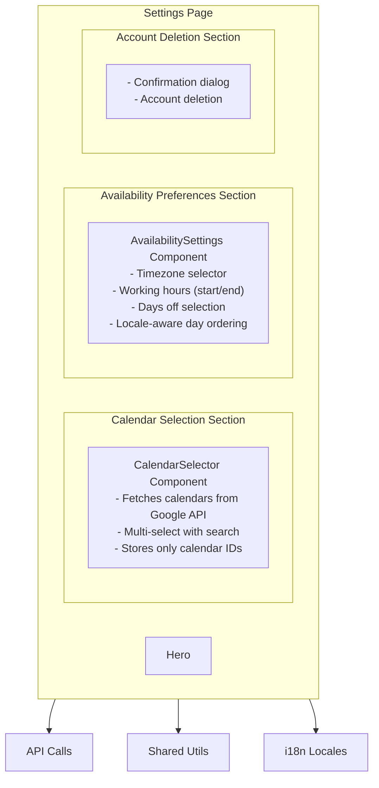
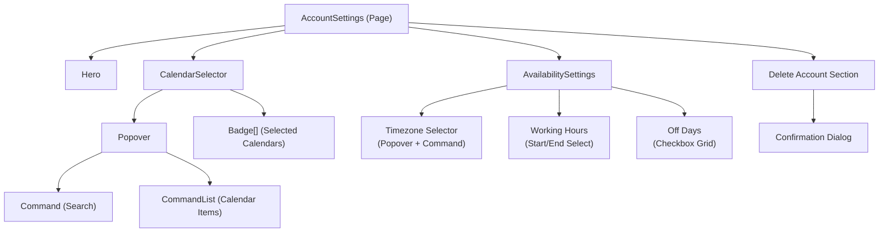
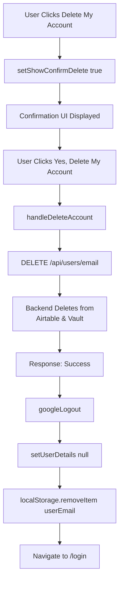

# Linguist Settings Design Document

## Overview

The **Linguist Settings Page** is a dedicated interface for linguists to configure their account settings, manage Google Calendar integration, and set availability preferences. The page enables linguists to control how their availability is calculated and displayed to project managers in the dashboard.

## Table of Contents

- [Purpose](#purpose)
- [Architecture](#architecture)
- [Key Features](#key-features)
- [Component Structure](#component-structure)
- [Data Flow](#data-flow)
- [State Management](#state-management)
- [API Integration](#api-integration)
- [User Interactions](#user-interactions)
- [Technical Implementation](#technical-implementation)
- [Future Enhancements](#future-enhancements)

## Purpose

The settings page solves the core problem of linguist self-management by:

1. **Calendar Integration**: Allows linguists to select which Google Calendars to use for availability checking
2. **Availability Configuration**: Enables setting timezone, working hours, and days off
3. **Privacy Protection**: Stores only calendar IDs (not display names) for privacy
4. **Automatic Saving**: Changes are saved automatically with debouncing to reduce API calls
5. **Account Management**: Provides account deletion functionality

## Architecture

### High-Level Architecture



### Component Hierarchy



## Key Features

### 1. Calendar Selection

**Purpose**: Allow linguists to select which Google Calendars to use for availability checking.

**Features**:

- **Multi-Select Interface**: Searchable dropdown with checkboxes
- **Privacy-First**: Stores only calendar IDs, never display names
- **Real-Time Fetching**: Fetches calendars from Google Calendar API via backend
- **Session Management**: Handles token expiration and session expiry gracefully
- **Visual Feedback**: Shows selected calendars as removable badges
- **Automatic Save**: Saves immediately when calendars are selected/deselected

**Technical Details**:

- Fetches calendars from `/api/calendars/list/{email}`
- Stores calendar IDs as comma-separated string in Airtable
- Display names fetched only for UI, never persisted
- Handles 401 errors (TOKEN_EXPIRED, TOKEN_NOT_FOUND, generic 401)
- Uses localStorage to track session expiration state

**User Flow**:

1. User navigates to settings page
2. CalendarSelector fetches available calendars from Google
3. User clicks calendar selector button
4. Popover opens with searchable list
5. User selects/deselects calendars
6. Changes saved automatically via `PUT /api/users/{email}`
7. Selected calendars shown as badges with remove option

### 2. Availability Preferences

**Purpose**: Configure working hours, timezone, and days off for availability calculations.

**Features**:

- **Timezone Selection**: Searchable timezone picker with UTC offset sorting
- **Working Hours**: Start and end time selectors (24-hour or AM/PM format based on locale)
- **Days Off**: Checkbox grid for selecting non-working days
- **Locale-Aware**: Week start day respects user's locale (Sunday vs Monday)
- **Auto-Detection**: Browser timezone auto-detected and suggested
- **Validation**: Ensures start time is before end time, valid timezone, valid time format
- **Debounced Auto-Save**: Saves automatically 200ms after changes stop
- **Field-Specific Feedback**: Shows which field was saved in success message

**Technical Details**:

- Uses `getWeekStartsOn()` from `@linguistnow/shared` for locale consistency
- Time format (12/24-hour) determined by language (en/es/pt/ar use AM/PM)
- Timezone list uses `Intl.supportedValuesOf('timeZone')` when available
- Falls back to comprehensive list of common IANA timezones
- Timezones sorted by UTC offset for easier selection
- Off days stored as array of day numbers (0=Sunday, 6=Saturday)
- Validates HH:mm format for working hours

**User Flow**:

1. User views availability settings section
2. Timezone auto-populated from browser or saved preference
3. User selects timezone from dropdown (searchable)
4. User selects working hours start/end from dropdowns
5. User toggles days off checkboxes
6. Changes auto-saved after 200ms debounce
7. Success toast shows which field was saved

### 3. Account Deletion

**Purpose**: Allow linguists to permanently delete their account.

**Features**:

- **Two-Step Confirmation**: Requires explicit confirmation before deletion
- **Permanent Action**: Cannot be undone
- **Complete Cleanup**: Removes user from Airtable and Vault
- **Session Cleanup**: Logs out from Google OAuth and clears localStorage
- **Navigation**: Redirects to login page after deletion

**User Flow**:

1. User scrolls to delete account section
2. User clicks "Delete My Account" button
3. Confirmation message appears
4. User clicks "Yes, Delete My Account" to confirm
5. Account deleted from backend
6. Google OAuth session cleared
7. User redirected to login page

## Component Structure

### AccountSettings.tsx

**Responsibilities**:

- Main page container and layout
- Coordinating child components
- Handling calendar save operations
- Handling availability preferences save operations
- Managing account deletion flow

**State**:

```typescript
- isDeleting: boolean
- showConfirmDelete: boolean
```

**Props**:

```typescript
{
  userDetails: User
  setUserDetails: (user: User | null) => void
}
```

### CalendarSelector.tsx

**Responsibilities**:

- Fetching calendars from Google Calendar API
- Displaying calendar selection UI
- Managing selected calendars state
- Handling session expiration

**State**:

```typescript
- fetchedCalendars: Calendar[]
- loading: boolean
- error: string | null
- open: boolean (popover state)
```

**Props**:

```typescript
{
  userDetails: User;
  onSave: (calendarIds: string[]) => Promise<void>;
}
```

**Key Functions**:

- `fetchCalendars()`: Fetches calendars from `/api/calendars/list/{email}`
- `handleSelectCalendar()`: Toggles calendar selection
- `handleRemoveCalendar()`: Removes calendar from selection
- `checkSessionExpired()`: Checks localStorage for expiration flag
- `markSessionExpired()`: Marks session as expired in localStorage

### AvailabilitySettings.tsx

**Responsibilities**:

- Managing availability preference state
- Validating user inputs
- Auto-saving preferences with debouncing
- Formatting time display based on locale
- Managing timezone selection

**State**:

```typescript
- timezone: string
- workingHoursStart: string (HH:mm format)
- workingHoursEnd: string (HH:mm format)
- offDays: number[] (0-6, Sunday-Saturday)
- isSaving: boolean
- hasInitialized: boolean
- timezoneOpen: boolean
```

**Props**:

```typescript
{
  userDetails: User;
  onSave: (preferences: AvailabilityPreferences) => Promise<void>;
}
```

**Key Functions**:

- `savePreferences()`: Validates and saves preferences
- `formatHour()`: Formats hour for display (12/24-hour)
- `formatTimeString()`: Formats HH:mm string for display
- `formatTimezoneLabel()`: Formats timezone with UTC offset
- `handleOffDayToggle()`: Toggles day in offDays array
- `getValidTimezones()`: Gets list of valid IANA timezones

## Data Flow

### Calendar Selection Flow

```mermaid
flowchart TD
    A[User Selects Calendar] --> B[handleSelectCalendar]
    B --> C[onSave(updatedCalendarIds)]
    C --> D[AccountSettings.handleSaveCalendars]
    D --> E[PUT /api/users/email<br/>Body: calendarIds: string[]]
    E --> F[Backend Updates Airtable]
    F --> G[Response: Updated User]
    G --> H[setUserDetails(updatedUser)]
    H --> I[Success Toast]
```

### Availability Preferences Flow

```mermaid
flowchart TD
    A[User Changes Preference] --> B[State Update<br/>timezone/workingHoursStart/<br/>workingHoursEnd/offDays]
    B --> C[useEffect Detects Change]
    C --> D[Debounce Timer 200ms]
    D --> E[savePreferences]
    E --> F[Validation<br/>timezone, time format, start < end]
    F --> G[onSave(preferences)]
    G --> H[AccountSettings.handleSaveAvailabilityPreferences]
    H --> I[PUT /api/users/email<br/>Body: availabilityPreferences]
    I --> J[Backend Updates Airtable]
    J --> K[Response: Updated User]
    K --> L[setUserDetails(updatedUser)]
    L --> M[Success Toast<br/>field-specific message]
```

### Calendar Fetching Flow

```mermaid
flowchart TD
    A[Component Mount] --> B[useEffect Trigger]
    B --> C[fetchCalendars]
    C --> D[GET /api/calendars/list/email]
    D --> E[Backend: getValidAccessToken]
    E --> F{Token Valid?}
    F -->|Yes| G[Use Existing Token]
    F -->|No| H[Auto-Refresh Token<br/>Save to Vault]
    H --> I[Use Refreshed Token]
    G --> J[Backend Calls Google Calendar API]
    I --> J
    J --> K[Response: calendars: Calendar[]]
    K --> L[setFetchedCalendars]
    L --> M[Display in Popover]

    style H fill:#90ee90
    style E fill:#61dafb
```

### Account Deletion Flow



## State Management

### Local State (React Hooks)

The settings page uses React hooks for state management:

- **useState**: Component-level state (calendars, preferences, deletion state)
- **useEffect**: Side effects (API calls, auto-save, calendar fetching)
- **useMemo**: Computed values (timezone labels, day ordering, time format)
- **useCallback**: Memoized functions (save handlers, fetch functions)
- **useRef**: Refs for debounce timers and previous values comparison

### State Updates

1. **Calendar Selection**: Updates `selectedCalendars` → triggers `onSave` → API call
2. **Availability Changes**: Updates preference state → debounced auto-save → API call
3. **Account Deletion**: Updates `showConfirmDelete` → confirmation → deletion API call

### Default State

```typescript
// CalendarSelector
fetchedCalendars: [];
loading: true;
error: null;
selectedCalendars: userDetails["Calendar IDs"]?.split(",") || [];

// AvailabilitySettings
timezone: browserTimezone || userDetails.Timezone;
workingHoursStart: userDetails["Working Hours Start"] || "08:00";
workingHoursEnd: userDetails["Working Hours End"] || "18:00";
offDays: userDetails["Off Days"] || [0, 6]; // Sunday and Saturday
```

## API Integration

### Automatic Token Refresh

The settings page leverages automatic token refresh to ensure uninterrupted calendar access:

- **Transparent Refresh**: When fetching calendars, expired access tokens are automatically refreshed before API calls
- **Shared Token Storage**: Tokens are stored in Vault and shared between dashboard and settings pages
- **DRY Principle**: Token refresh happens once per user, benefiting both endpoints
- **User Impact**: Linguists never see "session expired" errors for access token expiration (1 hour expiry)
- **Implementation**: Uses `getValidAccessToken()` utility from `server/utils/tokenRefresh.ts`

**Flow:**

1. Linguist opens Account Settings page
2. CalendarSelector fetches calendars via `GET /api/calendars/list/:email`
3. Server calls `getValidAccessToken(userEmail)`
4. If access token expired → automatically refreshed and saved to Vault
5. Calendar list fetched with fresh token
6. Result: Linguist sees calendars without interruption

**Error Handling:**

- If refresh token is invalid/expired (6 months of inactivity) → User sees error message and needs to re-authenticate
- Calendar selector field remains visible but greyed out with error message displayed next to it
- Error uses consistent styling with other form field errors

**Note**: Users only need to re-authenticate if their refresh token is invalid/expired (6 months of inactivity). Access token expiration (every hour) is handled automatically.

### Update User Endpoint

**Endpoint**: `PUT /api/users/{id}`

**Path Parameters**:

- `id`: User's email address

**Request Body**:

```typescript
{
  calendarIds?: string[]  // Array of Google Calendar IDs
  availabilityPreferences?: {
    timezone?: string  // IANA timezone identifier
    workingHoursStart?: string  // HH:mm format
    workingHoursEnd?: string  // HH:mm format
    offDays?: number[]  // Array of day numbers (0-6)
  }
}
```

**Response**:

```typescript
{
  // Updated User object from Airtable
  email: string
  Timezone: string
  'Working Hours Start': string
  'Working Hours End': string
  'Off Days': string | string[]  // Comma-separated string or array
  'Calendar IDs': string  // Comma-separated string
  // ... other user fields
}
```

**Error Responses**:

- `400`: No fields provided for update
- `404`: User not found
- `500`: Failed to update user

### List Calendars Endpoint

**Endpoint**: `GET /api/calendars/list/{email}`

**Path Parameters**:

- `email`: User's email address

**Response**:

```typescript
{
  calendars: Array<{
    id: string; // Calendar ID (email or alphanumeric)
    summary: string; // Display name (NOT stored)
    // ... other calendar fields
  }>;
}
```

**Error Responses**:

- `401`: Unauthorized (TOKEN_EXPIRED, TOKEN_NOT_FOUND, or generic)
- `500`: Failed to fetch calendars

### Delete User Endpoint

**Endpoint**: `DELETE /api/users/{id}`

**Path Parameters**:

- `id`: User's email address

**Response**:

```typescript
{
  success: true;
  message: "User deleted successfully";
}
```

**Error Responses**:

- `404`: User not found
- `500`: Failed to delete user

## User Interactions

### Primary Actions

1. **Select Calendars**
   - Click calendar selector → Search/select calendars → Auto-save

2. **Configure Availability**
   - Select timezone → Set working hours → Toggle days off → Auto-save

3. **Delete Account**
   - Click delete button → Confirm → Account deleted

### Error Handling

- **API Errors**: Displayed via toast notifications
- **Session Expiration**: Shows error message, prevents retries
- **Validation Errors**: Field-specific error messages
- **Loading States**: Skeleton components and disabled buttons

### Success Feedback

- **Toast Notifications**: Success messages for each save operation
- **Field-Specific Messages**: Indicates which field was saved
- **Visual Indicators**: "Saving..." text during save operations

## Technical Implementation

### Internationalization

All user-facing strings are externalized to i18n locale files:

- Calendar selection messages
- Availability settings labels and hints
- Error and success messages
- Time format (12/24-hour) based on locale
- Week start day respects locale (via `getWeekStartsOn()`)

### Date and Time Handling

- **Shared Utilities**: `getWeekStartsOn()` from `@linguistnow/shared` for locale consistency
- **Timezone Management**: Uses IANA timezone identifiers, sorted by UTC offset
- **Time Formatting**: Locale-aware (AM/PM for en/es/pt/ar, 24-hour for others)
- **Day Ordering**: Week start day respects locale (Sunday vs Monday)

### Privacy and Security

- **Calendar IDs Only**: Only calendar IDs stored, never display names
- **Token Storage**: OAuth tokens stored in Vault, not Airtable
- **Session Management**: Tracks session expiration to prevent unnecessary API calls
- **Input Validation**: Validates timezone, time format, and logical constraints

### Performance

- **Debouncing**: 200ms debounce for auto-save to reduce API calls
- **Memoization**: Timezone labels, day ordering, and format functions memoized
- **Lazy Loading**: Calendar list only fetched when needed
- **Conditional Rendering**: Timezone list only computed when popover is open

### Accessibility

- **Keyboard Navigation**: Full keyboard support via Radix UI components
- **Screen Readers**: Proper ARIA labels and roles
- **Focus Management**: Proper focus handling in popovers and modals
- **Error Announcements**: Error messages accessible to screen readers

## Future Enhancements

### Planned Features

1. **Calendar Management**
   - Calendar refresh button
   - Calendar sync status indicator
   - Multiple calendar account support

2. **Availability Enhancements**
   - Recurring availability patterns
   - Time zone-aware scheduling
   - Availability preview/calendar view
   - Custom availability exceptions

3. **Profile Management**
   - Profile picture upload
   - Bio/description editing
   - Language pair management
   - Specialization tags
   - Rate management

4. **Notifications**
   - Email notification preferences
   - Booking request notifications
   - Availability change alerts

5. **Account Settings**
   - Password change (if applicable)
   - Two-factor authentication
   - Connected accounts management
   - Data export/download

6. **User Experience**
   - Settings search/filter
   - Settings categories/tabs
   - Undo/redo for changes
   - Settings import/export

## Related Documentation

- [Architecture Overview](./architecture-overview.md) - Overall system architecture
- [API Documentation](./api-documentation.md) - API endpoint details
- [Google Calendar Integration](./integration-of-google-calendar-api.md) - Calendar API implementation
- [Internationalization](./internationalization-using-i18next.md) - i18n implementation
- [Dashboard Design](./dashboard-design.md) - How PMs view linguist availability
- [Testing and TDD](./testing-and-tdd.md) - Testing approach
