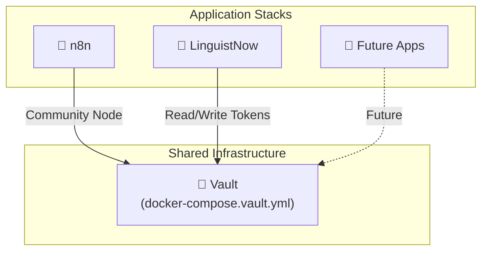

# HashiCorp Vault Integration Guide

This guide covers deploying HashiCorp Vault as shared infrastructure and integrating it with n8n and LinguistNow.

## Table of Contents

- [Architecture Overview](#architecture-overview)
- [Deploy Vault](#deploy-vault)
- [Initialize Vault](#initialize-vault)
- [Configure n8n External Secrets](#configure-n8n-external-secrets-optional) _(optional, Enterprise only)_
- [Set Up n8n Workflow](#set-up-n8n-workflow) ← **Start here for token integration**
- [Troubleshooting](#troubleshooting)

---

## Architecture Overview

Vault is deployed as **shared infrastructure** separate from application stacks:



**Why separate?**

- Vault is critical infrastructure - should have independent lifecycle
- n8n can only connect to ONE external secrets store
- Multiple apps can share the same Vault instance
- Update apps without affecting Vault availability

---

## Deploy Vault

### Using docker-compose.vault.yml

1. **Create shared network** (if not exists):

   ```bash
   sudo docker network create shared_net
   ```

2. **Deploy via Portainer:**
   - Go to **Stacks** → **Add Stack**
   - **Repository URL**: `https://github.com/nicmart-dev/linguistnow`
   - **Compose path**: `docker-compose.vault.yml`
   - **Stack name**: `shared-vault`
   - **Environment variables**:
     ```env
     VAULT_DEV_TOKEN=dev-token
     ```

3. **Or deploy via CLI:**

   ```bash
   curl -O https://raw.githubusercontent.com/nicmart-dev/linguistnow/main/docker-compose.vault.yml
   docker-compose -f docker-compose.vault.yml up -d
   ```

---

## Initialize Vault

### Development Mode (Local Development)

In dev mode, Vault is ready immediately - **no additional setup required**:

- KV v2 secrets engine is **automatically enabled at `secret/`**
- Use `dev-token` as your `VAULT_TOKEN` (the root token)
- No policies or separate tokens needed

**Environment variables for local dev:**

```env
VAULT_ADDR=http://localhost:8200   # or http://vault:8200 in Docker
VAULT_TOKEN=dev-token
```

That's it! You can now run the application locally.

> **Verify Vault is running** (optional):
>
> ```bash
> curl http://localhost:8200/v1/sys/health
> ```

---

### Production Mode

For production, you need to:

1. Create a restricted policy for LinguistNow
2. Generate a scoped token (not the root token)
3. Optionally switch from dev mode to production mode

#### Step 1: Create Policy for LinguistNow

**Option A: Using Vault UI** (recommended)

1. Open Vault UI at `http://your-docker-host:8200`
2. Log in with the root token (`dev-token` or your production root token)
3. Go to **Policies** → **ACL Policies**
4. Click **Create ACL policy +**
5. Set **Name**: `linguistnow-backend`
6. Paste this policy:

   ```hcl
   path "secret/data/linguistnow/*" {
     capabilities = ["create", "read", "update", "delete", "list"]
   }
   path "secret/metadata/linguistnow/*" {
     capabilities = ["list", "read", "delete"]
   }
   ```

7. Click **Create policy**

**Option B: Using CLI**

```bash
# Create policy file
cat > /tmp/linguistnow-policy.hcl <<EOF
path "secret/data/linguistnow/*" {
  capabilities = ["create", "read", "update", "delete", "list"]
}
path "secret/metadata/linguistnow/*" {
  capabilities = ["list", "read", "delete"]
}
EOF

# Copy to container and apply
sudo docker cp /tmp/linguistnow-policy.hcl shared-vault:/tmp/linguistnow-policy.hcl
sudo docker exec -it shared-vault sh -c "VAULT_ADDR=http://127.0.0.1:8200 vault policy write linguistnow-backend /tmp/linguistnow-policy.hcl"
```

#### Step 2: Generate Scoped Token

Token creation requires the Vault CLI. Use Portainer Console or SSH:

**Using Portainer Console** (no SSH required)

1. Open Portainer → **Containers** → **shared-vault**
2. Click **Console** → Select `/bin/sh` → **Connect**
3. Run:

   ```bash
   export VAULT_ADDR=http://127.0.0.1:8200
   vault token create -policy=linguistnow-backend -period=768h
   ```

**Using SSH + CLI**

```bash
sudo docker exec -it shared-vault sh -c "VAULT_ADDR=http://127.0.0.1:8200 vault token create -policy=linguistnow-backend -period=768h"
```

This outputs:

```
Key                  Value
---                  -----
token                hvs.CAESI...
token_policies       ["default" "linguistnow-backend"]
```

Save the `token` value for the LinguistNow stack's `VAULT_TOKEN` environment variable.

#### Step 3: (Optional) Switch to Production Mode

For persistent storage (data survives container restarts), modify `docker-compose.vault.yml`:

1. Change command from `server -dev` to `server -config=/vault/config`
2. Uncomment production environment variables
3. Mount a config file

Then initialize:

```bash
sudo docker exec -it shared-vault sh
export VAULT_ADDR=http://127.0.0.1:8200
vault operator init -key-shares=1 -key-threshold=1
# Save the unseal key and root token securely!
vault operator unseal <unseal-key>
vault secrets enable -version=2 -path=secret kv
```

> **Warning**: In production mode, you must unseal Vault after every restart using the unseal key.

---

## Configure n8n External Secrets (Optional)

> **⚠️ Not Required for LinguistNow**: External Secrets is **not needed** for the LinguistNow integration. Skip this section and go directly to [Set Up n8n Workflow](#set-up-n8n-workflow).

n8n's [External Secrets](https://docs.n8n.io/external-secrets/) feature allows n8n to read secrets from Vault.

### Why External Secrets Doesn't Work for User Tokens

| Limitation                  | Impact                                                                                          |
| --------------------------- | ----------------------------------------------------------------------------------------------- |
| **Enterprise/Paid Feature** | External Secrets requires n8n Cloud or Enterprise license                                       |
| **Static Paths Only**       | Only discovers top-level secrets, not nested paths like `secret/linguistnow/tokens/{userEmail}` |
| **No Dynamic Lookup**       | Cannot use expressions to build secret paths at runtime                                         |

Since LinguistNow stores per-user tokens at dynamic paths, **you must use the workflow approach** described in [Set Up n8n Workflow](#set-up-n8n-workflow). The community node works with **n8n Community Edition** (free).

### Setup (Only If You Have Enterprise)

If you have n8n Enterprise and want to use External Secrets for other static secrets:

1. In n8n, go to **Settings** → **External Secrets**

2. Select **HashiCorp Vault**

3. Configure:
   - **Vault URL**: `http://shared-vault:8200/v1` (include `/v1` path)
   - **Authentication Method**: Token
   - **Token**: `dev-token` (or your production token)
   - **Vault Namespace**: (leave blank)

4. Click **Save** and **Enable**

5. Static secrets are accessible as:

   ```
   {{ $secrets.vault.secret_name }}
   ```

> **Note**: Secrets must be at the root level of the `secret/` path to be discovered. Nested paths won't appear.

---

## Set Up n8n Workflow

The workflow is pre-configured in `n8n/Determine_Google_Calendar_availability.json`. You just need to:

1. Install the community node
2. Create the Vault credential
3. Import the workflow

### Step 1: Install Community Node

The workflow uses [`n8n-nodes-hashi-vault`](https://www.npmjs.com/package/n8n-nodes-hashi-vault) to fetch tokens from Vault.

1. In n8n, go to **Settings** → **Community Nodes**
2. Click **Install a community node**
3. Enter: `n8n-nodes-hashi-vault`
4. Click **Install**
5. Restart n8n if prompted

### Step 2: Create HashiCorp Vault Credential

1. In n8n, go to **Credentials** → **Add Credential**
2. Search for **HashiCorp Vault API**
3. Configure:

| Field         | Value                                                                |
| ------------- | -------------------------------------------------------------------- |
| **Vault URL** | `http://shared-vault:8200` (or `http://vault:8200` for local Docker) |
| **Token**     | `dev-token` (development) or your scoped token (production)          |

4. Click **Save**

> **Note**: The token is stored securely in n8n's encrypted credential store. No environment variable needed in your n8n compose file.

### Step 3: Import Workflow

1. In n8n, go to **Workflows** → **Import from File**
2. Select `n8n/Determine_Google_Calendar_availability.json`
3. Open the **"Fetch Token from Vault"** node
4. Select the credential you created in Step 2
5. Click **Save**
6. **Activate** the workflow

### Workflow Overview

```
Webhook → Stringify calendar list → Fetch Token from Vault → Define time window → Check when busy → ...
```

The workflow:

- Receives `calendarIds` and `userEmail` from the Express backend
- Fetches the user's OAuth token from Vault at `secret/linguistnow/tokens/{userEmail}`
- Calls Google Calendar FreeBusy API with the token
- Returns availability data

---

## Testing

1. Ensure a user has logged in (tokens stored in Vault)

2. Test with a webhook call:

   ```bash
   curl -X POST http://your-n8n-url/webhook/calendar-check \
     -H "Content-Type: application/json" \
     -d '{
       "calendarIds": "your-calendar@group.calendar.google.com",
       "userEmail": "user@example.com"
     }'
   ```

3. Verify the response contains availability data

---

## Troubleshooting

### Vault not accessible from n8n

- Verify both containers are on `shared_net` network
- Check Vault URL uses Docker DNS: `http://shared-vault:8200`
- Test connectivity: `sudo docker exec n8n wget -qO- http://shared-vault:8200/v1/sys/health`

### "permission denied" errors

- Check token has correct policy attached
- Verify path in policy matches request path
- Ensure KV v2 engine is enabled at `secret/`

### "No token found for user"

- Verify tokens were written to Vault during login
- Check the path matches: `secret/data/linguistnow/tokens/{userEmail}`
- Check for special characters in email (may need URL encoding)

### "Invalid token" in Google Calendar API

- Token may have expired - check Vault for latest token
- Verify background refresh service is running
- Check token refresh workflow is scheduled

---

## Related Documentation

- [Deploy to Production](./deploy-app-to-production.md)
- [n8n Workflow Integration](./n8n-workflow-integration.md)
- [Google Authentication](./google-authentication.md)
