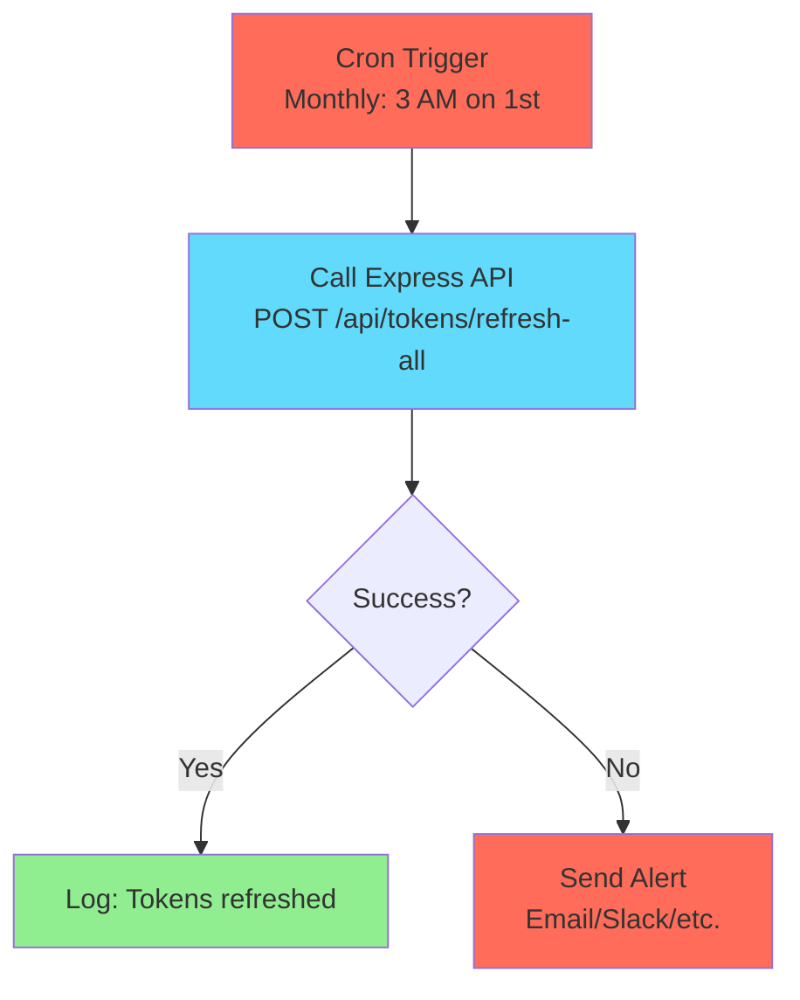
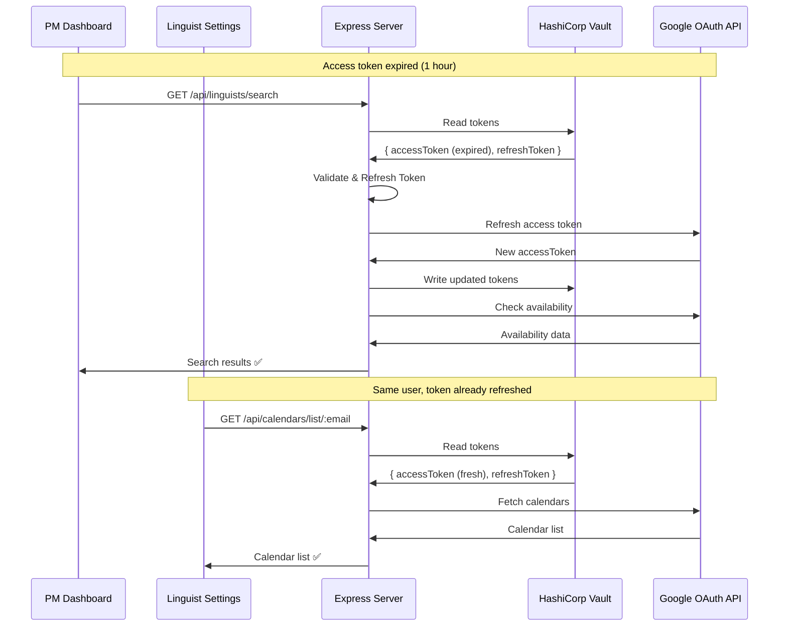

# n8n Workflow Integration

## Table of Contents

- [1. Overview](#1-overview)
  - [Current Architecture](#current-architecture)
  - [Why n8n?](#why-n8n)
- [2. Active Workflows](#2-active-workflows)
  - [Token Refresh Schedule](#token-refresh-schedule)
- [3. Deploy n8n](#3-deploy-n8n)
  - [Option A: Local Development (via docker-compose.yml)](#option-a-local-development-via-docker-composeyml)
  - [Option B: Standalone Deployment (Production)](#option-b-standalone-deployment-production)
  - [Option C: Local npm Installation](#option-c-local-npm-installation)
- [4. Removed Workflows](#4-removed-workflows)
  - [Google Calendar Availability (Removed)](#google-calendar-availability-removed)

---

# 1. Overview

The app uses [n8n](https://n8n.io/), an open-source workflow automation tool, for scheduled tasks and future calendar provider integrations.

n8n can be deployed in several ways:

- **Local development**: Included in `docker-compose.yml` (all-in-one stack)
- **Production**: Deploy as a separate stack (see [Deploy n8n](#3-deploy-n8n))
- **Local npm**: Install globally for development without Docker

## Current Architecture

As of the latest refactor, **Google Calendar availability checks are handled directly by the Express server**, not n8n. This provides:

- ✅ Faster response times (no n8n webhook overhead)
- ✅ Easier debugging and testing (TypeScript with proper types)
- ✅ Single source of truth for Vault integration (Express only)
- ✅ Better error handling with typed errors

n8n is now used primarily for:

- **Token Refresh Schedule**: Automated periodic refresh of Google OAuth tokens
- **Future Provider Integrations**: Calendly, Microsoft Outlook, etc. where n8n's native nodes add more value

## Why n8n?

While Google Calendar integration is now handled directly in Express, n8n remains valuable for:

1. **Scheduled Tasks**: Token refresh workflows that run on a cron schedule
2. **Future Integrations**: Easy connection to 500+ apps and services via no-code nodes
3. **Complex Workflows**: AI-powered features like [suggesting meeting slots using AI](https://n8n.io/workflows/1953-suggest-meeting-slots-using-ai/)
4. **Non-developer Configuration**: PM dashboard operators can modify workflows without code changes

---

# 2. Active Workflows

## Token Refresh Schedule

Located at `n8n/Token_Refresh_Schedule.json`

This workflow runs monthly to refresh Google OAuth **refresh tokens**, preventing them from expiring after 6 months of inactivity.

**Important**: This workflow does NOT handle **access token expiration** (which happens every hour). Access tokens are automatically refreshed on-demand by the Express server during API calls. See [Automatic Token Refresh](#automatic-token-refresh) below.



**Note**: This workflow prevents **refresh token expiration** (6 months of inactivity). For **access token expiration** (1 hour), the Express server automatically refreshes tokens on-demand during API calls. See [Automatic Token Refresh](#automatic-token-refresh) below.

### Configuration

1. Import the workflow from `n8n/Token_Refresh_Schedule.json`
2. Update the HTTP Request node URL to match your Express server:
   - Local: `http://host.docker.internal:4000/api/tokens/refresh-all`
   - Production: `https://api.yourdomain.com/api/tokens/refresh-all`
3. (Optional) Configure alert notifications for failures
4. Activate the workflow

### Automatic Token Refresh

The Express server includes automatic token refresh that handles **access token expiration** (every hour):

- **Proactive**: Validates tokens before API calls and refreshes if expired
- **Reactive**: Automatically retries failed API calls with a refreshed token
- **Transparent**: Users never see token expiration errors
- **DRY Principle**: Token refreshed once in Vault, shared between PM dashboard and linguist settings pages

**User Impact:**

**PM Dashboard:**

- PMs see accurate linguist availability even if access tokens expired
- No interruption to availability checking workflow
- Availability status remains consistent

**Linguist Settings Page:**

- Linguists can access calendar selector without "session expired" errors
- Calendar list loads successfully even after access token expiration
- Field remains visible (greyed out) with error message only if refresh token is invalid

**Implementation:**

- `server/utils/tokenRefresh.ts` provides `getValidAccessToken()` and `withAutoRefresh()` utilities
- Both `calendarController.listCalendars()` and `linguistsController.checkLinguistAvailability()` use these utilities
- Tokens are validated before use and automatically refreshed if expired
- Refreshed tokens are immediately saved to Vault for reuse by other endpoints

**Token Refresh Flow:**



This complements the n8n workflow:

- **n8n workflow**: Prevents refresh token expiration (6 months) - runs monthly
- **Automatic refresh**: Handles access token expiration (1 hour) - happens on-demand

Both mechanisms work together to ensure uninterrupted service.

---

# 3. Deploy n8n

## Option A: Local Development (via docker-compose.yml)

For local development, n8n is included in the main `docker-compose.yml` stack:

```bash
# From repository root
docker-compose up -d
```

n8n will be available at `http://localhost:5678`.

**Services included:**

- n8n (workflow automation)
- n8n-runner (external task runner for performance)
- PostgreSQL database for n8n

No additional setup needed - proceed to [Active Workflows](#2-active-workflows).

## Option B: Standalone Deployment (Production)

For production, deploy n8n as a separate stack (independent of LinguistNow):

### Using Portainer

1. **Ensure shared network exists:**

   ```bash
   sudo docker network create shared_net
   ```

2. In Portainer, go to **Stacks** → **Add Stack**

3. Use a dedicated n8n compose file or create one with:

   ```yaml
   version: "3.8"
   services:
     n8n:
       image: n8nio/n8n:latest
       container_name: n8n
       restart: unless-stopped
       ports:
         - "5678:5678"
       environment:
         - N8N_HOST=n8n.yourdomain.com
         - N8N_PROTOCOL=https
         - WEBHOOK_URL=https://n8n.yourdomain.com/
         - N8N_RUNNERS_ENABLED=true
         - N8N_RUNNERS_MODE=external
         - N8N_RUNNERS_BROKER_LISTEN_ADDRESS=0.0.0.0
       volumes:
         - n8n_data:/home/node/.n8n
       networks:
         - shared_net

     n8n-runner:
       image: n8nio/runners:latest
       container_name: n8n-runner
       restart: unless-stopped
       environment:
         - N8N_RUNNERS_TASK_BROKER_URI=http://n8n:5679
       depends_on:
         - n8n
       networks:
         - shared_net

   volumes:
     n8n_data:

   networks:
     shared_net:
       external: true
   ```

4. Add environment variables as needed

5. Deploy the stack

### Verify Deployment

```bash
# Test n8n is accessible
curl http://localhost:5678/healthz
```

## Option C: Local npm Installation

For development without Docker:

1. Install n8n globally:

   ```bash
   npm install -g n8n
   ```

2. Start n8n:

   ```bash
   n8n start
   ```

3. Access n8n at `http://localhost:5678`

---

# 4. Removed Workflows

## Google Calendar Availability (Removed)

**Status**: Removed (replaced by Express direct integration)

This workflow was previously used to check linguist availability via Google Calendar. It has been removed and replaced by direct Express server integration for the following reasons:

1. **Performance**: Direct API calls are faster than n8n webhook round-trips
2. **Debugging**: TypeScript services are easier to debug and test than n8n Code nodes
3. **Consolidation**: Single Vault client in Express (no duplicate integration)
4. **Error Handling**: Typed errors with proper HTTP status codes

### Migration Summary

| Before (n8n)                   | After (Express)                                  |
| ------------------------------ | ------------------------------------------------ |
| POST `/webhook/calendar-check` | POST `/api/calendars/availability`               |
| n8n reads token from Vault     | Express reads token from Vault                   |
| n8n calls Google freeBusy API  | Express calls Google freeBusy API                |
| n8n calculates availability    | `availabilityService.ts` calculates availability |

### New API Endpoint

The new Express endpoint provides more features:

- Configurable timezone (default: America/Los_Angeles)
- Configurable working hours (default: 8am-6pm)
- Configurable minimum hours per day (default: 8)
- Configurable weekend exclusion (default: true)
- Detailed response with free slots, hours per day, etc.

See API documentation at `/api-docs` for full details.

---

## Related Documentation

- [Integration of Google Calendar API](./integration-of-google-calendar-api.md) - How availability checks work
- [Vault Integration Guide](./vault-integration-guide.md) - HashiCorp Vault setup and token storage
- [Deploy to Production](./deploy-app-to-production.md) - Production deployment with Portainer
- [Install Instructions](./install-instructions.md) - Local development setup
