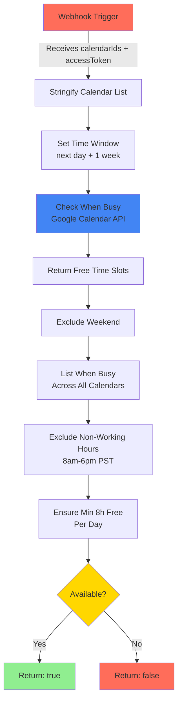

# 1. Overview

The app is using n8n, an open-source workflow automation tool, to determine linguist availability against Google Calendar API.
It is using [n8n](https://www.npmjs.com/package/n8n) npm library which is currently [deployed](./deploy-app-to-production.md#deploy-n8n) to a Docker container on Synology NAS.

If you do a local [install](./install-instructions.md#n8n), workflow can be managed through UI at http://localhost:5678 per Express server [env](https://github.com/nicmart-dev/linguistnow/blob/9c05725fe67713061450e9e88849b0f4a76b0889/server/example.env#L9) variable.

## Why n8n?

Even though the current implementation relies on making HTTP request and running JS code, which could be managed in Node.js Express server, I want to show it is possible to easily extend this to many other services (eg. using their existing template to [suggest meeting slot using AI](https://n8n.io/workflows/1953-suggest-meeting-slots-using-ai/), or many building blocks to connect to one of the 500+ apps and services they support) following a more no-code approach.

# 2. Overview

N8N is used to automate the process of checking linguists' availability by integrating with their Google Calendars. This integration allows LinguistNow to streamline the scheduling process and ensure efficient allocation of translation tasks.

# 3. n8n Workflow Configuration

Latest version was downloaded from n8n UI to repo under `n8n\Determine_Google_Calendar_availability.json`

## Workflow Diagram

## Webhook Trigger

Configure a Webhook node to trigger the workflow. This node will receive the list of calendar IDs and access token as inputs.

## Availability Calculation and Output

Workflow returns as output a single boolean, true if given user is available, or false otherwise, based on variables that are pre-defined and functions whereby:

- Time window set from next day + 1 week
- Excluded busy slots during that time returned using Google Calendar `freeBusy` [API](https://developers.google.com/calendar/api/v3/reference/freebusy/query)
- User needs to be available a minimum of 8h a day in each working day, during working hours
  - Working days defined as Mon-Fri
  - Timezone set to "America/Los_Angeles",
  - Working hours as 8 to 6pm in that timezone

Note: In the future, several or all of them could be removed and instead passed on to webhook from the app Express server for better UX.

### Action nodes:

Nodes are executed in order stated below for separation of concerns.

#### Stringify calendar list

This node takes the input items and adds a new field called 'parsedCalendarIds' to the JSON of each one. It parses the list of calendar IDs received from the previous node and converts them into an array of objects with an 'id' property. The resulting array is then stringified and added to the 'parsedCalendarIds' property of the input JSON.

#### Check when busy

This node sends an HTTP POST request to the `freeBusy` [Google Calendar API](https://developers.google.com/calendar/api/v3/reference/freebusy), using [credentials set up](./set-up-oauth-in-google-cloud.md), to check when the specified calendars are busy within the defined time window. It uses the time window and calendar IDs obtained from previous nodes to construct the request body.

#### Return free time slots

This node calculates the free time slots based on the combined availability received from the previous node. It finds the gaps between busy times and returns them as free slots.

#### Exclude weekend

This node filters out weekend slots from the list of free slots received from the previous node. It ensures that only weekdays are considered for scheduling.

#### List when busy across all calendars

This node aggregates the busy slots across all calendars received from the previous node. It combines the busy slots into a single array and sorts them by start time.

#### Exclude non-working hours

This node removes non-working hours from the free slots received from the previous node. It adjusts the slots to exclude times outside the defined working hours.

#### Ensure at least 8h free each day

This node checks if each day has at least 8 hours of free time.

### Variables defined and used by the above nodes.

Those variables are used by the action nodes previously defined.

#### Set Time Window

This node defines the time window to look for free slots. It sets the 'timeMin' and 'timeMax' parameters based on the current date and time window specified in the configuration.

#### Set min hours per day

This node sets the minimum hours required per day. It defines the minimum number of hours that should be available each day for scheduling.

#### Set local timezone

This node sets the local timezone for date/time conversions. It ensures that date/time calculations are performed accurately based on the specified timezone.

#### Set Working Hours

This node sets the working hours start and end times. It defines the start and end times of the working hours to be considered for scheduling.
