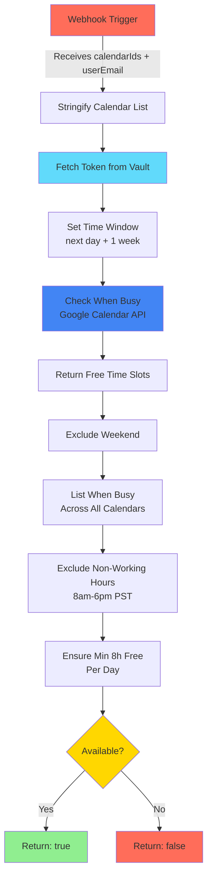

# n8n Workflow Integration

## Table of Contents

- [1. Overview](#1-overview)
  - [Why n8n?](#why-n8n)
- [2. Integration Purpose](#2-integration-purpose)
- [3. Deploy n8n](#3-deploy-n8n)
  - [Option A: Local Development (via docker-compose.yml)](#option-a-local-development-via-docker-composeyml)
  - [Option B: Standalone Deployment (Production)](#option-b-standalone-deployment-production)
  - [Option C: Local npm Installation](#option-c-local-npm-installation)
- [4. Workflow Configuration](#4-workflow-configuration)
  - [Workflow Diagram](#workflow-diagram)
  - [Webhook Trigger](#webhook-trigger)
  - [Availability Calculation and Output](#availability-calculation-and-output)
  - [n8n Runner Configuration](#n8n-runner-configuration)

---

# 1. Overview

The app uses [n8n](https://n8n.io/), an open-source workflow automation tool, to determine linguist availability against the Google Calendar API.

n8n can be deployed in several ways:

- **Local development**: Included in `docker-compose.yml` (all-in-one stack)
- **Production**: Deploy as a separate stack (see [Deploy n8n](#3-deploy-n8n))
- **Local npm**: Install globally for development without Docker

## Why n8n?

Even though the current implementation relies on making HTTP request and running JS code, which could be managed in Node.js Express server, I want to show it is possible to easily extend this to many other services (eg. using their existing template to [suggest meeting slot using AI](https://n8n.io/workflows/1953-suggest-meeting-slots-using-ai/), or many building blocks to connect to one of the 500+ apps and services they support) following a more no-code approach.

# 2. Integration Purpose

N8N is used to automate the process of checking linguists' availability by integrating with their Google Calendars. This integration allows LinguistNow to streamline the scheduling process and ensure efficient allocation of translation tasks.

---

# 3. Deploy n8n

## Option A: Local Development (via docker-compose.yml)

For local development, n8n is included in the main `docker-compose.yml` stack:

```bash
# From repository root
docker-compose up -d
```

n8n will be available at `http://localhost:5678`.

**Services included:**

- n8n (workflow automation)
- n8n-runner (external task runner for performance)
- PostgreSQL database for n8n

No additional setup needed - proceed to [Workflow Configuration](#4-workflow-configuration).

## Option B: Standalone Deployment (Production)

For production, deploy n8n as a separate stack (independent of LinguistNow):

### Using Portainer

1. **Ensure shared network exists:**

   ```bash
   sudo docker network create shared_net
   ```

2. In Portainer, go to **Stacks** → **Add Stack**

3. Use a dedicated n8n compose file or create one with:

   ```yaml
   version: "3.8"
   services:
     n8n:
       image: n8nio/n8n:latest
       container_name: n8n
       restart: unless-stopped
       ports:
         - "5678:5678"
       environment:
         - N8N_HOST=n8n.yourdomain.com
         - N8N_PROTOCOL=https
         - WEBHOOK_URL=https://n8n.yourdomain.com/
         - N8N_RUNNERS_ENABLED=true
         - N8N_RUNNERS_MODE=external
         - N8N_RUNNERS_BROKER_LISTEN_ADDRESS=0.0.0.0
       volumes:
         - n8n_data:/home/node/.n8n
       networks:
         - shared_net

     n8n-runner:
       image: n8nio/runners:latest
       container_name: n8n-runner
       restart: unless-stopped
       environment:
         - N8N_RUNNERS_TASK_BROKER_URI=http://n8n:5679
       depends_on:
         - n8n
       networks:
         - shared_net

   volumes:
     n8n_data:

   networks:
     shared_net:
       external: true
   ```

4. Add environment variables as needed (see [n8n Runner Configuration](#n8n-runner-configuration))

5. Deploy the stack

### Verify Deployment

```bash
# Test n8n is accessible
curl http://localhost:5678/healthz
```

### Configure Vault Connection

For n8n to read tokens from Vault, see [Vault Integration Guide - Set Up n8n Workflow](./n8n-vault-integration-guide.md#set-up-n8n-workflow).

## Option C: Local npm Installation

For development without Docker:

1. Install n8n globally:

   ```bash
   npm install -g n8n
   ```

2. Start n8n:

   ```bash
   n8n start
   ```

3. Access n8n at `http://localhost:5678`

> **Note**: Set `N8N_BASE_URL=http://localhost:5678` in your `server/.env` file.

---

# 4. Workflow Configuration

Latest version was downloaded from n8n UI to repo under `n8n\Determine_Google_Calendar_availability.json`


## Workflow Diagram



## Webhook Trigger

Configure a Webhook node to trigger the workflow. This node receives the list of calendar IDs and userEmail as inputs. The access token is read from HashiCorp Vault using the userEmail (see [Vault Integration Guide](./n8n-vault-integration-guide.md)).

## Availability Calculation and Output

Workflow returns as output a single boolean, true if given user is available, or false otherwise, based on variables that are pre-defined and functions whereby:

- Time window set from next day + 1 week
- Excluded busy slots during that time returned using Google Calendar `freeBusy` [API](https://developers.google.com/calendar/api/v3/reference/freebusy/query)
- User needs to be available a minimum of 8h a day in each working day, during working hours
  - Working days defined as Mon-Fri
  - Timezone set to "America/Los_Angeles",
  - Working hours as 8 to 6pm in that timezone

Note: In the future, several or all of them could be removed and instead passed on to webhook from the app Express server for better UX.

### Action nodes:

Nodes are executed in order stated below for separation of concerns.

#### Stringify calendar list

This node takes the input items and adds a new field called 'parsedCalendarIds' to the JSON of each one. It parses the list of calendar IDs received from the previous node and converts them into an array of objects with an 'id' property. The resulting array is then stringified and added to the 'parsedCalendarIds' property of the input JSON.

**Optimization Note**: The node has been optimized for performance and reliability:

- Processes only the first input item (webhooks typically send one item)
- Includes comprehensive input validation with clear error messages
- Uses efficient single-pass parsing with `split()`, `map()`, and `filter()`
- Prevents timeout issues that occurred with the previous nested loop implementation
- Validates structure before processing to avoid runtime errors

#### Fetch Token from Vault

This node reads the access token from HashiCorp Vault using the `n8n-nodes-hashi-vault` community node. It uses the `userEmail` from the webhook to construct the Vault path: `linguistnow/tokens/{userEmail}`. The token is then used in the "Check when busy" node.

**Configuration:**

- **Node Type**: HashiCorp Vault (community node)
- **Operation**: Read
- **Engine Version**: v2
- **Secret Path**: `linguistnow/tokens/{{ $json.body.userEmail }}`

See [Vault Integration Guide - Set Up n8n Workflow](./n8n-vault-integration-guide.md#set-up-n8n-workflow) for installation and credential setup.

#### Check when busy

This node sends an HTTP POST request to the `freeBusy` [Google Calendar API](https://developers.google.com/calendar/api/v3/reference/freebusy) to check when the specified calendars are busy within the defined time window. It uses the access token fetched from Vault in the previous node, constructing the Authorization header dynamically: `Bearer {{ $('Fetch Token from Vault').item.json.data.accessToken }}`. It uses the time window and calendar IDs obtained from previous nodes to construct the request body.

#### Return free time slots

This node calculates the free time slots based on the combined availability received from the previous node. It finds the gaps between busy times and returns them as free slots.

#### Exclude weekend

This node filters out weekend slots from the list of free slots received from the previous node. It ensures that only weekdays are considered for scheduling.

#### List when busy across all calendars

This node aggregates the busy slots across all calendars received from the previous node. It combines the busy slots into a single array and sorts them by start time.

#### Exclude non-working hours

This node removes non-working hours from the free slots received from the previous node. It adjusts the slots to exclude times outside the defined working hours.

#### Ensure at least 8h free each day

This node checks if each day has at least 8 hours of free time.

### Variables defined and used by the above nodes.

Those variables are used by the action nodes previously defined.

#### Set Time Window

This node defines the time window to look for free slots. It sets the 'timeMin' and 'timeMax' parameters based on the current date and time window specified in the configuration.

#### Set min hours per day

This node sets the minimum hours required per day. It defines the minimum number of hours that should be available each day for scheduling.

#### Set local timezone

This node sets the local timezone for date/time conversions. It ensures that date/time calculations are performed accurately based on the specified timezone.

#### Set Working Hours

This node sets the working hours start and end times. It defines the start and end times of the working hours to be considered for scheduling.

## n8n Runner Configuration

For optimal performance, especially when using Code nodes, n8n should be configured with external task runners. This offloads JavaScript execution to separate processes, improving workflow execution speed and preventing timeouts.

### Required Configuration

When deploying n8n with Docker Compose, the following environment variables are critical for runner functionality:

**n8n Service:**

- `N8N_RUNNERS_ENABLED=true` - Enables task runners
- `N8N_RUNNERS_MODE=external` - Uses external runner processes
- `N8N_RUNNERS_BROKER_LISTEN_ADDRESS=0.0.0.0` - **CRITICAL**: Allows runner container to connect (default is localhost only)
- `N8N_RUNNERS_BROKER_PORT=5679` - Port for runner broker (default: 5679)
- `N8N_RUNNERS_AUTH_TOKEN=<shared-secret>` - Shared secret for authentication
- `N8N_RUNNERS_TASK_REQUEST_TIMEOUT=120` - Timeout in seconds (default: 20, increased for resource-constrained systems)
- `N8N_RUNNERS_MAX_CONCURRENCY=10` - Max concurrent tasks per runner (default: 5)

**n8n-runner Service:**

- `N8N_RUNNERS_AUTH_TOKEN=<same-shared-secret>` - Must match n8n service
- `N8N_RUNNERS_TASK_BROKER_URI=http://n8n:5679` - Use Docker network DNS name, not host IP
- `N8N_RUNNERS_TASK_REQUEST_TIMEOUT=120` - Should match n8n service
- `N8N_RUNNERS_MAX_CONCURRENCY=10` - Should match n8n service

### Performance Optimizations

The "Stringify calendar list" Code node has been optimized to:

- Process only the first input item (webhooks send one item)
- Use efficient single-pass parsing instead of nested loops
- Include comprehensive validation to prevent runtime errors
- Prevent timeout issues on resource-constrained systems

**Before optimization**: The node used nested loops that could timeout after 60 seconds on slower systems.

**After optimization**: The node completes in seconds with proper error handling.

### Troubleshooting

**Runner not connecting:**

- Verify `N8N_RUNNERS_BROKER_LISTEN_ADDRESS=0.0.0.0` is set in n8n service
- Check that both services use the same `N8N_RUNNERS_AUTH_TOKEN`
- Ensure runner uses Docker network DNS (`http://n8n:5679`) not host IP
- Verify both containers are on the same Docker network

**Task request timeout:**

- Increase `N8N_RUNNERS_TASK_REQUEST_TIMEOUT` (default 20s, recommended 120s for NAS)
- Check runner logs: `docker logs n8n-runner`
- Verify runner is healthy: `docker exec n8n-runner pgrep -f task-runner-launcher`

**Code node timeout:**

- Optimize JavaScript code in Code nodes (avoid nested loops, use efficient array methods)
- Ensure runner is connected and healthy
- Check resource limits (memory/CPU) for both n8n and runner containers

---

## Related Documentation

- [Vault Integration Guide](./n8n-vault-integration-guide.md) - Configure n8n to read tokens from Vault
- [Deploy to Production](./deploy-app-to-production.md) - Production deployment with Portainer
- [Install Instructions](./install-instructions.md) - Local development setup
- [Google Authentication](./google-authentication.md) - OAuth flow details
