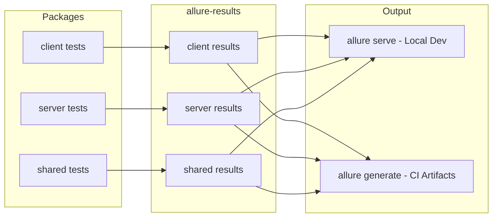

# Allure Reports Integration for Vitest Test Suite

## Overview

Add `allure-vitest` reporter to generate beautiful, interactive test reports with:

- Executive summary of all test suites across client/server/shared
- Test case hierarchy with pass/fail/skip status
- Coverage integration
- History trends (in CI)
- Local dev server AND static HTML for CI artifacts

## Architecture



## Key Files to Modify

| File                      | Change                                 |
| ------------------------- | -------------------------------------- |
| `client/package.json`     | Add `allure-vitest` dev dependency     |
| `server/package.json`     | Add `allure-vitest` dev dependency     |
| `shared/package.json`     | Add `allure-vitest` dev dependency     |
| `client/vitest.config.ts` | Add Allure reporter configuration      |
| `server/vitest.config.ts` | Add Allure reporter configuration      |
| `shared/vitest.config.ts` | Add Allure reporter configuration      |
| `package.json`            | Add monorepo-level test report scripts |

## Implementation Details

### 1. Install Dependencies

Each package needs `allure-vitest`:

```bash
pnpm --filter ./client add -D allure-vitest
pnpm --filter ./server add -D allure-vitest
pnpm --filter ./shared add -D allure-vitest
```

Root package needs `allure-commandline` for report generation:

```bash
pnpm add -D allure-commandline
```

### 2. Configure Vitest Reporters

Add Allure reporter to each vitest config.

**client/vitest.config.ts:**

```typescript
import { defineConfig } from "vitest/config";
import AllureReporter from "allure-vitest/reporter";
import react from "@vitejs/plugin-react-swc";
import path from "path";

export default defineConfig({
  plugins: [react()],
  test: {
    globals: true,
    environment: "happy-dom",
    setupFiles: "./src/test/setup.ts",
    include: ["src/**/*.{test,spec}.{ts,tsx}"],
    reporters: [
      "default",
      new AllureReporter({
        resultsDir: "../allure-results/client",
      }),
    ],
    coverage: {
      // ... existing coverage config
    },
  },
  // ... rest of config
});
```

**server/vitest.config.ts:**

```typescript
import { defineConfig } from "vitest/config";
import AllureReporter from "allure-vitest/reporter";

export default defineConfig({
  test: {
    globals: true,
    environment: "node",
    include: ["**/*.{test,spec}.ts"],
    reporters: [
      "default",
      new AllureReporter({
        resultsDir: "../allure-results/server",
      }),
    ],
    coverage: {
      // ... existing coverage config
    },
  },
});
```

**shared/vitest.config.ts:**

```typescript
import { defineConfig } from "vitest/config";
import AllureReporter from "allure-vitest/reporter";

export default defineConfig({
  test: {
    globals: true,
    environment: "node",
    include: ["src/**/*.{test,spec}.ts"],
    reporters: [
      "default",
      new AllureReporter({
        resultsDir: "../allure-results/shared",
      }),
    ],
    coverage: {
      // ... existing coverage config
    },
  },
});
```

### 3. Add Monorepo Scripts

Add to root `package.json`:

```json
{
  "scripts": {
    "test:report": "pnpm test && allure generate allure-results -o allure-report --clean",
    "test:report:serve": "pnpm test && allure serve allure-results",
    "test:report:open": "allure open allure-report"
  }
}
```

### 4. Update .gitignore

Add to root `.gitignore`:

```
# Allure test reports
allure-results/
allure-report/
```

### 5. CI Integration (Optional)

For GitHub Actions, add a workflow step to upload Allure reports as artifacts:

```yaml
- name: Generate Allure Report
  run: pnpm test:report

- name: Upload Allure Report
  uses: actions/upload-artifact@v4
  with:
    name: allure-report
    path: allure-report/
```

## Usage

| Command                  | Description                                     |
| ------------------------ | ----------------------------------------------- |
| `pnpm test:report:serve` | Run tests and open interactive Allure dashboard |
| `pnpm test:report`       | Run tests and generate static HTML report       |
| `pnpm test:report:open`  | Open previously generated report                |

## Cost

**Free and open-source:**

- `allure-vitest` - MIT license
- `allure-commandline` - Apache 2.0 license

Note: "Allure TestOps" is a separate paid product - this plan uses only the free Allure Framework.

## Notes

- Allure results from all packages merge into a single unified report
- Coverage HTML reports remain separate (Allure focuses on test cases, not line-level coverage)
- For combined coverage + test view, you can add links from Allure report to coverage HTML reports
